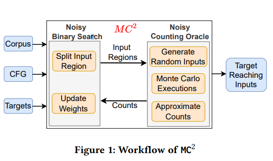
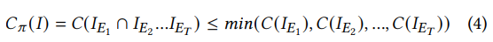
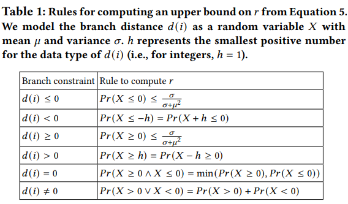
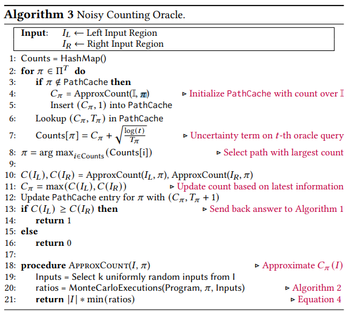

# 1. MC2


- DGF에서 target input을 찾는 문제를 oracle-guided search problem으로 봄

## 1.1. noisy counting oracle
- 두 input space가 주어졌을때 target site로 도달하는 입력의 수를 "대략적"으로 계산 
- Monte Carlo algorithm을 통해 구현

## 1.2. Monte Carlo Counting



## 1.3. Uniconstraint Counts
- uniconstraint count = 단일 branch constraint를 만족하는 input의 수
- uniconstraint count > 여러 branch constraint를 만족하는 input의 수  이기에 Monte Carlo counting을 통하여 Uniconstraint를 근사

uniconstraint count의 두가지 문제점
1. single branch constrain는 소수의 execution에 의해선 잘못 평가될 수 있다.
> algorithm상 일정 수의 프로그램을 실행하기 때문에 사전에 얼마나 많은 수의 실행이 필요한지 모름
- Cheby-shev inequality를 사용하여 concentration bound를 이용하여 uniconstraint count에 대한 upper bound 계산 > uniconstraint 자체가 upper bound이기 때문에 근사하여도 괜찮음



- branch constraint를 근사할때 오차가 지수적으로 감소
- overapproximation error를 발생할 수 있으므로 한번도 만족되지 않은 branch에서 사용
2. 중첩된 branch에 대해서 평가할 수 없음
- 외부의 constraint를 만족하지 않더라도 내부의 branch를 방문하고 평가하도록 하는 Monte Carlo Execution 도입
- 한번의 실행으로 모든 branch를 방문하여 ㅍ여가함 > 적은 실행으로 모든 분기의 uniconstraint counts를 근사 가능
- runtime에 control-flow를 수정하여 input과 관계없이 모든 분기를 방문하도록 함
- 원하는 branch를 방문하는것을 보장하기 위하여 program exception을 조작해야함
> arr[input]의 경우 invalid memory error 가능성 > instruction pointer를 진행 시키고 값을 무작위 값으로 설정함
- memory read, write에 대한 의존성이 사라지지만 overhead가 낮음

## 1.4. Path
- 이제까지 단일 path만 고려함 > path가 많은 경우 oracle query마다 각 path에 대한 계산은 어려움
- path를 모두 계산하는 것이 아닌 가장 큰 count의 path를 선택하여 수행
- 하지만 우리는 어떤 path가 가장 큰지 모르기 때문에 초기에 각 경로의 개별 count를 근사
- 여기에도 불확실성이 포함되어 multi-armed bandit 을 사용



## 1.5. Implementation
- algorithm 1,2,3 = LLVM instrumentation
- algorithm 2 = signal handler를 사용하여
  *** 보충 필요
- input space를 분할하는 방법 > byte index set을 기준으로 분활하여 index에 대한 byte값을 변형해가며 MCE 수행 > 각 byte index가 count를 얼마나 증가시키는지에 따라 순서를 할당

- path set을 구하는 방법 >  initial seed corpus를 사용하여 mutation을 수행하며 path set을 만듬
- input space를 d차원 hyper rectangle > k개를 input을 선택하기 위하여 d개의 정수를 무작위로 생성
  
# 2. DAFL
## 2.1. selective coverage instrumentation
- Def-Use Graph를 이용하여 target point와 관련된 function set 반환
- DUG를 thin slicing을 적용 (target point와 관련된 data flow만 포함하도록 slicing)
- selective coverage instrumentation 수행
- fuzzing중 target site와 관련된 부분에서만 coverage feedback을 받음
## 2.2. semantic relevance scoring
- seed input을 syntatic이 아닌 semantic distance로 평가
- seed input score를 DUG에서의 semantic relvance score의 합으로 정의

# 3. DAFL llvm-pass.so.cc
```cpp
void initDFGNodeMap(char* dfg_file) {
  unsigned int idx = 0;
  std::string line;
  std::ifstream stream(dfg_file);
  /// dfg_file에서 정보를 읽어서 dfg_node_map = targ_line -> (idx, score) 생성
  while (std::getline(stream, line)) {
    std::size_t space_idx = line.find(" ");
    std::string score_str = line.substr(0, space_idx);
    std::string targ_line = line.substr(space_idx + 1, std::string::npos);
    int score = stoi(score_str);
    dfg_node_map[targ_line] = std::make_pair(idx++, (unsigned int) score);
    if (idx >= DFG_MAP_SIZE) {
      std::cout << "Input DFG is too large (check DFG_MAP_SIZE)" << std::endl;
      exit(1);
    }
  }
}
...

      if (dfg_scoring) {
        for (auto &inst : BB) {
          DebugLoc dbg = inst.getDebugLoc();
          DILocation* DILoc = dbg.get();
          if (DILoc && DILoc->getLine()) {
            int line_no = DILoc->getLine();
            /// target string을 만듬
            std::ostringstream stream;
            stream << file_name << ":" << line_no;
            std::string targ_str = stream.str();
            /// target string이 dfg_node_map에 존재하는지 확인
            if (dfg_node_map.count(targ_str) > 0) {
              is_dfg_node = true;
              /// map에서 score, idx 정보를 가져옴
              auto node_info = dfg_node_map[targ_str];
              node_idx = node_info.first;
              node_score = node_info.second;
              inst_dfg_nodes++;
              break;
            }
          }
        }
      } // If disabled, we don't have to do anything here.


...
      if (is_dfg_node) {
        /* Update DFG coverage map. */
        ///  AFLMapDFGPtr 로드
        LoadInst *DFGMap = IRB.CreateLoad(AFLMapDFGPtr);
        DFGMap->setMetadata(M.getMDKindID("nosanitize"), MDNode::get(C, None));
        /// node_idx, score에 해당하는 값 생성
        ConstantInt * Idx = ConstantInt::get(Int32Ty, node_idx);
        ConstantInt * Score = ConstantInt::get(Int32Ty, node_score);

        /// AFLMapDFGPtr에서 index에 해당하는 위치에 score를 저장
        Value *DFGMapPtrIdx = IRB.CreateGEP(DFGMap, Idx);
        IRB.CreateStore(Score, DFGMapPtrIdx)
            ->setMetadata(M.getMDKindID("nosanitize"), MDNode::get(C, None));
      }

```