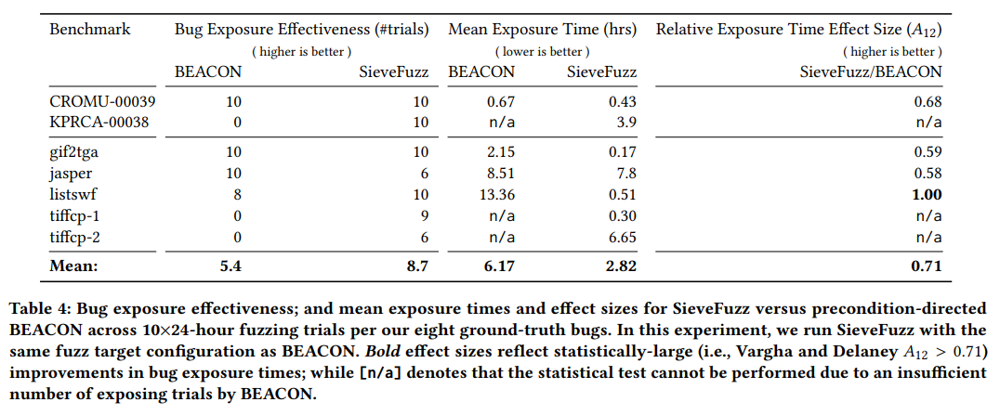

[One Fuzz Doesn’t Fit All: Optimizing Directed Fuzzing via Target-tailored Program State](https://dl.acm.org/doi/pdf/10.1145/3564625.3564643)

[source code](https://github.com/HexHive/SieveFuzz)

# 기존 DGF의 문제

- distance minimazation > 모든 testcase에 대한 distance calculation : 높은 overhead, dijoint target의 경우 non-DGF보다 비효율적 

# Motivate Example

- DAPRA cyber grand challenge benchmark `KPRCA-00038` 
- `cgc_program_parse` : NULL pointer referencing 이 포함된 interpreter
- bug trigger 조건 
1. empty statement > language semantics 만족
2. reference를 trigger하는 non empty statement 삽입

- `crc_parse_statements`는 disjoint target
- *AFL* 2/10 > *AFLGo* 1/10 , 시간도 92% 빠름
- distance minimazation은 program state에 대한 greedy search로 인한 대가를 지불함 따라서 non-DF이 더 우수할때가 있음, dijoint target에 대한 성능 문제

# Tripwiring
- tripwiring : fuzzer의 program state space의 search가 확률적이며 control flow에 크게 영향을 받는점을 이용 > rechable path의 subset을 serach space에 제한 > subset은 target site에 도달하는데 반드시 필요한 path로 보장됨

- target site를 선행하지 않는것으로 입증되는 region의 탐색을 선제적으로 종료 > 장점
1. 90% 이상의 runtime에서 실행되는 target inrerelevant path의 code coverage, target distance를 측정하는 낭비 없앰
2. path를 explore 하기 전에 filtering > resource를 낭비하지 않음

# Fuzzing

# Evaluation > 보충하기
1. RQ1. tripwiring은 rechable search space를 제한하는데 효과적인가 > Tripwiring 된 code region의 비율
2. RQ2. tripwiring은 DF를 효과성과 속도를 향상시키는가 > TTE
3. RQ3. tripwiring에 잘 적용되는 target location의 특성 > dijoint target과 SieveFuz, AFLGo의 성능의 상관관계
## Benchmarks

- DARPA CGC corpus의 3개의 ground truth memory bug set
- real world bug 5개
- Magma의 2개
- 특이한점 : Debian 사용

## RQ1: Tripwiring’s Search Space Restriction

1. tripwiring된 code region의 비율
2. tripwire initialization, on-demand analysis의 cost를 계산
- 24시간 fuzzing중 overhead는 낮은편임
## RQ2: Targeted Defect Discovery

1. consistency
2. speed
### Results: Tripwiring vs. Minimization-directed Fuzzing
- AFLGo와 비교
### Results: Tripwiring vs. Precondition-directed Fuzzing
- BEACON과 비교 

- SieveFuzz 대비 BEACON은 path를 과도하게 줄임
- BEACON은 indirect controlflow를 감지하지 못함 
### Results: Tripwiring vs. Undirected Fuzzing
- AFL++과 비교
## RQ3: Target Location Feasibility for Tripwiring
- disjoint target일때 tripwiring이 distance minimaization 보다 성능이 더 좋아짐

# Discussion
1. Refinements in Path Analysis
- target site에 도달하는 경로를 찾은 경우 indirect call에 의해 발생되는 경로를 못찾을 수 있음
- exploration과 tripwiring을 번갈아 수행하여 indirect call을 해결할 수 있을것으로 기대됨

2. Path Prioritization
- target에 도달한s path set search를 유도 > path중 우선순위를 정하지 못함
