# BEACON

[BEACON : Directed Grey-Box Fuzzing with Provable Path Pruning](https://qingkaishi.github.io/public_pdfs/SP22.pdf)

## 2.2. Problem and Challenges : infeasible-path-explosion problem
- BEACON : 적은 overhead로 infeasible path를 pruning
- intermediate program state를 weakest precondition으로 근사하여 계산하여 execution을 허용한다.
- CFG에서 target l, 위치 p가 주어졌을떄 wp(p,l) : l에 rechable을 보장하는 가장 러프한 precondition
- p에 도달하지만 wp(p,l)을 만족하지 않는 path는 제거된다.

> challenge
1. precondition inference 에서 path condition에 대해 효율적으로 추론하는방법
2. merging path에서 정밀도 손실을 피하면서 precision loss를 피하는 방법

## 3.1. Backward Interval Analysis
- static하게 계산된 control flow information으로 프로그램을 slicing 함
- wp를 추론하기 위하여 backward interval analysis를 수행
- 정확한 weakest precondition 을 계산할 수 없기에 predefined abstract domain에 대한 sound abstraction을 계산함 (over approximation) > interval domain > 변수간의 상호작용을 고려하지 않음 
> 부정확성을 악화시키는 두가지 해결
1. Relationship Preservation
- 변수간의 관계를 보존한다면 정확한 precondition을 얻을 수 있음 
2. Bounded Disjunction
- 전통적인 방법은 서로 다른 path에서의 SA결과를 병합함 > 부정확성 발생
- SA 결과에 대한 제한적 Disjoint를 유지하고 path의 수가 임계값을 넘을때만 병합함 (구현에서 5)
- 임계값에서 병합할때 어떤식으로 병합하는지에 따른 문제도 있음
## 3.2. Selective Instrumentation
- PUT의 모든 statement를 intrumentation 하는 것은 cost가 많이듬
- BEACON은 변수 정의, branch에 대해서만 intrumentation
- precondition을 포함하는 assertion을 삽입함

### 4.1.1. Language
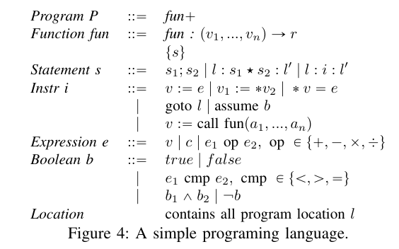

## 4.2. Backward Interval Analysis
- target location $l_0'$이 주어질때 target에 도달하기 위한 precondition set $\hat{wp}(l,l_0')$을 계산
- path condition을 추론하기 위하여 $\alpha, \gamma$를 사용
- target site에서 시작하는 역방향 path를 over-approximate 해야함 > worklist = (instruction, postcondition) 사용

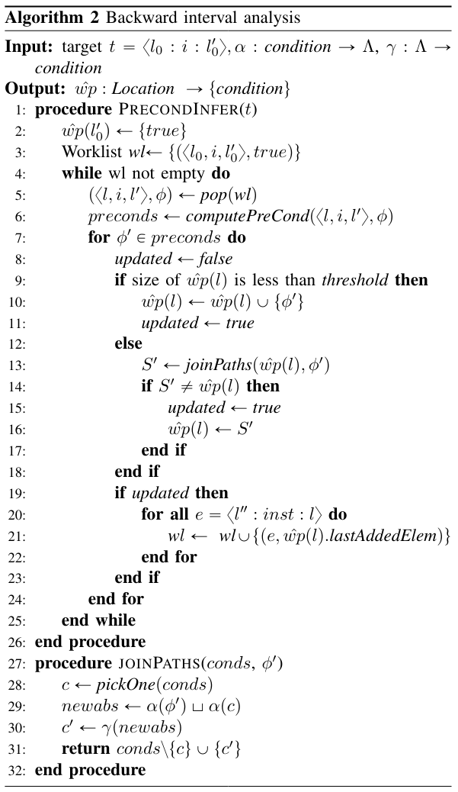
- line3 : target t와 initial postcondition `true`를 worklist에 추가 
- line 5-6 : work list에서 $(<l,i,l'>,\phi)$를 pop 하여 instruction i에 따라 postcondition $\phi$ 변환
- 새로 계산된 postcondition $\phi'$은 $\hat{wp}(l)$의 값을 update하기 위하여 역방향 전파
- predicate transformer 와 worklist가 모든 execution을 추적하여 backworld path를 추론할 수 있음

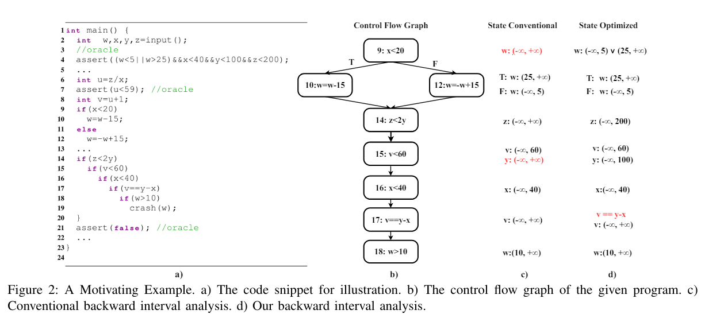

- $l_{18} -> l_{14} backworld analysis$를 진행하여 line 9에서 p1, p2로 분기됨
- line 8 에서 p1, p2의 condition은 다음과 같음
- pc1 : {z<2y, v<6, x<40, v=y-x, w<5, x>=20}
- pc2 : {z<2y, v<6, x<40, v=y-x, w>25, x<20}
- 이를 해결하기 위해서 SMT solver를 사용하는 것은 cost가 높음
- line 8 에서 다시 두 path가 합쳐지므로 적당한 정밀도 손실을 유지하며 $\hat{wp}(l_8)$로 결합되어야함
- 이를 위하여 적당한 interval abstraction 사용 
- $\alpha = \Lambda : V -> Interval $, Interval = integear 사이의 집합, $\top$ = Z, $\bot$ = 공집합
- $\gamma(\Lambda) = \cap_{v\in dom(\Lambda)}cons(v)$ : abstract value를 logical constraint로 mapping

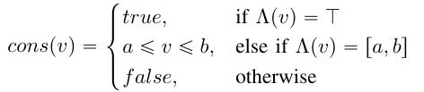

- interval abstraction으로 다양한 backword path를 건전하게 결합함

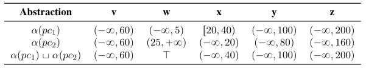

- `joinPath`에서 pc1, pc2의 interval abstraction을 결합
- interval abstraction은 부정확 할 수 있음 > 정밀도를 향상시키는 두가지 최적화
1. 특정 변수간 관계를 명시적으로 추적하는 interval abstraction $\alpha$ 설계
2. 결합을 수행할 시기와 방법을 결정하는 bounded disjuction strategy 설계

## 4.3. Optimizations for Maintaining Precision
### 4.3.1. Relationship Preservation
- top-down analysis
- interavl abstraction $\alpha$는 path condition에 나타내는 변수들의 범위를 추론하는데 사용됨
- 변수 뿐만 아니라 path condition에 나타나는 expression의 interal 또한 추적 > 이를 child, parent에 전파하여 정밀도 상승

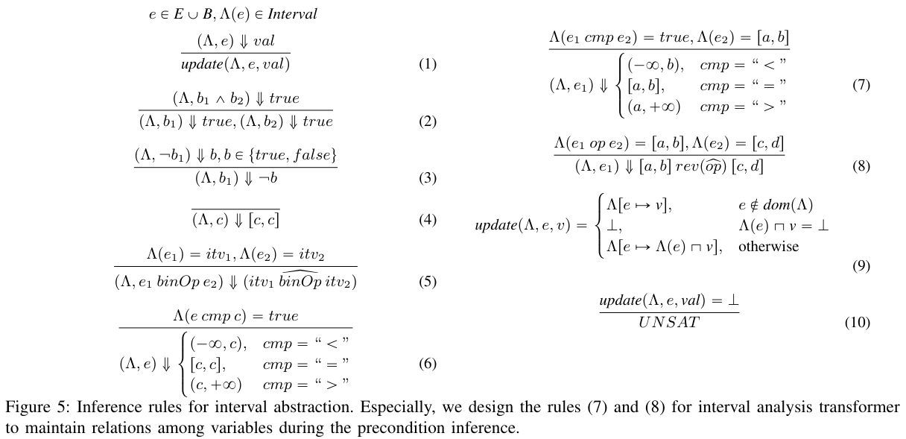

- 7,8 : interval abstactionn의 정밀도를 증가시키는 heuristic

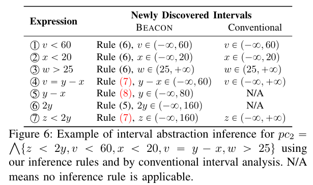
- pc2에서 새로운 추론규칙을 사용 : 더 정밀한 결과

### 4.3.2. Bounded Disjunctions
- 다른 path에서 전파된 조건을 선택적으로 결합하여 정밀도를 높일 수 있음
- backword propagation 동안 정밀도를 유지하기 위한 bounded dijunctions 전략 설계
- bound threshold를 사용하여 l에 도달하는 path의 수가 threshold 적을때 condition들을 $\hat{wp}(l)$에서 유지
- 개별적으로 backword propagate

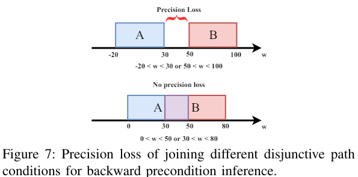
- interval abstraction을 통해 정밀도 손상이 발생할 수 있음
- 두 abstract region의 교차는 frechet distance로 측정할 수 있음
- interval domain에서 각 변수의 interval 에서 distance를 누적하여 정밀도 손실을 계산해야함
- 여러 path중 distance가 작은 path의 condition을 결합

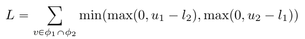
- v = path condition $\phi_1, \phi_2$의 공유 변수
- $v_{\phi_1} = [l_1, u_1], v_{\phi_2} = [l_2, u_2]$

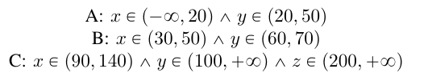

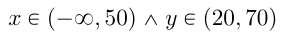

## 4.4. Precondition Instrumentation
- target program location에서 rechable을 위한 precondition을 추론 > 이를 program에 instrumentation 하여 runtime에 infeasible path pruning
- 정교한 분석 > instrumentation, runtime에 overhead > 선택적으로 instrumentation 해야함
1. SSA form으로 변환하여 변수 정의만 instrumentation의 후보 위치
2. v1의 값이 v2에 의존하는 경우 v1은 instrumentation 되지 않음
# 5. Evalutation
- LLVM을 기반으로 BEACON 구현
- PUT를 LLVM bit code로 compile, precondition analysis, instrumentation, coverage 관련 instrumentation이 수행됨
- 이후 LLVM bit code를 executable binary로 compile하여 AFLGo를 fuzzing engine으로 사용
1. 4가지 DGF와 비교
2. path slicing, precondition 확인이 fuzzing 시간을 얼마나 단축하는지 평가
3. precondition analysis가 relational preservation, bounded disjunction의 영향 평가
4. instrumentation에 의한 runtime overhead의 측정으로 instrumentation 전략의 효과 평가 
- Baselines : AFLGo, Hawkeye, AFL, Mopt, AFL++
- Benchmarks

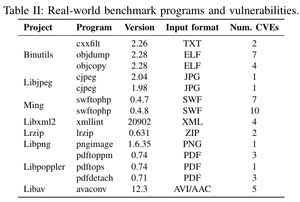

## 5.1. Compared to the State of the Art
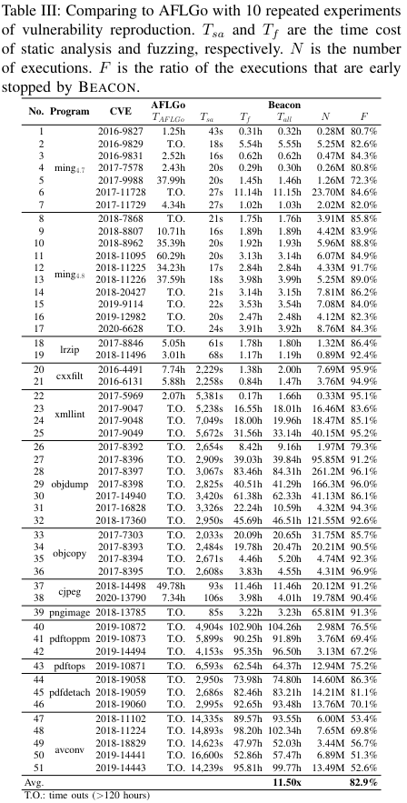
## 5.2. Impacts of Path Slicing & Precondition Checking
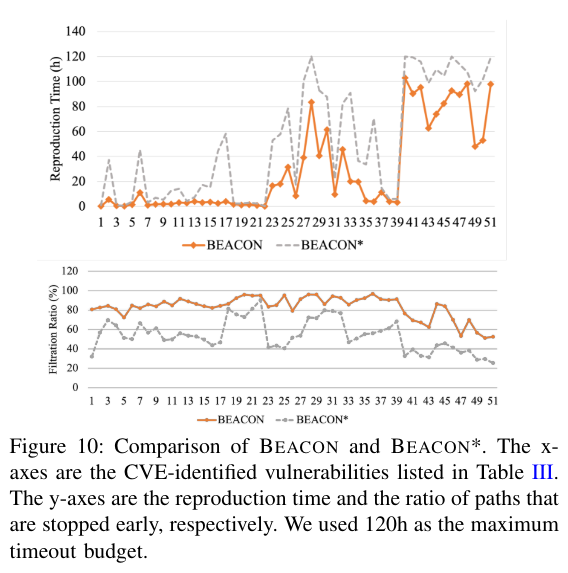 
## 5.3. Impacts of Relation Preservation & Bounded Disjunction
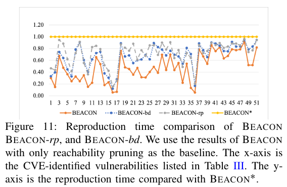
## 5.4. Instrumentation Overhead
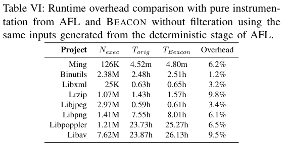

# 2. CAFL

[Constraint-guided Directed Greybox Fuzzing](https://www.usenix.org/system/files/sec21fall-lee-gwangmu.pdf)

## 2.1. Directed Greybox Fuzzing
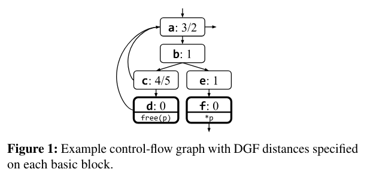

- [a,b,e,f] -> 0.785
- [a,b,c,d,a,b,e,f] -> 0.85
- [a,b,c,a,d,e,f] -> 0.971
- target에 모두 도달해도 거리가 더 클 수 있음

## 2.3. Limitation
### 2.3.1. Independent Target Sites
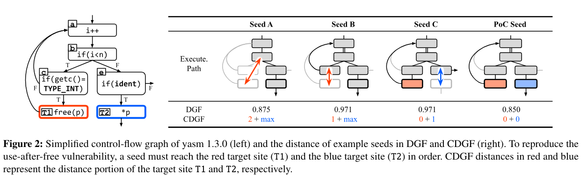
- DGF는 모든 target site를 독립적이라고 간주하여 crash site 이전에 precondition site에 도달하는 개념이 없음
- UAF에서 T1 : TYPE_INT, T2 : ident > 우선 순위가 seed C > B > A 가 바람직함
- DGF는 T1, T2를 독립적으로 간주하기 때문에 target site 의 average distance를 기준으로 seed distance 계산

### 2.3.2. No Data Condition
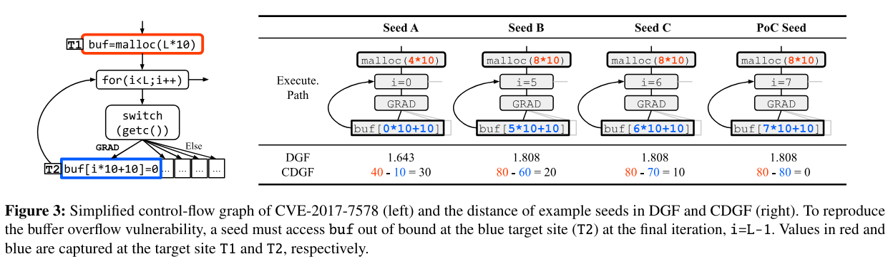
- DGF는 seed를 원하는 data condition으로 유도할 mechanism이 없음 
- T1에서 buf를 할당 > t2에서 bound를 넘어서 buf에 접근하는 GRAD를 가져야함 > 우선 순위가 seed C > B > A 가 바람직함
- DGF는 data condition을 인식하지 못하므로 distance를 기준으로 잘못된 우선순위 부여
## 2.4. Requirements
1. Ordered Target Sites : crash의 precondition을 나타내는 program location을 가지고 있어야 하므로 DGF는 이 지점으로 먼저 유도되어야함
2. Data Conditions : 대부분의 vulnerability는 data condition을 동반하므로 DGF는 seed를 data condition으로 유도할 수 있어야함

## 3.1. Overview
- CDGF : independent target site set에 도달하는 것이 아닌 sequence of constraints 를 만족하는 것을 목표로함
- 따라서 더 많은 constraint를 만족하거나 다른 seed보다 첫번째로 만족되지 않는 constraint를 만족하기 쉬운 경우에 짧은 distance 부여 
- constraint distance = target site distance + data condition

## 3.2. Example
### 3.2.1. Ordered Target Sites
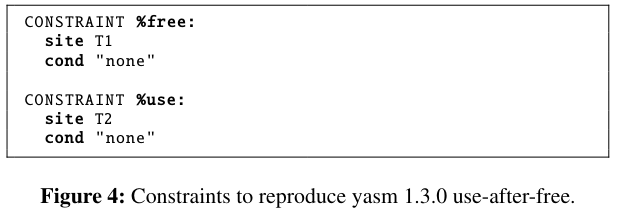
- figure 2의 `yasm 1.3.0`의 UAF에 대한 constraint
- T1 > T2  순서로 도달해야함

- CDGF의 seed distance
1. seed A : T1과 가까운 b에 접근 > free의 constraint = 2, %use : T1에 도달하지 못하였기에 T2에 도달하더라도 max > 2 + max
2. seed B : 1 + max
3. seed C : 0 + 1
4. seed D : 0 + 0
- UAF를 재현하는 단계를 더 잘 따르는 seed에 대해서 더 짧은 seed distance 부여

### 3.2.2. Data Conditions
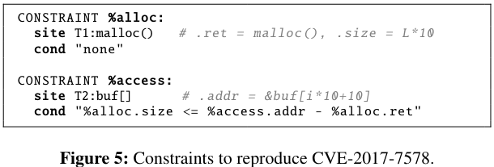
- figure 3의 `CVE-2017-7578` 의 constraint
- T1 에서 buffer allocation
- T2 : buffer 크기와 offset 사이의 크기를 줄이도록 하여 boundary로 유도 (cond)
- figure 3의 모든 seed는 target에 도달함
- %access의 data condition distance를 통하여 seed distance를 계산함
- T1의 buf 크기 - T2 의 offset 

# 4. Constraints
- CDGF를 사용하기 위해선 constraint, constraint의 distance metric을 정의해아함
## 4.1. Definition
- constraint = target site + target site's data condition
- constraint는 다음의 경우 satisfied 된것으로 간주
1. target site에 도달
2. target site에서 모든 data condition을 만족 한 경우 (있다면) 
### 4.1.1. Variable capturing
- target site에서 사용된 변수를 캡쳐 > target site가 의 유형에 따라 다름
- figure 5 의 예시
- T2:buf[] : deereference > (&buf[i*10+10]) : dereferenced address
- T1:malloc() : allocation > L*10 : size, 할당된 주소 : ret
### 4.1.2. Data condition
- data condition : target site 에서 만족해야하는 캡쳐된 변수간의 boolean expression (including comparison operation)
- precondition 이나 constraint에 의해 캡쳐된 모든 변수를 사용할 수 있음
### 4.1.3. Orderedness
- constraint는 여러개가 존재할 수 있음 > 그러한 경우 지정된 순서되로 만족되어야함
## 4.2. Distance of Constraints
### 4.2.1. Target Site Distance
#### Basic block distance
- 두 BB가의 거리는 다음과 같이 정의

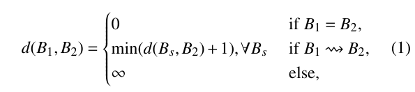
- $B_s$ : $B_1$의 모든 successor

#### Target site distance
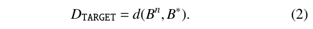
- target site와 현재 BB간의 BB distance로 정의
- $B*$ : target site
- $\overrightarrow{B} = [B_1,B_2,...]$ : 실행된 BB sequence

- 앞으로 임의의 변수 #에 대해서 #^n : B^n을 실행하는 순간의 변수의 값
### 4.2.2. Data Condition Distance
#### Distance of an individual data condition
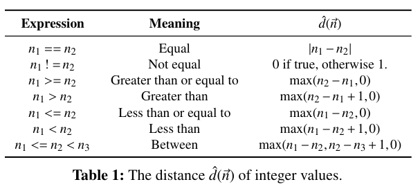
- Angora와 유사
- 개별 data condition은 $\hat{d}_x(\overrightarrow{n})$를 기반
- $\hat{d}(\overrightarrow{n})$을 다음과 같이 정의함

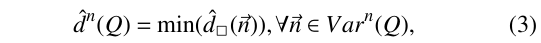

- $Var^n(Q)$ : $B^n$이 실행될때까지 포착된 변수의 vector set
#### Distance of multiple data conditions
- seed가 모든 data condition을 만족하는데까지의 거리를 의미
- 더 많은 data condition이 만족될때 더 짧아지도록 정의
- 만약 같은 수의 data condition이 만족 > 첫번째로 만족하지 못하는 data condition의 가능성이 더 가까운 것으로함

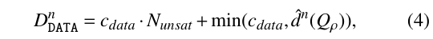
-  $c_{data} = 2^{32}$  
### 4.2.3. Constraint Distance
- constraint distance = target site distance + data condition distance

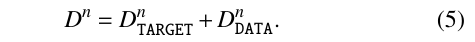
- 다음과 같이 계산됨
1. Target site 이전 : $D^n = d(B^n,B^*)+c_{data}*N(\overrightarrow{Q})$
2. Target site 에서 : $D^n= 0 + D^n_{DATA}$
3. constraint 만족 : $D^n = 0$
### 4.2.4. Total Distance
- total distance = distance of a constraint sequence
- $\overrightarrow{B}^* = [B^*_1, ..., B^*_M]$ : constraint에 포함되는 target site의 sequence
- $\tau_n$ : 천번째로 만족되지 않은 constraint의 index

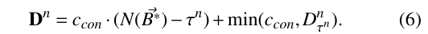
- $c_{con} = 2^{35}$ = 8개의 data condition 수용 가능 
- 다음과 같이 계산됨
1. 모든 constraint를 만족하지 못하였을때 : $D^n=c_{con}(N(\overrightarrow{B}^*)-1+min(c_{con}, D^n_1)$
2. 하나의 constraint가 남았을때 : $D^n = min (c_{con},D^n_M)$
3. 모든 constraint를 만족하였을떄 : $D^n=0$
- seed : execution 동안의 minimum total distance로 정의
# 5. Constraint Generation
- 추가 정보를 이용하여 constraint를 생성함 > 사전에 정의된 constraint templete을 이용
- memory error detector의 crash dump, patch changelog를 이용하여 생성함
## 5.1. Crash Dump
- 7개의 bug type을 지원하는 3가지 template을 제공
- nT : UAF, double-free, use-of-uninitilized-value
- 2T + D : stack-BOF, heap-BOF
- 1T + D : assertion-failure, divide-by-zero
### 5.1.1. Multiple Target Sites (nT)
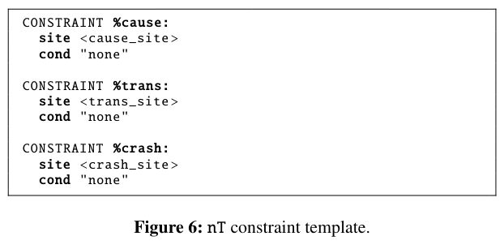
- nT  : crash dump가 순서대로 도달해야하는 target site를 알려줌
#### Avoiding wrapper functions
- alloc, ree, mem과 같은 keyword가 stack fram caller에 있는지 확인하여 memory wrapper 내부의 target이 아닌 하위 stack frame의 location을 선택
#### Constraint description
- crash reproduction을 위해 순서대로 도달해야하는 multiple target site를 지정함
- %cause(cause 생성) -> %trans(cause 전달) -> %crash (crash 발생)
### 5.1.2. Two Target Sites with Data Conditions (2T+D)

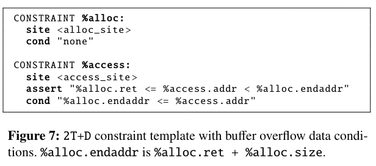
- BOF를 위한것
- endaddr는 할당된 memory의 끝 (ret+size)
#### Constraint description
- %alloc은 buf를 할당하는 위치
- <alloc_site>에 도달하면 ret, endaddr 을 캡쳐
- %access : <access_site>에서 cond 조건을 통하여 endaddr로 경계까지 driven
#### Corresponding bug types
- global-buffer-overflow, buffer underflow를 지원하진 못함
### 5.1.3. One Target Site with Data Conditions (1T+D)

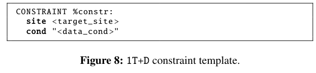
#### Constraint description
- target site와 data condition을 지정
#### Corresponding bug types
- Divide-by-zero : <data_cond>에서 constr.rhs == 0
- Assertion-failure : target_site : 실패한 assertion, datacond = assertion 조건의 부정
## 5.2. Patch Changelog

- patch change log에 대한 constraint는 1T+D를 사용
#### Constraint description
- target_site, data_cond 설정
#### Determining constraint
- 적절한 constraint를 찾기 위하여 patch changelog는 사전에 정의된 case와 matching
- [부록 3](#113-constraint-generation-algorithm-for-changelogs)
1. 새로운 예외검사 도입 : target_site : 해당 source, data_cond : 도입된 예외 검사 조건
2. branch condition 변경 : target_site : 변경된 조건, data_cond : C_pre XOR C_post
3. 변수 교체 : target_site : 교체된 변수, data_cond : patch 전과 후의 변수의 값이 다른지 확인
4. 위의 경우가 아닌 경우 > data condition이 없음
#### Multiple target sites
- 모든 변경된 위치에 sentinal function으로 연결하고 이를 target_site로 설정
- 각 변경 위치에서 sentinal function call을 삽입
## 6.1. System Overview

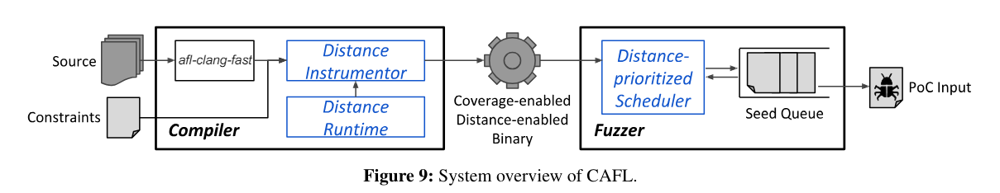
## 6.2. CAFL Compiler
### 6.2.1. Coverage instrumentation
- LLVM IR을 통한 byte code 생성
- target site들이 최적화 되지 않도록 주석을 담
- AFL instrumentation compiler를 사용하여 edge coverage를 instrumentation
### 6.2.2. Call graph construction
- target site distance calculation을 위하여 program 전체의 CG 구축
- function pointer와 관련하여 같은 형식의 모든 함수를 잠재적인 callee로 가정 > 그런 함수가 없다면 부분적으로 일치하는 함수들을 callee로 가정
### 6.2.3. Target site distance instrumentation
- target site에서 시작하여 BB의 target site distance를 계산하고 CFG, CG를 기반으로 checkpoint call을 삽입
- target site에서 캡처된 변수를 check point call을 통하여 CAFL에 runtime으로 전달함
## 6.3. CAFL Runtime
### 6.3.1. Seed distance tracking
- checkpoint를 통한 target site distance feedback을 사용하여 seed distance을 tracking
- intrumentation된 binary는 $[\tau,d(B_n,B^*_\tau)]$ tuple을 전달
- $\tau : constraint index, d(B_n,B^*_\tau) : \tau번째 constarint의 target site distance$
- CAFL runtime은 첫번째로 만족되지 않는 constraint의 target site distance를 선택적으로 받아들여 seed distance를 update
- target site에서 checkpoint call을 통하여 캡쳐된 변수를 받고 data condition distance를 계산
- 할당 해제된 변수에를 처리하기 위하여 memory pointer varibale, free/realloc에 의해 해제된 heap objext, stack unwinding object를 폐기
- 현재 constraint의 distance가 0이 된다면 다음 constraint로 이동함
### 6.3.2. Seed distance reporting
- CAFL은 shared memory interface를 통하여 fuzzer에게 seed distance를 보고함
- 추가적인 runtime 정보 (어떤 constraint에 멈추어 있는지)도 보고함
## 6.4. CAFL Fuzzer
### 6.4.1. Seed scoring
- CAFL은 distance에 반비례하여 scoring
- 일부 seed는 더 줄일 수 없는 local minimum 일 수 있음 > 이를 해결하기위해 stuck depth(fuzzing된 횟수)를 통하여 지수적으로 낮춤

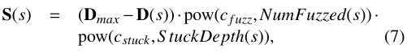
### 6.4.2. Seed creation
- 현재 최대 점수보다 높은 점수의 seed를 관찰할때마다 새로운 seed 생성
- seed가 새로운 control flow edge를 cover할때도 일반적인 방법으로 seed를 생성하여 dtat context를 다양화함
### 6.4.3. Seed prioritization
- AFL의 seed prioritization을 수정하여 seed의 선택 확률을 score에 기반하여 조절함
- seed의 점수의 증가순으로 순위를 매기고 지수적으로 높게 부여함
- 점수가 아니라 순위를 통한 확률 부여 > distance가 두가지 척도의 조합이고 스 척도가 호환되지 않기 때문
- P(s)=1/exp(R(s))

# 7. Evaluation
- AFLGo와 CAFL을 비교
- 모든 constraint는 자동으로 생성
## 7.1. Microbenchmark: LAVA-1
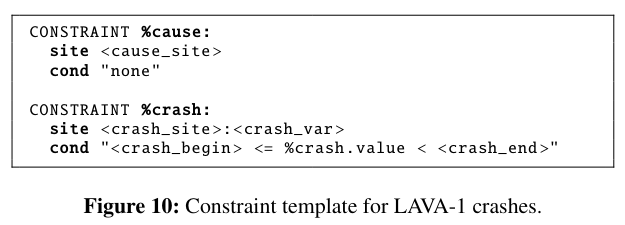

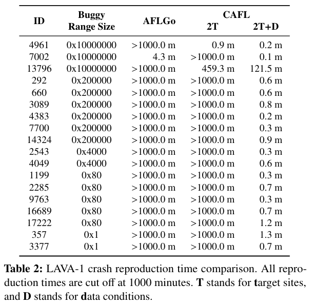
## 7.2. Crash Reproduction
- 47개의 real world crash에 대한 crash reproduction time
- AddressSanitizer, MemorySanitizer의 crash dump를 이용한 자동 constraint 생성

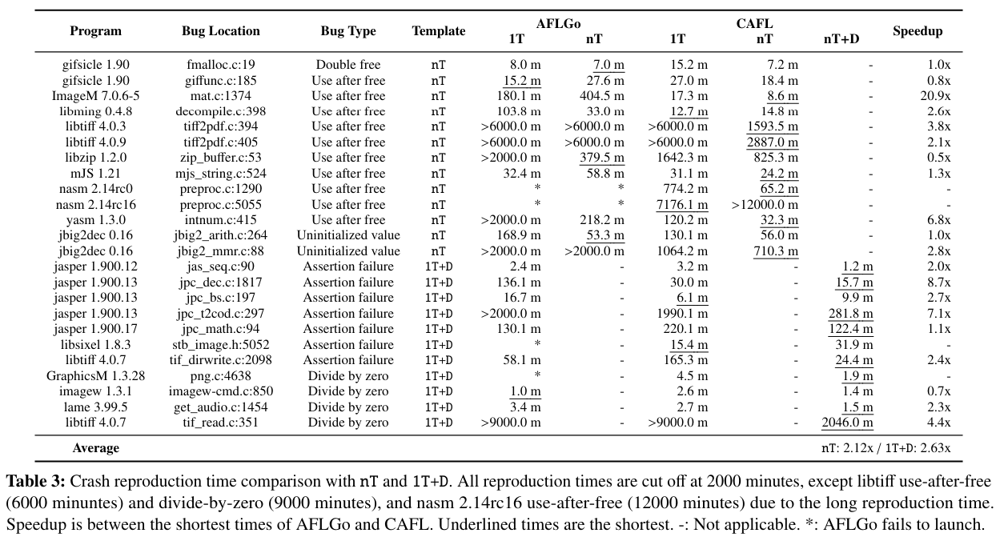

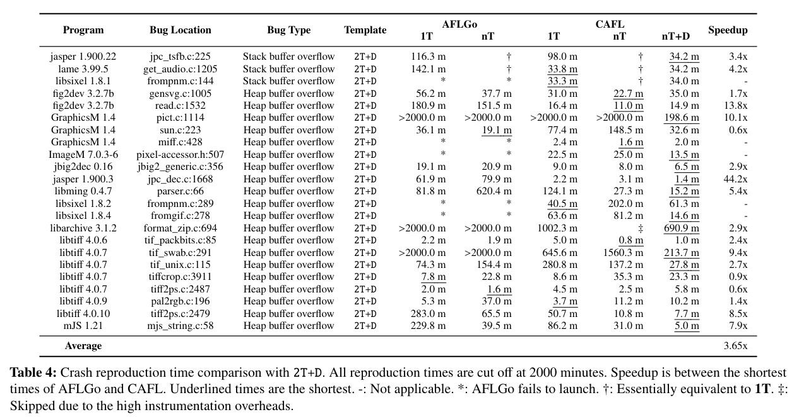
## 7.3. PoC Generation
- 12개의 crash에 대한 PoC 생성 시간
- git, Mercurial의 patch changelog를 사용한 자동 생성

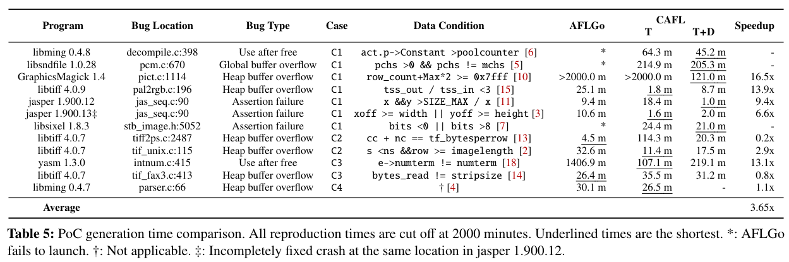

# 11. Appendix
## 11.C. Constraint Generation Algorithm for Changelogs
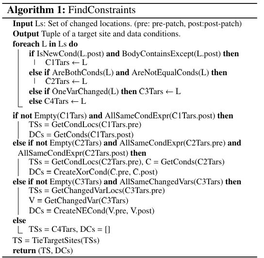
- 주어진 patch changelog와 함꼐 적절한 constraint를 찾음
- 변경된 location set을 통하여 사전에 정의된 사례로 분류 > target site, data condition 생성

## 11.D. Analysis on Minimum Distance Change
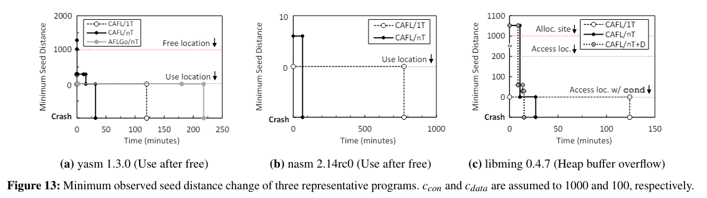
- fuzzing중 minimum seed distance의 변화