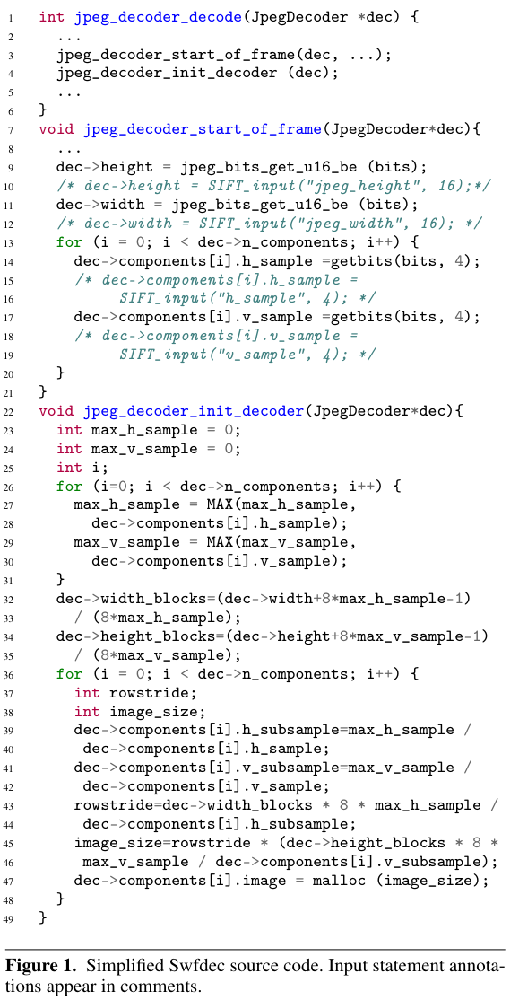

[Sound Input Filter Generation for Integer Overflow Errors](https://www.cs.toronto.edu/~fanl/papers/sift-popl14.pdf)

# 1. 개요
## 1.1. 기존 Input filter의 문제 (unsoundness)
- execution path를 기반으로 FSE를 사용하여 vulnerability signature 찾음
- loop unroling을 사용 > 가능한 execution path의 subset만 분석
- aliased value를 고려하지 않음

## 1.2. SIFT
- critical site(allocation, block copy)의 critical expression (크기 계산) 에서 INT OF가 발생하는지 체크해주는 filter 
- inter procedural, demand-driven, weakest precondition static analysis 사용
- critical expression의 value에 기여하는 모든 expression의 symbolic condition
- path를 고려하지 않기에 sound > 특징
1. critical site로 가는 path를 정확하게 다 찾을 수 없음
2. conditional statement를 무시하기 때문에 overhead가 적음
3. safety check 까지 무시하기 때문에 안전한 input을 filtering 가능함 (incomplete)
- overhead가 낮고 false postive가 없음 (sound)
## 1.3. Pointer analysis
- potential aliasing relationship을 분석하여 equivalence set으로 grouping
- arbitary off-the-shelf alias or pointer analysis와 precondition generation algorithm을 통합
- fixed point analysis를 사용하여 loop invariants를 얻음 (찾을 수 없다면 10회 반복)
## 1.4. SIFT Usage Model
1. Module Identification : input을 처리하는 moudle을 식별, 해당 module에 대한 input filter 생성
2. Critical Site Identification : module을 scan하여 ciritical site를 식별
3. Static Analysis : ciritical exprssion에 대해 demand-driven backward SA를 통해 symbolic condition 도출

# 2. Example
## 2.1. Swfdec 0.5.5

- jpeg_decoder_decode : JPEG 디코딩
- jpeg_decoder_start_frame : image metadata를 읽음
- jpeg_decoder_init_decoder : JPEG에 대한 메모리 buffer 할당
- line 43~47에서 Swftdec에서 INT OF 취약점 존재

- demand-driven interprocedual backward SA를 통해 figure2의 symbolic condition C를 계산함
- safe(e) : e를 계산하는 과정에 OF 발생하지 않아야함
- sext(v, w) : v를 w로 확장
- 실제로는 부호도 추적하지만 figure 2에는 이를 생략

## 2.2. Challenge

- 버퍼의 크기를 계산하는 식은 `h_sample, v_sample`의 최대 값인 `max_h_sample, max_v_smaple`을 사용
- 이 변수가 어떤 instance를 나타내는지 정적으로 결정하는것은 불가능함 > 해당 input field의 모든 instance를 나타내는 추상화 수행
- input field를 읽는 함수와 할당하는 함수가 다름 > interprocedual analysis

# 3. Static Analysis
- LLVM Compiler Infrastrucutre를 사용

- firstS(s) : s의 첫번째 statement, firstL(s) : s의 첫번째 label 
- last(s) : s의 마지막 label
- labels(s) : s의 label의 집합, load sotre는 LoadLabel, StoreLabel 을 사용하여 표현
- SA는 load, store 에서 alias를 구분하기 위하여 LLVM pointer analysis pass, DSA pointer pass 사용
