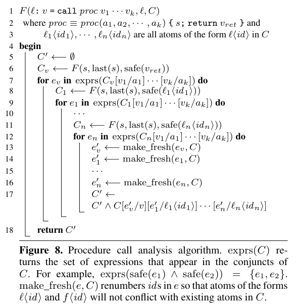
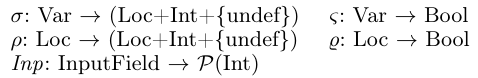
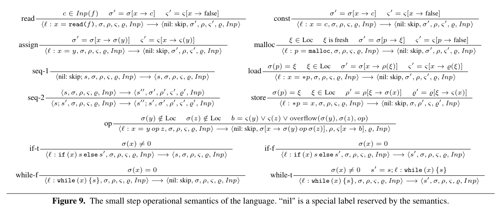
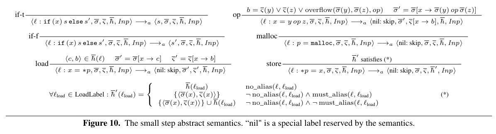

## 3.3. Interprocedural Analysis
### 3.3.1. Analyzing Procedure Calls

1. C에서 v(반환값)가 있는 경우 symbolic expresion으로 대체
2. function에서 store가 있는 경우 C를 변경
- 즉 C에서 다음과 같은 l\<id>를 찾음
1. function이 p에 저장 할 수 있는 값
2. function call 이후 load 명령으로 p에 접근하는 l을 찾음
- 이와 같은 l\<id>을 symbolic expression으로 대체함

- caching을 사용하여 procedual에 대한 중복 분석 하지 않음
- return value에 대한 symbolic expression (line 6) or l\<id>(line 8, 11) 을 얻음
- 이 분석으로 인한 symbolic expression 에는 argument (a_i)가 포함될 수 있음, 이때 caller의 이름으로 변경해줌 (line 7,9,12)
- line 13-16 : id renumbering > 기존 c와 중복 X

### 3.3.2. Propagation to Program Entry
- CG를 이용해서 현재 procedural을 호출 할 수 있는 모든 call site를 찾음 > 현재 C를 caller에게 전파
- argument를 caller의 naming context로 변환
- critical site에서 프로그램의 시작점까지 이를 계속함, 최종 조건 C는 모든 path로 도출한 조건의 합집합
- /// 의문 :  indirect call은 어떻게 해결 ? + callee를 기준으로 caller을 찾는게 어떻게 가능한지

## 3.4. Extension to C Programs
### 3.4.1. Identify Critical Sites
- LLVM IR을 scan > 개발자가 지정한 module 내의 alloc, block copy site (크기 포함) 식별 이를 통해 정적분석 수행
- alloc, calloc, realloc, memcpy, dMalloc을 인식함
### 3.4.2. Bit Width and Signedness
- 각 atom들의 bit크기를 식별, 산술 연산 부호 추적, bitvector의 크기를 변경하는 작업을 처리
### 3.4.3. Function Pointers and Library Calls
- pointer analysis(context-sensetive point-to analysis)를 사용하여 function pointer 구분
- SA의 경우 source code가 없는 libarary call을 처리할 수 없음 > memset, strlen과 같은 일부 함수에 대해 사전 정의된 주석을 사용
- library call에 잠재적으로 저장된 값을 symbolic expression 으로 표현 불가능함 
- 반환 값이나 매개변수를 통해 접근할 수 있는 값이 symbolic condition에 영향을 미친다면 filter 생성 X
- 아니라면 생성함 > demand-deriven이기 때문에 영향이 없는한 가능 /// 잘 이해 되지 않음
### 3.4.4. Command Line Arguments
- benchmark 56개중 4개가 command line argument의 길이에 의존함
- SIFT는 input filter를 생성할때 최종 symbolic condition에 이러한 길이를 나타내느 변수를 포함시킴
- 큰 특정 상수와 비교하거나 동적으로 추출하여 필터에 제공할 수 있음
### 3.4.5. Annotations for Input Read Statements
- 사용자가 어떤 input statement가 어떤 input field를 읽는지 주석달면 이를 이용 > figure 1의 주석들
- SIFT annotation generator는 comment를 스캔하여 input을 찾은 다음 지정된 정보를 LLVM IR에 삽입함
- `v = SIFT_INPUT("field_name", w)` 형식 명령어 삽입
- v : field_name을 저장하는 프로그램 변수, w : field의 너비
## 3.5. Input Filter Generation
- filter generator는 최종 symbolic condition C에서 l\<id>를 포함하는 모든 조건을 제거, v = 0 으로 변경
- $C_{Inp}$ : 초기 조건, f\<id>, 상수 만 포함시킴
- 초기화 되지 않은 데이터와 관련된 검사를 수행하지 않음
> Filter의 작동 방식
1. input format에 대해 기존 parser를 사용하여 input을 parsing
2. $C_{Inp}$에서 사용하는 input field 추출
3. 이 값을 기반으로 $C_{Inp}$를 평가 > 다양한 조합이 가능하다면 하나라도 존재하면 폐기

# 4. Soundness of the Static Analysis
- intra procedual analysis에 중점, inter는 생략
## 4.1. Dynamic Semantics of the Core Language
### 4.1.1. Program State

- σ : variable
- ρ : memory location
- ς, ϱ : boolean overflow flag
- undef : 초기화 되지 않은 값
- Inp : 실행중 변경되지 않는 input file
- Inp(f) : input field f를 f의 모든 nstantitaion value에 mapping
- 초기 상태에서 σ, ρ는 모든 변수와 위치를 undef로 mapping, ς, ϱ = false
### 4.1.2. Small Step Rule

- overflow(a, b, op) : a op b가 overflow를 일으킬때 true
- read 에서 Inp(f)에서 임의의 요소 c를 선택하여 x를 update

## 4.2. Soundness of the Pointer Analysis

- no_alias : s의 load, store에서 variable의 mapping이 모두 다를때
- must_alias : load 할때 store가 마지막으로 저장한 값을 읽을떄

## 4.3. Abstract Semantics
- soundness를 증명하기 위한 정의
- 기존 dynamic semantics와 차이점
1. if, while에 대해 condition을 무시하고 두 control flow중 하나를 nondeterministic하게 실행
2. load, store 값을 uderlying pointer or alias analysis로 얻는 정보로 equivalence class로 group화 함 > 보수적 모델링
### 4.3.1. Abstract Program State

- h : load label을 memory 에서 얻을 수 있는 value의 집합으로 mapping
- 초기 상태 : σ = 0, ς = false, h = empty set
### 4.3.2. Small Step Rule

- if, while, malloc, load ,store에 대해 차이가 있음
- if, while의 condition을 무시함
- store는 alias 정보를 기반으로 h를 유지
- load : h에서 (c,b)를 nondeterministic 하게 반환
- store : alias를 기반으로 h를 유지

## 4.4. Relationship of the Original and the Abstract Semantics

1. INT로 mapping 되는 것은 값과 boolean condition이 같아야함
2. load 할때 h_i에 포함되어야 함
## 4.5. Evaluation of the Symbolic Condition

- abstract program state에 대한 symbolic condition C를 정의하는 방법
- safe(e1 op e2) : e1 op e2를 계산하기 위한 하위 연산에 OF가 발생하지 않음
- f\<id> : Inp(f)의 임의의 요소
- l\<id> : h(l)의 임의의 요소
## 4.6. Soundness of the Analysis
- /// 잘이해 못함
### 4.6.1. Soundness of the Analysis over the Abstract Semantic

- s_i를 실행하기 전 F(si,l,C)를 만족한다면 l 이후 항상 C를 만족함
### 4.6.2. Soundness of the Analysis over the Original Semantics
- abstract된 공식을 이용하여 original을 증명

# 5. Experimental Results
## 5.1. Methodology
### 5.1.1. Input Format and Module Selection
- 각 프로그램에 대해 INT OF filter를 생성함
- input을 처리하는 module에 SIFT처리함
### 5.1.2. Input Statement Annotation

- ciritical expression의 값에 영향을 미치는 input field를 읽는 statement를 식별하기 위한 annotation
- Relevant Fields가 훨씬 적음
### 5.1.3. Filter Generation and Test
- 6000 개 이상의 실제 input을 사용 > false postive가 없음
### 5.1.4. Vulnerability and Filter Confirmation
- 실제 잘못된 input에 대해선 filter가 잘 작동함
## 5.2. Analysis and Filter Evaluation
### 5.2.1. Analysis Evaluation

### 5.2.2. Filter Evaluation

## 5.4. Discussion
- overhead가 낮음, 또한 false postive가 없기 때문에 real-world 프로그램에 배포할만 함