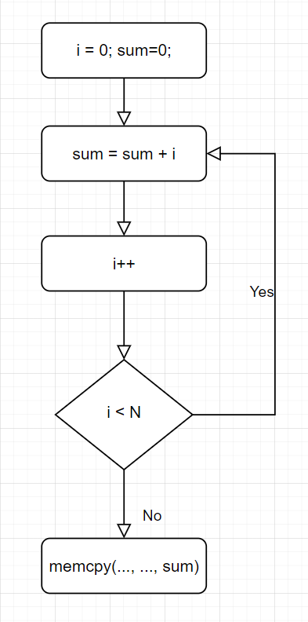

# 1. Summary
- WindRanger git : docker hub로 배포되어 있기에 tar.gz 유지
- run_vanilla 에서 EXIT 출력 하지 않고 triage.py 에서 log.txt를 확인하는 방식으로 변경
- run_fuzzer.sh를 kill 하도록 변경 완료
- build_bench_WindRanger 에 여러 bug 추가 (AFLGo와 동일)
- libtiff, libxml2의 URL을 gitlab -> github 변경 완료 : 정상 작동
- windranger에 CFLAGS에 `-ljpeg -llzma` flag를 추가함 (libxml2, libtiff)
- run_AFLGo 작성 완료
- fuzzing중 
# 2. precondition과 관련없는 함수에 대한 SA
- 

# 3. loop - sum
``` c
int sum = 0;
int i = 0;
while (i < N){
    sum = sum + i;
    i = i + 1;
}
memcpy(..., ..., sum); // C = safe(sum)

``` 


# 4. Comment
- 