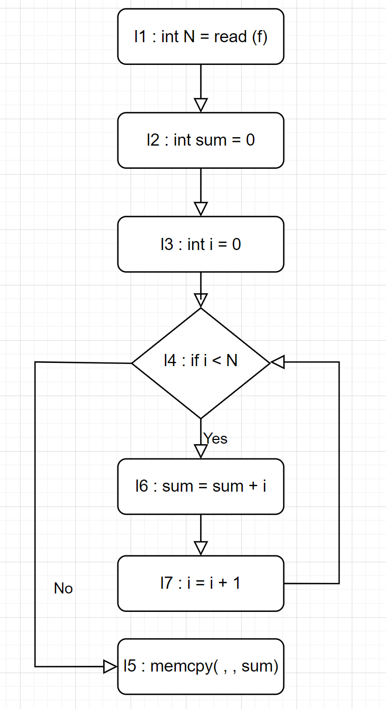

[Sound Input Filter Generation for Integer Overflow Errors](https://www.cs.toronto.edu/~fanl/papers/sift-popl14.pdf)

# 1. Summary
- WindRanger git : docker hub로 배포되어 있기에 tar.gz 유지
- run_vanilla 에서 EXIT 출력 하지 않고 triage.py 에서 log.txt를 확인하는 방식으로 변경
- run_fuzzer.sh를 kill 하도록 변경 완료
- build_bench_WindRanger 에 여러 bug 추가 (AFLGo와 동일)
- libtiff, libxml2의 URL을 gitlab -> github 변경 완료 : 정상 작동
- windranger에 CFLAGS에 `-ljpeg -llzma` flag를 추가함 (libxml2, libtiff)
- run_AFLGo 작성 완료
- fuzzing중 
# 2. precondition과 관련없는 함수에 대한 SA
- function call을 할때에는 관련 없던게 나중에 연관성이 생길 수 있을까?
- 다음 예시의 경우 foo()를 call 하는 시점에서는 precondition과 관련 없다고 판단 됨
- 포인터를 통해 지정한 경우 이는 불가능 > backward 이기에 미리알 수 없음 > foo()에 대한 SA 필요
- backward와 forward를 동시에 사용?
``` c
int foo(){};

int main(){
    int *a;
    int b;
    *a = &b;
    b = foo();
    memcpy(..., ..., *a);
}
```
# 3. loop - sum

``` c
l1 : int N = read(f)
l2 : int sum = 0;
l3 : int i = 0;
l4 : while (i < N){
l6 :    sum = sum + i;
l7 :    i = i + 1;
    }
l5 : memcpy(..., ..., sum); // C = safe(sum)
``` 



- 간략한 기호를 위해 si = li로 표현
- s0 = l1; l2; l3; l4; l5
- l4 = while ( i < N ) {l6; l7}

> F(s0, l5, safe(sum)) 

= F(l1; l2; l3; l4; l5, l5, safe(sum)) 

= F(l1;l2;l3;l4, l4, safe(sum))

= F(l1; l2; l3, l3, F(l4, l4, safe(sum)))

> F(l4 : while (v) {l6; l7}, l4, safe(sum))

= norm(F(l6; l7, l7, safe(sum)), C_fix ∧ safe(sum)) ∧ safe(sum)

- C0 = Φ, C_i = norm(F(s',last(s'), C ∧ Ci-1))
- C0 = Φ, Ci = norm(F(l6; l7, l7, safe(sum) ∧ Ci-1))

1. 1st loop (C0 = Φ) 

C1 = F(l6; l7, l7, safe(sum))

= F(l6, l6, F(l7, l7, safe(sum)))

= F(l6, l6, safe(sum))

= safe(sum + i)

2. 2nd loop (C1 = safe(sum + i))

C2 = F(l6; l7, l7, safe(sum) ∧ safe(sum + i))

= F(l6, l6, F(l7, l7, safe(sum) ∧ safe(sum + i)))

= F(l6, l6, safe(sum) ∧ safe(sum + i + 1))

= safe(sum + i) ∧ safe(sum + 2i + 1)

3. 3rd loop C2 = safe(sum + i) ∧ safe(sum + 2i + 1)

C3 = F(l6; l7, l7, safe(sum) ∧ safe(sum + i) ∧ safe(sum + 2i + 1))

= F(l6, l6, F(l7, l7, safe(sum) ∧ safe(sum + i) ∧ safe(sum + 2i + 1)))

= F(l6, l6, safe(sum) ∧ safe(sum + i + 1) ∧ safe(sum + 2i + 3))

= safe(sum + i) ∧ safe(sum + 2i + 1) ∧ safe(sum + 3i + 3)

...

- fixed point에 도달하지 못함

# 4. Comment