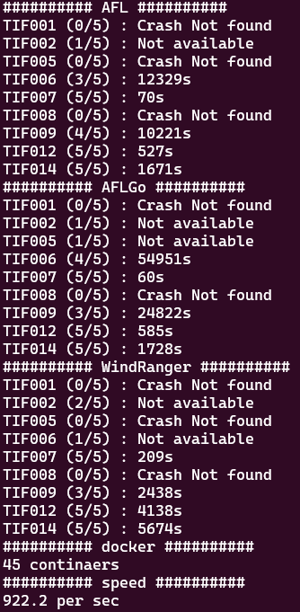

# Todo
- git commit 정리 > 완료
- binutils 2.26 cxxfilt > @@ 이 아닌 stdin으로 넣어주기

# Build
- 전반적으로 컴파일을 두번 해야 하는 fuzzer의 경우 (WindRanger, Beacon) linking 과정이 어려움 (debug도 오랜 시간 걸림)
## openssl
- AFL, AFLGo, WindRanger 모두 exec speed가 너무 느림 (50/sec 정도), x509는 조금 빠른편(500/sec)
- seed가 다른 bug에 비해 많은편(1500~2500개), dry_run에 5분정도 소요
- timeout seed
```sh
/fuzzer/script/run_fuzzer.sh AFL 86400 asn1 SSL001 '@@'
/fuzzer/script/run_fuzzer.sh AFL 86400 server SSL002 '@@'
/fuzzer/script/run_fuzzer.sh AFL 86400 x509 SSL009 '@@'
rm docker-setup/benchmark-project/openssl/seed-asn1/84b2799b61fd26fc84d6156d6de2eea708c3f7b9
rm docker-setup/benchmark-project/openssl/seed-asn1/9a3a5ec13a57886861b8697158963bb92c55371b
rm docker-setup/benchmark-project/openssl/seed-asn1/ab081ada8894cd62f2734335980ddcfa5d82c3eb
rm docker-setup/benchmark-project/openssl/seed-asn1/af39bf31a73cd17b276e9532f84fa560497a8146
rm docker-setup/benchmark-project/openssl/seed-asn1/afcab562fa0a5c81bdbf4e8ab7f206aa5011fa44
rm docker-setup/benchmark-project/openssl/seed-asn1/c46253a1d751696db332d4269b4775c6075238e4
rm docker-setup/benchmark-project/openssl/seed-asn1/dee7b2f77db8cc3053e178f8aec2a37090b45750
rm docker-setup/benchmark-project/openssl/seed-asn1/e396cbc946b93300a65c555660c4b2f8f024804f
rm docker-setup/benchmark-project/openssl/seed-asn1/e3b5f37178bd8147eb942990d314828b4cbf7313
rm docker-setup/benchmark-project/openssl/seed-asn1/e5ffdb029388da232cd5698dc7addb99069d25ab
rm docker-setup/benchmark-project/openssl/seed-asn1/e73193fb669e66957fed09967a1e530b97038c68
rm docker-setup/benchmark-project/openssl/seed-asn1/e88fbd25d3ce9f527d0a5233e39ce8cd4ecc0890
rm docker-setup/benchmark-project/openssl/seed-asn1/e9fd641bd29cdb14d72ecd856558a4d6495025ea
rm docker-setup/benchmark-project/openssl/seed-asn1/ff524a47e7f366ae1507aaac5c00cd0848d14e41

rm docker-setup/benchmark-project/openssl/seed-x509/d7feb971250783ab492a0927c39605cf87ab0c12
rm docker-setup/benchmark-project/openssl/seed-x509/ee3cb099a8e0440984e7fb2265b8ba2274b2976f
rm docker-setup/benchmark-project/openssl/seed-x509/f2a93c1c511098571c0cc9a24a495b3307956cc6
rm docker-setup/benchmark-project/openssl/seed-x509/f4a6f30f6dcf2b88f1cd11a01d715918ff83ed9c
```

- Beacon의 경우 되는것 같으나 precondInfer에 너무 많은 시간이 소요됨 (TOP)
``` sh
    PID     USER    PR  NI    VIRT    RES    SHR S  %CPU  %MEM     TIME+ COMMAND
    593545  root    20   0   20.4g  20.4g  14152 R 100.0   4.0  99:08.60 precondInfer
```
## php
- WindRanger 실패
``` sh
BIN_DIR="/magma/targets/php/repo/sapi/fuzzer"
LINKLIB="-lboost_context -licuio -licui18n -licuuc -lstdc++"
OBJECT="/magma/targets/php/repo/ext/standard/base64.o /magma/targets/php/repo/ext/standard/string.o"
/fuzzer/WindRanger/fuzz/afl-clang-fast -fno-common ./$BIN_NAME.ci.bc /magma_out/afl_driver.o /magma_out/magma.o $OBJECT $CFLAGS \
-ldl -pthread -ljpeg -llzma -lz -lm $LINKLIB -o ./$BIN_NAME-$BUG_ID
```
- Beacon의 sqlite3와 유사하게 실패 (linking 오류)

## BEACON sqlite3
- 다른 bug와 같이 build > linking ERROR
``` sh
    ADDITIONAL="-flto -fuse-ld=gold -Wl,-plugin-opt=save-temps" # compile중 .bc파일이 필요해서 추가한 flag
    export CFLAGS="$ADDITIONAL $BACKUP_CFLAGS"
    export CXXFLAGS="$ADDITIONAL $BACKUP_CXXFLAGS"
    ...
    build_project $1 || exit 1 # linking ERROR
```
- linking에 필요한 flag 모두 추가 > precondInfer : malformed target file -- exiting!
``` sh
    ln -s /usr/lib/x86_64-linux-gnu/libsqlite3.so.0 /usr/lib/x86_64-linux-gnu/libsqlite3.so
    ADDITIONAL="-flto -fuse-ld=gold -Wl,-plugin-opt=save-temps -lm -lz -ljpeg -llzma -ldl -pthread -lsqlite3"
    ...
    build_project $1 || exit 1 # PASS
    ...
    cp $BIN_DIR/$BIN_NAME.0.0.preopt.bc $BIN_NAME.bc || exit 1 # PASS
    /fuzzer/Beacon/precondInfer ./$BIN_NAME.bc --target-file=/benchmark/target/$BIN_NAME/$BUG_ID --join-bound=5 >precond_log 2>&1 #
```
- flag를 제거할 시 > .bc 파일이 없음
``` sh
    # ADDITIONAL="-flto -fuse-ld=gold -Wl,-plugin-opt=save-temps"
    export CFLAGS="$ADDITIONAL $BACKUP_CFLAGS"
    export CXXFLAGS="$ADDITIONAL $BACKUP_CXXFLAGS"
    ...
    build_project $1 || exit 1 # PASS
    ...
    cp $BIN_DIR/$BIN_NAME.0.0.preopt.bc $BIN_NAME.bc || exit 1 # ERROR .bc파일이 없음

```

# libtiff fuzzing

## AFL
- 800 exec/sec
```sh
cd /home/mjkim/dfuzz-windranger/scripts/
./parse_result.py AFL_libtiff
```
## AFLGo
- 800 exec/sec
```sh
cd /home/mjkim/dfuzz-windranger/scripts/
./parse_result.py AFLGo_libtiff
```
## WindRanger
- 550 exec/sec
```sh
cd /home/mjkim/dfuzz-windranger/scripts/
./parse_result.py WindRanger_libtiff
```

# cmdline
## triage.py
``` python
def run_vanlla(container, crash_file):
    program, bug, _ = container.split("-")
    for target in TARGETS :
        if program == target[0] and bug == target[1] :
            cmdline = target[2]
            break;
    cmdline = cmdline.replace("@@", crash_file)
    cmd = "python3 /triage/run_vanilla.py %s '%s'" % (container, cmdline) # single quote로 string으로 인식
    run_cmd_in_docker(TRIAGE_CONTAINER_NAME, cmd , check=True)
```
## run_vanilla.py
- file = args
``` python
    path = "/benchmark/bin/vanilla/%s-common"%program
    file = " /output/%s/crashes/%s"%(sys.argv[1], sys.argv[2]) # @@ result.tiff를 다시 argument로 나누어줌
    args = (path + file).split()
    process = subprocess.Popen(args, stdout=PIPE, stderr=PIPE)
```
## config.py
- permission 문제로 /box/result.tiff로 변경
``` python
TARGETS = [
    ("tiff_read_rgba_fuzzer", "TIF001", "@@"),
    ("tiff_read_rgba_fuzzer", "TIF002", "@@"),
    ("tiff_read_rgba_fuzzer", "TIF007", "@@"),
    ("tiff_read_rgba_fuzzer", "TIF008", "@@"),
    ("tiff_read_rgba_fuzzer", "TIF012", "@@"),
    ("tiff_read_rgba_fuzzer", "TIF014", "@@"),
    ("tiffcp", "TIF005", "@@ /box/result.tiff"),
    ("tiffcp", "TIF006", "@@ /box/result.tiff"),
    ("tiffcp", "TIF009", "@@ /box/result.tiff"),
]
```
## run_experiment.py
``` python
def worker(worker_id, fuzzer, timelimit, outdir):
    while True:
        try:
            (target, nth) = work_queue.get_nowait()
            prog, bug, cmdline = target
            cmdline = "'" + cmdline + "'" # single quote 추가하여 string으로 보냄
            container = "%s-%s-%d" % (prog, bug, nth)
            print("Worker #%d is running %s" % (worker_id, container))
            spawn_container(container, worker_id, outdir)
            run_fuzzing(container, fuzzer, timelimit, prog, bug, cmdline)
            cleanup_container(container)
        except queue.Empty:
            break
```
## fuzzer script
- $3, $4는 WindRanger에서 copy distance 를 위한 argument
``` sh
# run_fuzzer.sh
/fuzzer/script/run_$1.sh $2 "$5" $3 $4 # sting을 유지하여 전달

# run_AFL.sh
timeout $1 /fuzzer/AFL/afl-fuzz -m none -d -i seed -o /output -- ./target `echo $2` # echo를 통해 string > argument

# run_WindRanger.sh
cp /benchmark/bin/WindRanger/$3-$4-distance.txt ./distance.txt
cp /benchmark/bin/WindRanger/$3-$4-targets.txt ./targets.txt
cp /benchmark/bin/WindRanger/$3-$4-condition_info.txt ./condition_info.txt
timeout $1 /fuzzer/WindRanger/fuzz/afl-fuzz -m none -d -i seed -o /output ./target `echo $2`
```

## BEACON cmdline
- afl 2.52b, AFL 모두 정상 동작, BEACON이 문제인것으로 보임 (odd, check syntax!)
- 좌측부터 AFL 2.52b, AFL2.57b, BEACON


# Comments
