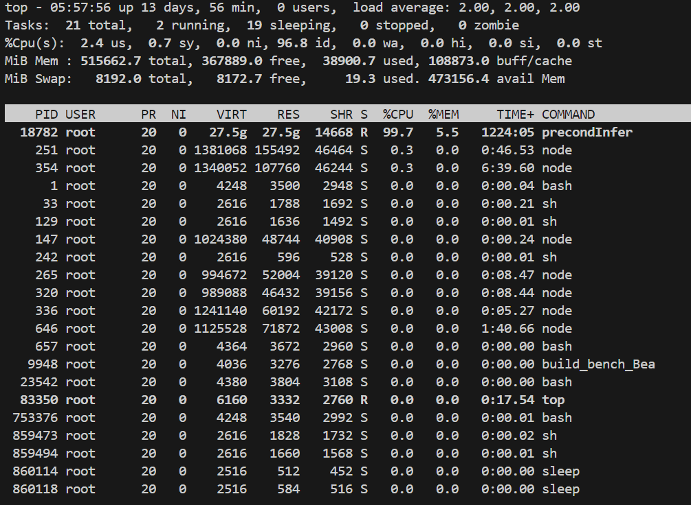

# Beacon openssl 24hr

# triage

- cp : run_vanilla에서 하기
- run_vailla.py 에서는 어떤 bug인지만 stdout으로 출력
- triage.py에서 log 기록, check_outdir에서 check_log 까지 합치기

# run_fuzzer.sh
- echo $2 > $2

# commit 정리
- commit 정리하기

# comment