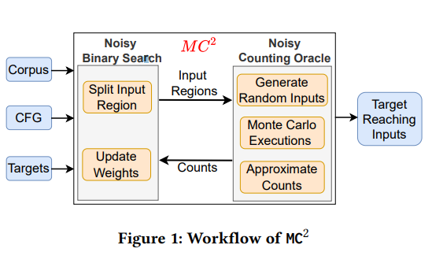
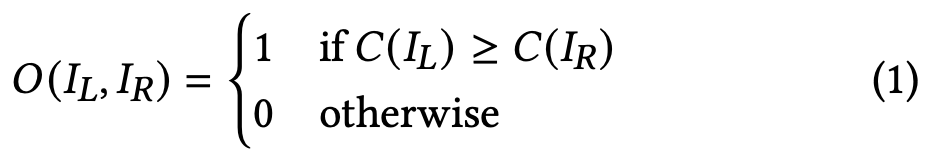
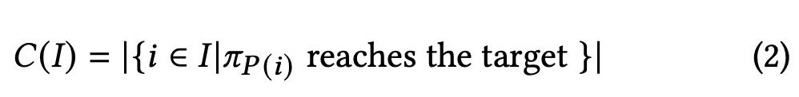
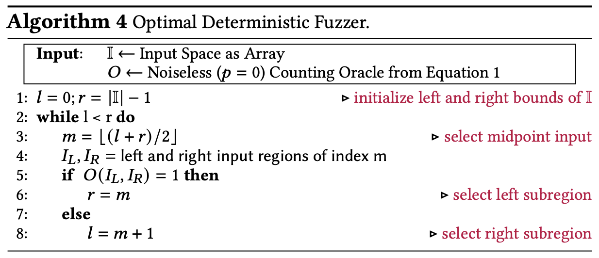
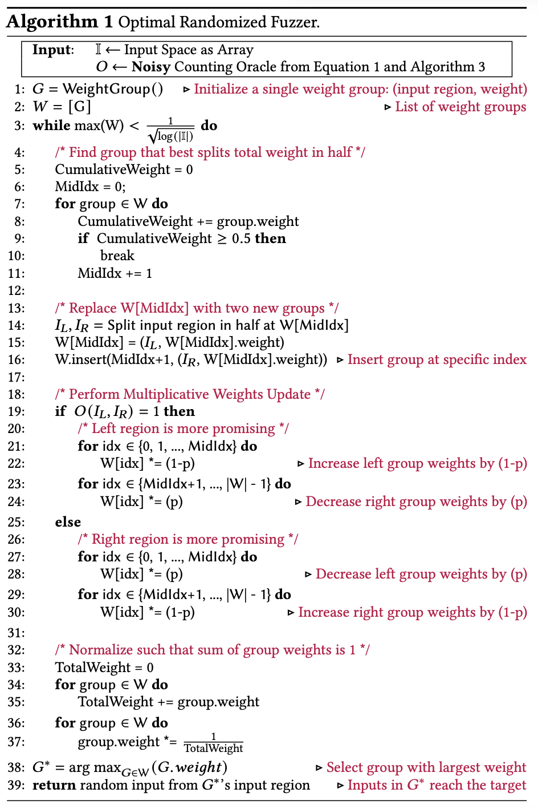
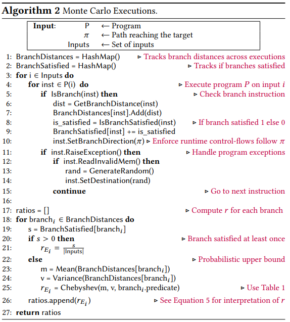
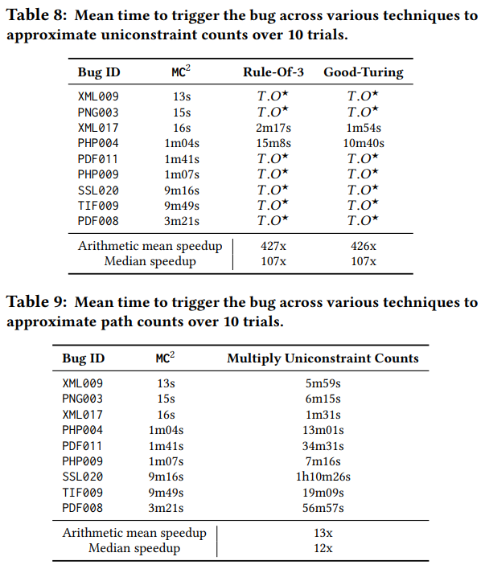

[MC2: Rigorous and Effeicient Directed Greybox Fuzzing](https://arxiv.org/pdf/2208.14530.pdf)
# Abstract
- 기존 DGF는 performance나 optimality에 대한 이론적 분석을 제공하지 않음
- DGF를 oracle-guided serach probrem으로 설정하는 complexity-theoritic framwork를 제시
- input space에 대한 feedback (ex distance)를 oracle에게 물어본다.
- target에 도달하는 input을 찾기 위한 oracle query의 수를 performance metric으로 사용
- 가능한 input의 수의 log scale에 해당하는 알고리즘을 구현하고 최적임을 증명
- *MC2*에 이를 구현
# 1. Introduction
- 기존에는 CFG distance, branch constraint distance을 사용
- 이는 직관이나 경험적 증거 (학문적 분석이 없음)
- computational complexitytheoretic framework 제시
# 1.1. Complexity-Theoretic Framework
- DGF의 complexity-theoretic formulation를 제시
- instrumentation type및 fuzzing algorithm 에 대한 세부 사항을 추상화 하여 framwork로 전환
- DGF -> oracle-guided serach problem으로 모델링
- oracle은 serach space에 대한 정보를 fuzzing algorithm에게 알려주어 target reached input을 찾음
- 프로그램의 동작이나 input/ouput 분포에 대한 가정을 하지 않음
- oralce이 쿼리당 크지만 일정한 양의 정보를 가진 내용을 반환하도록함
## 1.2. Execution Complexity
- target site에 도달할때까지 oralce에게 보내는 쿼리의 수로 performance 를 측정
- 우리의 complexity metric은 oracle을 통해 quantum algorithm의 quantum 부분과 classical part를 분리함

- query complexity : 어떤 알고리즘이 주어진 문제를 해결하기 위하여 얼마나 많은은 질문을 해야 하는가 > 이를 이용하여 알고리즘의 하한선을 정할 수 있고 얼마나 효율적인지 정량적으로 평가할 수 있다.

[On Quantum Versus Classical Query Complexity](https://eccc.weizmann.ac.il/report/2021/115/)

> 단 하나도 이해하지 못하였다.

[Understanding Quantum Algorithms via Query Complexity](https://eta.impa.br/dl/043.pdf)

> 양자 알고리즘이 무엇인지 설명

- feedback information에 대한 lower bound를 탐구하여 이를 최대한 활용하는 adaptive algorithm을 설계하는 방법을 사용함

## 1.3. An Optimal Fuzzing Algorithm
- *noisy counting oracle*을 도입함
- 이는 두 input space를 에서 각 영역에서 target site로 도달하는 입력을 대략적으로 계산하고 더 높은 수를 가진 영역이 더 유망한것으로 판단하고 이를 반환한다. (p<0.5의 확률로 거짓을 반환하는 Monte Carlo counting algorithm)

시간 복잡도 : $O({{log(N)} \over {(0.5-p)^2}})$ > 이는 다른 알고리즘으로 계선될 수 없음을 증명

- 우리의 fuzzing algorithm은 더 높은 수의 영역을 선택하고 Binary search 로 유망한 영역을 좁혀가는 counting oracle을 사용
- 하지만 어떤 input space가 더 큰 수를 가지고 있는지 확신할 수 없기 때문에 이러한 noise에 강해야 한다.
- 따라서 noisy binary search algorithm을 사용하였다.
- 각 space에 가중치 집합을 사용하여 알고리즘의 정확도를 나타낸다. > 즉 원하는 input이 해당 영역에 존재할 가능성을 나타냄
- 알고리즘은 각 oracle query에 기반하여 유망한 영역의 가중치를 반복적으로 증가시키며 유망한 input sapce를 좁혀나간다.

## 1.4. Approximate Counting with Monte Carlo
-  noisy counting oracle을 구현하기위하여 Monte Carlo algorithm 사용
- Monte Carlo random sampling은 실제 값이 0이 아닌 작은 수이더라도 대부분의 근사 계산이 0이 될 수 있다.
- input space에서 target reach input의 수를 계산하는 것도 매우 작은 확률이기에 0으로 계산된다.
- 이 문제를 극복하기 위해 우리는 목표에 도달할 수 있는 input을 찾지 못하더라도 더 높은 확신을 가지고 계산에 대한 상한선을 계산할 수 있다는것을 관찰하였다.
## 1.5. Concentration Bounds
- concentration bound를 이용함 > 평균과 분산에 기반하여 랜덤 함수가 특정 값을 가질 확률의 상한을 정하는 방법
- branch constraint의 distance를 기반으로 모델링 하면 무작위로 선택된 입력으로 평균과 분산을 계산하면 이 branch를 만족할 가능성에 대한 상한을 구할 수 있다.
하지만 이는 over approximate를 일으킬 수 있다. > 이를 방지하기 위하여 단일 oracle query를 수행할때 어떤 input에 대해서도 만족된적 없는 branch에 대해서만 상한을 적용한다. 나머지에 대해서는 branch를 만족시키는 input의 수와 총 입력수의 경험직 비율을 사용함
## 1.6. Counting along Multiple Branches
- 각 branch를 만족사는 input의 수를 근사하고 이를 통해 목표에 도달하는 입력에 수에 대한 추정치를 얻는다. [2.4절](#24-noisy-counting-oracle-through-monte-carlo-counting)
- Monte Carlo Executionn : runtime에 control flow를 수정하여 외부 branch constraint를 만족하지 않더라도 내부 branch에 방문하도록 함
- 이를 통해 소수의 프로그램 실행으로 근사할 수 있음
- MC2(Monte Carlo Counting)을 구현함

## 1.7. contributions
- DGF를 oracle-guided serach problem으로 정의하는 complexity-theoretic framework를 소개, 알고리즘의 성능을 측정하는 metric인 execution complexity를 도입함
- 가능한 input의 수에 logarithmic한 execution complexity를 갖는 DGF를 설계하였다.
- noisy counting oracle을 구현하기 위한 Monte Carlo algorithm을 구현

# 2. Methodology
## 2.1. Terminology and Notation
- fuzzer = DGF
- P = target program
- I = 유한한 input space 
- |·| = cardinality
### 2.1.1. Input Region
- WLOG. target program's input space = hyperrectangle I = [0,255]^d, d는 input byte
### 2.1.2. Control Flow Graph
- CFG=(V, E), V = BB, E = control-flow transition (ex branch)
- path $\pi$ = finite sequence of edge int CFG $\pi$ : $E_0 \rightarrow  E_1 \rightarrow ... \rightarrow E_k $
### 2.1.3. Branch Constraint
- CFG에서 각 edge는 branch constraint에 해당함
- $c:I\rightarrow{0,1}$
- d(i) : branch distance
>Constraint c(i) := d(i) ⊳⊲ 0

>Predicate ⊳⊲ := {==,<,<=,>,>=}

>Input i := [$i_1, i_2, ..., i_d$ ]

## 2.2. A Framework for Directed Greybox Fuzzing
- 실험적인 측정은 이상적인 fuzzer에 얼마나 가까운지 알려주지 못함
- program execution 횟수 측면에서 이상적인 fuzzer의 성능에 대한 하한선을 추론하기 위한 complexity theoretic framework 소개

### 2.2.1. Fuzzing as Oracle-Guided Search
- 우리의 framwork는 fuzzer가 oracle에 query 하여 input space I 에 대한 정보를 학습
- oracle $ O : I \rightarrow \{0,1\}^c$ , c bit의일정한 크기의 정보를 반환한다. 
- [2.3](#23-optimal-directed-fuzzer-with-noisy-counting-oracle)절에서 확인할 수 있듯이 fuzzer는 input의 크기를 $1\over{2^c}$로 줄일 수 있음
- 실제 fuzzer들은 simbolic/concolic execution이 모든 path constraint를 수집하고 SMT를 호출하는것과 달리 최소한의 execution overhead를 위하여 ligth-weight 한다.
- 이와 유사한 맥락으로 c를 상수로 정한것은 적합하다.
- 이 framwork를 일반적으로 사용하기 위하여 target program의 행동이나 input type에 대한 가정 없이 distribution-free하게 작동한다. 또한 fuzzer가 프로그램에 대한 사전 지식 없이 oracle query를 통해 정보를 얻는다고 가정한다.
### 2.2.2. Problem Definition
- DGF를 oracle-guided search problem으로 정의함
- $P, CFG, I, E_T, O:I \rightarrow \{0.1\}^c$를 이용하여 $E_T$에 도달하는 $i\in I$를 찾아야 함 
### 2.2.3. Execution Complexity
- fuzzer의 성능을 측정하기 위하여 search problem을 해결하기 위한 oracle의 query의 수를 분석한다.
- oracle query의 수는 program execution 수에 직접 mapping 되기 때문에 fuzzer의 성능을 execution complexity로 정의한다.
- 이를 이용하여 이상적인 fuzzer에 대해 추론할 수 있다. 즉 어떤 fuzzer의 성능에 대한 하한선을 제공한다.
  
#### Theorem 2.1 (Lower Bound for Any Fuzzing Algorithm)
query당 C bit의 정보를 드러내는 oracle이 주어졌을때 fuzzing algorithm도 N크기의 input space에서 목표에 도달하는 입력을 찾기 위해서 $\Omega(log(N))$의 execution complexity가 필요하다.
### 2.2.4. Greybox vs Blackbox Oracle
- Blackbox oracle을 이용하여 lower bound에 도달할 수 없다. 여기서 oracle query는 주어진 목표가 도달했는지 여부를 나타내는 bool value만 출력한다. 즉 fuzzer가 고려하는 input의 수를 1만큼 감소시킨다. 즉 O(N)의 실행 복잡도를 갖는다.
## 2.3. Optimal Directed Fuzzer with Noisy Counting Oracle
- noisy counting oracle : 임의의 두 input sapce중에서 target에 도달하는 input의 수를 대략적으로 계산하여 어느 영역이 더 유망하는지 식별
- 이상적이 환경에서 noise가 없는 counting oracle을 설명한 후 noisy가 있는것을 사용하는 현실적인 설정으로 확장
### 2.3.1. Noisy Counting Oracle
- noisy counting oracle : 목표에 도달하는 input이 더 많은 space에 대해 c=1 bit의 정보를 반환
- p<0.5의 확률로 잘못된 답을 반환한다고 가정, input space $I_L, I_R$에 대해 다음 공식을 계산
- C(I) = input space I에 속한 input중 target에 도달한 인풋

### 2.3.2. Optimal Deterministic Fuzzer
- 이상적인 환경에서 noise가 없는 (p=0) counting oracle을 사용하여 최적의 execution complexity를 달성하는 결정론적 fuzzing algorithm을 제시한다.
- binary search를 이용하여 counting oracle을 사용
- input space가 여러 바이트를 포함하기 때문에 반으로 나눈다는것이 애매할 수 있음 (ex [0, 255]*[0, 255]의 2byte의 경우 수직, 수평으로 나눌 수 있음)
- 이를 해결하기 위하여 flatting을 사용함 > [(0, 0), (0, 1), ..., (0, 255), (1,0), (1, 1), ... (255, 255)]
- 이 알고리즘은 O(log(N))의 execution complexity를 가지며 lower bound에 해당

### 2.3.3. Optimal Randomized Fuzzer
- 위의 결정론적 알고리즘은 이론적 lower bound를 달성하지만 noise가 없는 counting oralce을 구현하는것이 효율적이지 않음
- noisy binary search는 비교가 믿을 수 없다는 가정 하에 binary search를 수행하는 알고리즘을 사용
- 높은 확률로 성공하되 소수의 query를 요구하는 알고리즘을 개발하는것이 중요하다.
- 기대 값은 모든 잠재적인 행동을 고려하며 input 분포에 대한 가정을 하지 않는다.
- 일정 확률로 성공할 수 있는 알고리즘도 여러번 실행된다면 지수적으로 감소하여 작은 값이 된다.
- 우리는 *Ben-Or*이 제안한 noisy binary search를 사용하였다.

#### Theorem 2.2 (Algorithm 1 Execution Complexity)
쿼리당 p<0.5의 확률로 식패하는 c=1 bit를 반환하는 noisy counting oracle의 경우 적어도 1-𝛿 확률로 성공하는 O((1-𝛿)*$log(N)\over{(0.5-p^2)}$)의 execution complexity를 갖는다.
#### Theorem 2.3 (Algorithm 1 Optimality)
위의 조건을 만족하는 어떤 fuzzing algorithm도 동일한 execution complexity를 갖는다.

- query에 따라서 더 많은 input space에 가중치 (1-p)를 곱함, 적은 영역에는 p를 곱합 > 이후 합이 1이되도록 normalization
- 가중치가 큰 유망한 input space내에서 분할을 우선시함

이 알고리즘의 특징

1. noisy counting oracle은 p가 증가함에 지수적이 아닌 2차항으로 저하 된다. > 이는 theorem2.3 에서 보였듯이 개선될 수 없다.
2. input space I에 대해 공간복잡도가  O(log(N)이다. 
## 2.4. Noisy Counting Oracle through Monte Carlo Counting
- Monte Carlo counting을 기반으로 noisy counting oracle을 설계함
- graph structure을 활용하여 개별 경로의 합으로 분해한다. 또한 개별 경로 계산을 효율적으로 근사한다.
### 2.4.1. Monte Carlo Counting
- 일반적인 Monte Carlo counting을 사용한다면 대부분의 영역에 대해 0으로 계산된다.
- |I| >> C(I)이기 때문이다.
- 0으로 추정한 계산을 사용한다면 fuzzer의 성능이 크게 저하될것이다.
### 2.4.2. Exploiting CFG Structure for Counting
- CFG의 graph structure를 이용한다면 C(I)를 개별 경로의 합으로 분해할 수 있다.
  

- 프로그램에서 경로의 수가 많기 때문에 이 합을 정확하게 계산할 수 없지만 효율적으로 근사 가능하다.
- 개별 경로에 대한 count로 근사된 count을 추측할 수 있다.

Efficiently Approximating Individual Path Counts : uniconstraint count를 사용한다. 또한 계산이 어려운 두가지 우형의 uniconstraint count에 대해 설명한다.

### 2.4.3. Approximating Path Counts
- $C_\pi(I)$를 계산하고자 함
- 이는 여러 단일 brach constraint를 만족하는 input set $I_{E_i}$의 교집합

- 즉 최소 count를 통하여 upper bound를 정할 수 있음
### 2.4.4. Uniconstraint Counts
- $C(I_{E_i})$는 $E_i$의 단일 branch constraint를 만족하는 input의 수를 의미 > uniconstraint count 라고 부름
- Monte Carlo counting을 통해 uniconstraint count를 근사할 수 있음 > 단일 branch constraint가 여러 branch constraint의 교집합에 비해 count가 더 클 가능성이 높기 때문

r : I를 무작위로 섞어서 추출한 부분 집합에서 $E_i$ 분기 제약을 만족하는 비율
### 2.4.5. Challenges in Approximating Uniconstraint Counts
- uniconstraint counting은 naive Monte Carlo counting을으로 근사하기 쉽지만 어려운 두가지 유형이 존재한다.

1. 일부 single branch constraint는 소수의 execution에서 잘못 평가될 수 있다.C1
2. 중첩된 branch에서 평가될 수 없다.

- naive한 MCC는 이와 같은 경우 count = 0 으로 판단
- 이를 처리하기 위하여 program execution을 늘릴 수 있지만 2.2절에서 언급과 같이 일정수의 프로그램을 내부적으로 실행한다. > 우리가 사전에 얼마나 많은 수의 실행이 필요한지 알 수 없기에 불가능
### 2.4.6. C1: Handling Evaluated but Unsatisifed Branches
- Cheby-shev inequality를 사용하여 concentration bound를 사용하여 uniconstraint counts에 대한 확률적 upper bound를 계산함
- 프로그램 실행 동안 branch distance의 평균, 분산을 통하여 branch constraint를 만족시킬 확률 r을 설정함
- uniconstraint count 자체가 upper bound이기 때문에 Chebt-shev에서도 상한을 사용하는것은 괜찮음

- branch constraint에 따라 r을 계산하는 방법 > 오차가 실행 횟수 k에 대해 $1\over{e^k}$로 감소하기 때문에 유효한 근사
- 이러한 상한은 true count에서 overapproximation error를 발생할 수 있으므로 한번도 만족되지 않는 분기에서만 사용
- 그렇지 않다면 branch를 만족하는 input의 수와 총 input의 수 사이의 비율을 사용

### 2.4.7. C2: Handling Unevaluated Nested Branches
- 외부의 constraint를 만족하지 않더라도 내부의 branch를 방문하고 평가하도록 하는 *Monte Carlo Execution* 
- 한번의 실행으로 모든 branch를 방문하여 평가함 > 적은 실행으로 모든 분기의 uniconstraint counts를 근사 가능
- Monte Carlo Execution은 runtime에 control-flow를 수정하여 input과 관계없이 모든 분기를 방문하도록 함
- input이 $\pi$의 모든 branch constraint를 만족하는 경우 > 일반적인 실행
- branch constraint중 하나라도 만족하지 않는 경우 원래 path에서 벗어남
- 항상 sequential odering of compution을 유지
- 원하는 branch를 방문하는것을 보장하기 위하여 program exception을 조정해야함

> input이 array index를 조절한다고 하였을때 범위 밖의 메모리에 접근할 수 있음 > instruction pointer를 진행시키고 읽어오는 값을 무작위 값으로 설정한다.

- 이와 같은 설계는 읽어오는 값에 대한 집합ㅇ르 증가시키지만 count에 대한 상한을 사용하기 때문에 괜찮다.
- memory read, write간의 의존성을 일어버리지만 overhead가 낮다. [4.3절](#43-rq3-performance-overhead)

### 2.4.8. Efficiently Approximating The Summation
- 이제까지는 target으로의 단일 path만 고려 > 각 path의 count의 합 : formula 3
- path가 많은 경우 oracle query마다 각 path에 대한 계산은 어려움
- path별로 더하는 것이 아니라 가장 큰 count로 근사함 > 가장 큰 count를 갖는 경로를 선택하는 것은 다른 path에 비해 합을 가장 잘 보존함
- 하지만 우리는 어떤 path가 가장 큰 count를 갖는지 사전에 알 수 없기 때문에 초기에 각 경로의 개별 count를 근사하는 일부 계산을 수행 > 하지만 근사 오류로 인한 불확실성 존재

- 불확실성을 포착하기 위하여 multi-armed bandit literature에서 사용한 소수의 대안 경로를 탐색하기 위한 수정 계수 $\sqrt{log(t)\over{T_\pi}}$ 를 사용 > $T_\pi$는 t번째 query 이전에 $\pi$가 선택된 횟수를 나타냄
- PathCache라고 불리는 캐시 구조를 이용하여 가장 최근의 count 정보를 추적
# 3. Implementation
## 3.1. Toolchain
- algorithm 1,2,3은 C언어로 구현함 > LLVM instrumentation, signal handler를 사용하여 algorithm 2 처리
- *AFLGo*와 같은 forkserver 사용
- algorithm 3:19에서 k의 값을 5로 설정 (1/e^5 < 0.01) > algorithm 1의 p값을 0.01 

## 3.2. Reducing Loop Overheads
- loop를 사용하면 동일한 branch를 여러번 방문함 > 이를 줄이기 위하여 방문간 정보를 공유함
- 단일 MCE에서 branch가 여러번 방문된다면 각 방문에서 branch distance는 평균과 분산에 기여함 (streaming mean)
- 각 branch마다 count 정보를 추가하여 runtime에 여러 방문에 걸친 control-flow를 강제한다.
## 3.3. Assigning A Total Order
- input space를 사전 순으로 분할함 > 이는 input space의 어떤 영역이던 counts를 변경할 가능성이 동등하다는 가정
- 실제 프로그램에서는 동등하지 않다는 실험적 증거로 인해 유효하지 않음
- 따라서 사전순이 아닌 noisy counting oracle에서 관찰된 program execution을 기반으로 순서를 할당함
- byte index set으로 시작하여 2개의 집합으로 분할하고 각 부분집합에 대해 index에 대한 byte값을 변형하며 MCE를 수행
- count가 변경되거나 단일 byte index가 남을때까지 이를 반복
- 각 byte index가 count를 얼마나 증가시키는지에 따라 순서를 할당함

> 부록 B : 사전순에 비해서 평균 210, 중앙값 54배 빠름

## 3.4. Preprocessing
- 목표에 도달하는 모든 path set을 구해야함 > 실제 CFG에서 너무 비싼 runtime을 요구
- path의 subset을 생성하는 알고리즘은 반복된 edge의 경로를 생성하지 않아서 loop 처리불가
- 우리는 초기 seed corpus를 사용하여 path set을 bootstrap함 
- 목표에 가까운 seed를 실행하고 해당 path를 따라 branch를 무작위로 변형하여 목표에 도달하는 path set을 생성함
- path가 반전된 후의 프로그램 실행을 기반으로 path를 생성함
- 다른 DGF와 MC2의 전처리 과정에 걸리는 시간이 비슷함
## 3.5. Randomly Generating Inputs
- input space를 d차원 hyper rectangle로 표현함, d개의 구간으로 인코딩 되며 각 구간은 차원당 input의 lower, upper bound를 나타냄
- 우리는 hyper rectangle에서 k개의 input을 무작위로 선택하기 위하여 d개의 정수를 무작위로 생성
- 초기 시드가 hyper rectangle에 속하는 경우 initial seed corpus 정보를 더 잘 활용하기 위하여 k개의 입력중 일부로 사용함
- seed corpus를 추적하는것이 아닌 group = (hyper rectangle, weight) 튜플을 추적
-  
# 4. Evaluation
1. 다른 최신 DGF와 비교
2. 실제 버그를 찾을 수 있는가?
3. 성능 오버헤드
4. design choice가 정당한가?
## 4.1. RQ1: Fuzzers Comparison
- benchmark : magma, AFLGo의 Fuzzer Test suite
- baseline : AFLGo, ParmeSan
- setup : Magma = TTE, Fuzzer Test suite : TTT, timeout = 6hr, 20회

### 4.1.1. Magma Results

### 4.1.2. Case Study

- MC2에서만 발견된 PNG001
- `width=0x55555555`, `channels=3`일때 `row_factor`가 0이 되어서 divide by zero를 발생
- AFLGo는 해당 특정 값을 생성할 확률이 낮음
- ParmeSan은 중첩된 조건 (6, 7) 행을 효과적으로 처리하지 못함 
### 4.1.3. Fuzzer Test Suite Results

> Result : 평균 134, 중앙값 38배 성능 향상, AFLGo(12)보다 많은 28개의 버그를 찾음
## 4.2. RQ2: Bug Finding

- Undefined Behavior Sanitizer를 사용하여 target but를 식별
- AFL-CMin으로 중복 제거
> Result : 49개의 새로운 bug 찾음

## 4.3. RQ3: Performance Overhead

- Monte Carlo Execution의 performance overhead를 측정함
- MC2의 데이터 구조 )PathCache)의 메모리 사용량 추적

> Result : instrumentatio에서 30% runtime, 4% memory, native execution에 비해 105% runtime, 16% memory overhead
## 4.4. RQ4: Design Choices 

- 각 design choice의 영향을 측정
### 4.4.1 Chebyshev’s Inequality for Uniconstraint Counts
- Rule-Of-3, Good-Turing을 적용하여 실험 > 결과 Table 8 > MC2의 Chebyshev's inequality는 효과적

### 4.4.2 Minimum Uniconstraint Count
- 최소 uniconstraint count  vs 모든 constraint의 곱 > 결과 table 9
### 4.4.3 Path Selection

-  [가장 큰 count를 갖는 path를 선택할때](#248-efficiently-approximating-the-summation) 의 multi-armed bandit이 아닌 greedy, epsilon-greedy를 적용하여 비교 > 결과 table 10

# 5. Related Work
## 5.1. Approximate Counting
- SAT formula의 해를 counting하는 것은 많은 곳에서 사용된다.
- Approximat Counting은 Monte Carlo 뿐만 아니라 많은 분야에서 사용됨
- 최근엔 CGF를 위한 seed scheduling에서도 사용됨, graph centrality를 사용하여 실행 가능한 edge의 수를 근사함
- MC2(DGF)를 CGF로 일반화 할 연구 필요
## 5.2. Directed Greybox Fuzzing
- MC2는 distance가 아닌 noisy binary seach과 aproximate counting을 통하여 guide함
