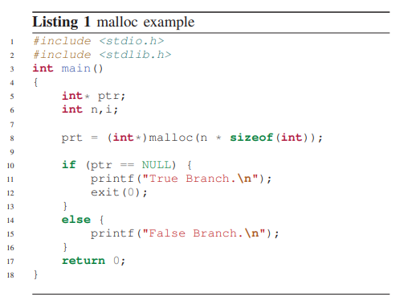
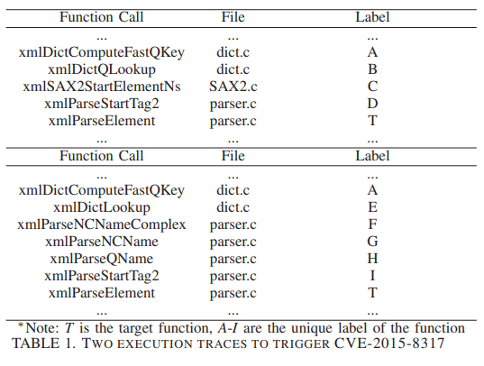
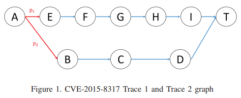

[Guiding Directed Fuzzing with Feasibility](https://ieeexplore.ieee.org/stamp/stamp.jsp?tp=&arnumber=10190644&tag=1)
# 0. Abstract
- 기존 distance calculation은 feasibility-unware
- 예로 if문의 두 분기가 같은 feasibility를 가진다고 가정 > DGF의 편향
- fesibility-aware DGF *AFLGopher* 제시
- feasibility를 인식한는 distance calculation을 수행함
- 새로운 classification method를 이용하여 제한적인 trace를 기반으로 모든 branch의 gasibility를 예측하여 runtime중 updqte를 통해 정밀도를 개선한다.
# 1. Introduction
- 기존 DGF의 근본적인 문제는 distance calculation이 feasibility를 인식하지 못한다는것

- 대부분의 경우 malloc은 NULL을 반환하지 않음 > 두 branch에 동일한 feasibility를 할당하는 것은 distance calculate에 편향을 줌
- if 이외에도 indirect-call, return 등 ougoing edge가 있는 statment를 branch statment라고 하겠다.
- *AFLGopher* light-weight instrumentation, dynamical analysis로 control flow branch의 feasibility를 추론함
- 여러개의 outgoing edge를 갖는 statement에 대한 feasibility 예측을 수행 (return은 고려하지 않고 if, switch, indirect-call을 고려)

## 1.1. Challenge
1. indirect-call이 있는 경우 target function을 모르는 상황에서 정확한 grobal CFG 필요 > MLTA (Multi-Layer Type Analysis) 사용
2. branch의 feasibility를 계산하기 위해 ground-truth data(dynamic analysis로 수집된 trace)가 필요함 > 힘들기 때문에 제한된 trace를 기반으로 모든 branch의 feasibility를 예측

## 1.2. Solution
1. 제한된 trace를 해결하기 위한 새로운 classification method > classification을 통하여 if, indirect-call이 trace에 없더라도 동일한 class의 다른 statement를 기반으로 branch의 feasibility를 예측
2. runtime fesibility-updating mechanism >  DGF가 진행하며 더 많은 trace를 얻고 이를 통해 예측의 정밀도 향상 > 효율적으로 처리하기 위하여 feasibility가 정확하지 않을때만 update를 하는 error monitor mechanism을 사용

## 1.3. contribution
- feasibility-aware distance calculation을 사용하는 DF 제안
- feasibility 예측의 challenge를 해결하는 clasification method, runtime fesibility-update mechanism으로 성능 개선
- 이를 이용하여 *AFLGopher* 구현

# 2. Motivation
- `CVE-2015-8317`

- AFLGo 에서 T1 = 1.6 < T2 = 2.43
- AFLGo에서 p1, p2 거리를 동일하게 계산함 > 실제 실행해서는 2번째 trace가 target에 도달할 확률이 더 높음 > 거리에 가중치를 주어야함

# 3. Approach
## 3.1. Overview

## 3.2. Branch Statement Analysis
### 3.2.1. Branch Statement Extraction
### 3.2.2. Branch Statement Grouping
## 3.3. Tracer
## 3.4. Feasibility Prediction
### 3.4.1. Branch Statement Feasibility Prediction
### 3.4.2. Indirect-call Target Feasibility Prediction
### 3.4.3. Distance Calculation
#### BB level
#### Function level
#### Distance table
## 3.5. Fuzzer Updating
#### Weights on CFG
#### Weights on CG
### 3.5.1. Error Monitor

# 6. Conclusion
