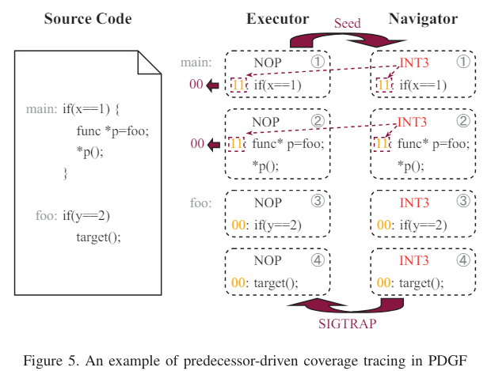

[Predecessor-aware Directed Greybox Fuzzing](https://csdl-downloads.ieeecomputer.org/proceedings/sp/2024/3130/00/313000a040.pdf?Expires=1714452425&Policy=eyJTdGF0ZW1lbnQiOlt7IlJlc291cmNlIjoiaHR0cHM6Ly9jc2RsLWRvd25sb2Fkcy5pZWVlY29tcHV0ZXIub3JnL3Byb2NlZWRpbmdzL3NwLzIwMjQvMzEzMC8wMC8zMTMwMDBhMDQwLnBkZiIsIkNvbmRpdGlvbiI6eyJEYXRlTGVzc1RoYW4iOnsiQVdTOkVwb2NoVGltZSI6MTcxNDQ1MjQyNX19fV19&Signature=CL4CF5f2c~oBEB1o6ZM6kOGEDFJ0WxSutK~Oadii33IGRHRN2uqaT6F0G14EP7bhihfOb0j9ermE-gCInPWbO-CJ~uGRbrIToPQ-x55NNQMJ8n785e1yh2EEJV8wG~d8OihQNbWcPSCIpV-dgcWad8wJDIkYKkgdHG3TkDxaOhdCa5v2zU-szAe2pTjzpuKJQLGH9iXDJKRuY3HCraCliYMF6G-RAMjibJelfeq67bhpwICiUYGcxdAzP~deJifgPZYoE-Fvaykeo74e-VM9VfDeEf5qUzrOvxYIXSpc6BU~qZq4D3hp6NPnvRqzTnHGaVMjHThKXDBzCkKrS4YWYg__&Key-Pair-Id=K12PMWTCQBDMDT)

[source code는 24.6에 공개 예정](https://github.com/SEU-SSL/PDGF)
# 0. abstract
- DGF = Static analysis + Dynamical execution
- heavyweight : target site를 식별하고 접근
- Incomplete : indirect call, insufficient path
- 이 논문은 DGF를 path-searching problem으로 보고 prodecessor-aware DGF 를 제안
- 주어진 프로그램을 prodecessor, non-predecessor 영역으로 나누고 초기에 ligth weight analysis를 통하여 predecessor set을 만들고 dynamic execution을 통하여 보강함
- regional maturity : predecessor의 coverage rate
- 이를 이용하여 simulated annealing-based power scheduling, seed selection, seed mutation
# 1. Introduction
> DGF의 문제
1. target site를 보정하는데 많은 노력이 노력이 필요, fuzzer는 이를 runtime에 다시 계산해야함, exploration-explotitation 에서 exploration에 많은 시간을 할당하는데 직접적으로 target reachable path를 발견하는데 도움이 되지 않음
2. static analysis는 indirect call이 있는 경우 program의 정보를 모두 알 수 없음 > reachable path에 이와 같은 상황이 발생하면 DGF의 성능에 크게 영향을 미침
3. 기존의 방법은 target site에 도달하는지와 얼마나 빨리 도달하는지에 관심을 두어 어떻게 도달하는지 (path diversity)에 대해 고려하지 않음, 이는 software testing의 completeness와 관련있음

- target으로의 feasible path는 iCFG의 subgraph로 구성됨 > 이 path의 모든 BB, edge는 target site의 predecessor로 간주 > predecessor를 식별하는 것은 excution path를 exploring하는 것과 같음
- 관련 없는 code branch를 제외하는 기존의 pruning과는 다르게 predecessor만 포함시킴 (빼는게 아니라 추가하는것) /// 기술의 불완전성 측면에서 확실한걸 제거하는게 확실한걸 추가하는거보다 정확하지 않나?
- predecessor area를 DGF에서 CGF문제로 변환하여 더 효율적인 resource 할당 가능
> PDGF scheme
1. [lightweight static analysis를 사용하여 initial predecessor BB를 식별, instrumentation에서 이에 ID를 label함](#32-predecessor-identification)
2. [2가지 binary (executor, navigator)를 사용](#33-predecessor-driven-coverage-tracing)
- executor에서 non-predecessor->predecessor 로의 새로운 edge가 발견되면 navigator에서 이를 predecessor로 labeling 
- 즉 predecessor set은 static, dynamic하게 구성됨
3. [fuzzing을 효율적으로 guide하기 위하여 precessor의 coverage rate를 나타내는 regional maturity 개념 도입](#34-fuzzing-based-on-regional-maturity)
- 이를 이용하여 seed selection, power scheduling, seed mutation을 포함한 fuzzing pipeline 구성
# 2. Background - problem and challenge
## 2.1. Heavyweight
- target site를 보정하기위한 노력이 필요함
- PUT의 충분한 정보를 추출하기위한 static analysis 필요, distance based 에서는 target site의 거리를 계산하고 instrumentation 해야함
- pruning은 BB의 reachability를 결정하기 위한 세밀한 분석이 필요함 (Beacon : avconv 을 위한 static analysis에 4시간 이상 사용)
- dynamic execution 또한 heavy maintenance, low-quality seed에 대한 문제가 있음 > rumtime에 target에 도달하지 못하는 대다수의 seed를 포함한 distance calculation을 수행함
## 2.2. Incomplete
- static, dynamic 관점에서 incomplete 문제가 존재함
- indirect call을 정확하게 분석할 수 없음 : 전체 호출의 40% 이상인 경우도 있지만 SA에서는 인식되지 않음
- path diversity 또한 고려되지 않기 때문에 불완전한 patch의 가능성이 존재함 > 즉 target site로 향하는 모든 feasible path에 대한 test가 수행되어야 함
- predecessors는 모든 feasible path를 가지고 있기에 DGF를 predecessor의 path seraching problem으로 formulated함
> 3가지 문제점
1. runtime에 predecessor edge를 어떻게 인식할까
- predecessor을 얻는 과정속에서도 indirect call과 같은 문제로 인해 전체 set을 구하기 힘듬
2. acceptable cost로 완전한 predecessor set을 구하는 방법
3. predecessor set을 이용하여 효율적이게 target site로 guide하는 방법은 무엇일까?
# 3. Predecessor-aware DGF

## 3.1. Framework
- target reachable area를 식별하여 CGF를 사용하려고 함
- PDGF는 이를 위해 DGF 위에 predecessor-aware facilities를 도입
> PDGF의 과정
1. static analysis
- initial predecessor BB를 인식하고 ID의 첫 2bit를 이용하여 labeling
- predecessor의 작은 부분만 제공
2. predecessor-driven coverage tracing
- executor : 기존 binary
- navigator : 각 BB의 싲가부분에 software interrupt를 삽입함
- executor가 bitmap을 통해 predecessor BB에서 끝나는 새 edge coverage를 보고하면 testcase 가 navigator로 전달되어 interrupt를 trigger > predecessor set을 확장함
3. regional maturity를 사용한 dynamic execution
- seed selection, power scheduling, seed mutation을 사용한 fuzzing pipeline을 만듬

## 3.2. Predecessor identification
> Definition 1 : Predecessor
>
> iCFG의 subgraph G = (V,E), V = BB set, E = target site rechable edge set
>
> Predecessor = PBB + PE
- edge = (v1, v2)로 표현할 수 있지만 PBB와 PE에 대한 별도의 정의를 제공함 > runtime에서 edge에서 code coverage를 측정하기 때문
- iCFG의 edge는 static analysis로는 불완전 하지만 전체 code coverage가 달성되면 이론적으로 완전하게 드러남
- PBB, PE를 식별하기 위하여 label-then-collect 전략을 개발

- PBB를 식별하기 위해 static analysis를 사용하여 target site에 도달할 수 있는 BB를 인식
- target site에서 시작하여 iCFG에 대한 BFS를 수행
- PBB가 식별되면 ID(16bit)의 처음 2bit에 00을 할당함, 그렇지 않은 경우에 11을 할당 > 이 값은 bitmap의 PE의 ID와 연관
- PE를 식별 : GF의 execution feedback 사용 > bitmap에 사용된 index는 hash값으로 사용됨

- testcase가 $ID_{BB}^{prev} \rightarrow ID_{BB}^{cur}$ edge를 실행한 경우 edge의 hit수는 bitmap의 $ID_{E}$에 저장됨

- 위의 전략은 원래 bitmap(64KB)를 4개의 region으로 나눔 (1: 확정, 2: PE 후보, 3,4 : DGF를 벗어남)
- DGF를 local CGF로 사용할때 1번 영역에서 coverage 정보를 받음

## 3.3. Predecessor-driven coverage tracing
- PDGF는 execution feedback을 통하여 predecessor set을 확장함
- *Untracer*, *HeXcite*에서 사용된 coverage tracing 을 사용함 > 새로운 coverage를 추적하기 위해 추가 binary를 사용
- PUT를 이용하여 executor (fuzzing), navigator(region 2를 탐색)을 생성함

- executor : instrumentation으로 생성됨, NOP operation 삽입, 이미 PBB가 인식되어 있고 labeling 되어있음
- navigator : NOP이 아닌 INT3 삽입
- executor에서 region2의 새로운 coverage를 감지하는 시드는 navigator로 절달되어 INT3 > PBB의 정확한 위치 보고

- 1-3 : instrumentation을 통하여 PE PN를 생성
- 4-12 : fuzzing loop
- 8-11 : predecessor 확장
- 13-17 : region2에 대한 새로운 coverage 에 대한 coverage 추적
- 18-30 : PN을 호출하여 SIGTRAP을 확인하여 PBB후보를 찾음, PBB후보의 주소는 A에 저장, ID의 bit를 변경

## 3.4. Fuzzing based on regional maturity

### 3.4.1. Seed selection

### 3.4.2. Power scheduling

### 3.4.3. Seed mutation

# 4. Implementation

## 4.1. Initialization at compile-time

## 4.2. Managing two binaries

# 5. Evaluation

## 5.1. Evaluation setup

### 5.1.1. Benchmarks

### 5.1.2. Baselines

### 5.1.3. Settings

## 5.2. Bug reproducing capability (RQ1)

## 5.3. Path diversity (RQ2)

## 5.4. Understanding performance boost (RQ3)

## 5.5. Component investigation (RQ4)

## 5.6. Bug discovery (RQ5)

# 6. Discussion

## 6.1. Hash collision

## 6.2. Identify venerable path

## 6.3. Hybrid DGF

# 7. Related Work

## 7.1. Distance-based DGF

## 7.2. Non-distance-based DGF

# 8. Conclusion
