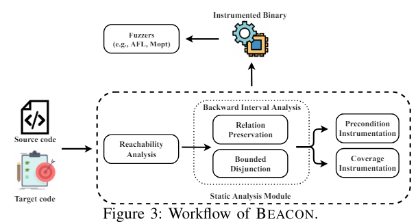
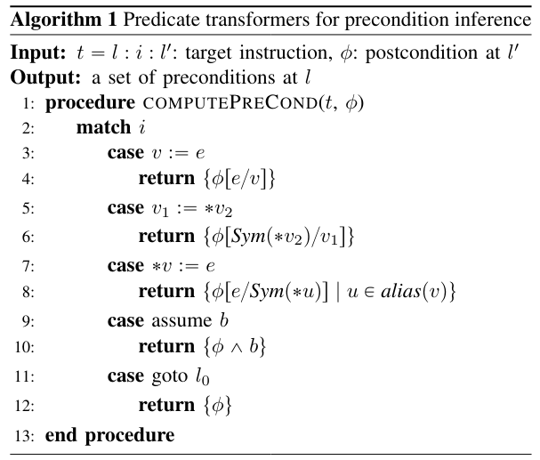

[BEACON : Directed Grey-Box Fuzzing with Provable Path Pruning](https://qingkaishi.github.io/public_pdfs/SP22.pdf)

# 0. Abstract
- target code에 unrechable path를 symbolically or concretely execution 하여 resource 낭비
- target에 도달하는데 필요한 abstracted precondition을 lightweight static analysis로 계산
- 관련 없는 path를 제거하고 제거된 path가 target과 관련 없음을 보장
# 1. Introduction
- DGF의 효율성을 높이기 위해 unrechable execution path를 빠르게 중단하는것이 중요
- 이를 infeasible-path-explosion problem이라고 함
- DWF : SE를 이용하여 path constraint를 해결하여 rechability를 결정함 > scale의 문제가 있음
- DGF : unrechable path를 거부하는데 관심이 없음
- BEACON : 적은 overhead로 infeasible path를 pruning
- lightweight SA를 이용하여 infeasible 하게 만드는 variable에 대한 근사치 계산 가능

> Contribution
- cheqp cost SA를 이용하여 target에 도달하기 위한 condition을 계산하고 이를 이용하여 infeasible program state를 filtering
- runtime overhead가 낮고 많은 infeasible path를 pruning 하는 DGF 제시

# 2. Background
## 2.1. Directed Grey-Box Fuzzing
- DGF의 목표 : 프로그램의 특정 부분을 작은 runtime overhead로 testing 하는것
- challenge
1. 어떤 대상을 테스트 할지 지정
2. fuzzer를 target code에 빠르게 도달하게 하는방법
### 2.1.1. Specifying the Targets
- 수동으로 target code를 지정할 수 있음 (patch가 이루어진 곳)
- 자동으로 지정 하는 방법(*Semfuzz* : 자연어 처리를 활용한 bug report 분석, *ParmeSan* : sanitizer에 의해 도입된 지점을 labeling)
### 2.1.2 Reaching the Targets
- AFLGo 
- Hawkeye
- FuzzGuard
- Savior
## 2.2. Problem and Challenges : infeasible-path-explosion problem
- intermediate program state를 weakest precondition으로 근사하여 계산하여 execution을 허용한다.
- CFG에서 target l, 위치 p가 주어졌을떄 wp(p,l) : l에 rechable을 보장하는 가장 러프한 precondition
- 일반적을 wp(p,l)은 프로그램 변수에 대한 1차 논리연산으로 표현된다.
- p에 도달하지만 wp(p,l)을 만족하지 않는 path는 제거된다.
- 이때 precondition을 static하게 정확하고 효율적으로 추론하는것이 어려움 > 기존의 두가지 절충안
1. fast SA : 특정 속성을 맞추는 간단한 path condition에대한 제한적 추론 > 정확하지 않음
2. slow SA : path exploration 과 같은 문제를 피하기 위하여 제한적 > 부정확한 결과

> challenge
1. precondition inference 에서 path condition에 대해 효율적으로 추론하는방법
2. merging path에서 정밀도 손실을 피하면서 precision loss를 피하는 방법
# 3. Beacon in a Nutshell

- BEACON은 target code를 입력으로 받음
- SA를 간소화 하여 명핵한 infeasible path를 pruning > CFG 에서 reachability analysis를 수행하여 제거함
## 3.1. Backward Interval Analysis
- static하게 계산된 control flow information으로 프로그램을 slicing 함
- wp를 추론하기 위하여 backward interval analysis를 수행
- 정확한 weakest precondition 을 계산할 수 없기에 predefined abstract domain에 대한 sound abstraction을 계산함 (over approximation)
- 일반적으로 사용되는 abstract domain : interval domain, octagon domain, polyhedral domain ....
- variable에 가능한 값을 추론하는데 도움을 줌
- 여기서 cheapest domain (interval domain)을 선택함
- interval domain은 precondition을 효율적으로 추론할 수 있지만 변수간의 상호작용을 고려하지 안ㅇ흠
> 부정확성을 악화시키는 두가지 해결
1. Relationship Preservation
- 변수간의 관계를 보존한다면 정확한 precondition을 얻을 수 있음 
2. Bounded Disjunction
- 전통적인 방법은 서로 다른 path에서의 SA결과를 병합함 > 부정확성 발생
- SA 결과에 대한 제한적 Disjoint를 유지하고 path의 수가 임계값을 넘을때만 병합함
- 임계값에서 병합할때 어떤식으로 병합하는지에 따른 문제도 있음
## 3.2. Selective Instrumentation
- PUT의 모든 statement를 intrumentation 하는 것은 cost가 많이듬
- BEACON은 변수 정의, branch에 대해서만 intrumentation
- precondition을 포함하는 assertion을 삽입함

# 4. Methodology
- BEACON은 control flow rechability, path condition satisfiability를 이용하여 infeasible path를 pruning
- iCFG를 이용한 reachability analysis > target에 도달할 수 없는 BB를 제거

## 4.1. Preliminary
### 4.1.1. Language

### 4.1.2. Precondition Inference

- target에 도달하기 위한 weakest condition을 역으로 계산됨 (true로 시작하여  변화함)
- algorithm1 은 precondition을 정확하게 찾지만 추론에 비용이 많이드는 복잡한 constraint를 출력함
## 4.2. Backward Interval Analysis

## 4.3. Optimizations for Maintaining Precision

### 4.3.1. Relationship Preservation

### 4.3.2. Bounded Disjunctions

## 4.4. Precondition Instrumentation

# 5. Evalutation

### 5.0.1. Baselines

### 5.0.2. Benchmarks

### 5.0.3. Configurations

## 5.1. Compared to the State of the Art

## 5.2. Impacts of Path Slicing & Precondition Checking

## 5.3. Impacts of Relation Preservation & Bounded Disjunction

## 5.4. Instrumentation Overhead

## 5.5. Case Study

## 5.6. Discussion

# 6. Related Work

## 6.1. Directed White-box Fuzzing

## 6.2. Coverage-guided Fuzzing

# 7. Conclusion
