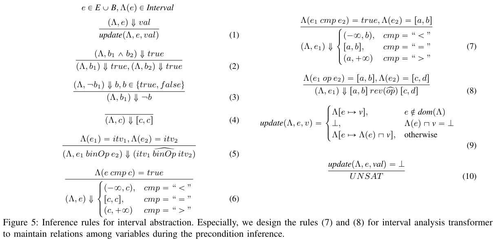
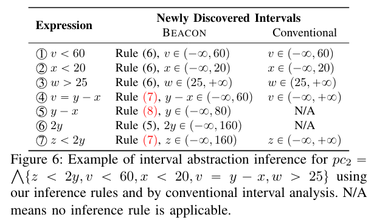
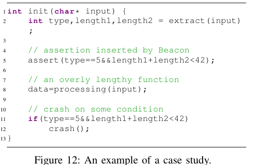

[BEACON : Directed Grey-Box Fuzzing with Provable Path Pruning](https://qingkaishi.github.io/public_pdfs/SP22.pdf)

# 0. Abstract
- target code에 unrechable path를 symbolically or concretely execution 하여 resource 낭비
- target에 도달하는데 필요한 abstracted precondition을 lightweight static analysis로 계산
- 관련 없는 path를 제거하고 제거된 path가 target과 관련 없음을 보장
# 1. Introduction
- DGF의 효율성을 높이기 위해 unrechable execution path를 빠르게 중단하는것이 중요
- 이를 infeasible-path-explosion problem이라고 함
- DWF : SE를 이용하여 path constraint를 해결하여 rechability를 결정함 > scale의 문제가 있음
- DGF : unrechable path를 거부하는데 관심이 없음
- BEACON : 적은 overhead로 infeasible path를 pruning
- lightweight SA를 이용하여 infeasible 하게 만드는 variable에 대한 근사치 계산 가능

> Contribution
- cheqp cost SA를 이용하여 target에 도달하기 위한 condition을 계산하고 이를 이용하여 infeasible program state를 filtering
- runtime overhead가 낮고 많은 infeasible path를 pruning 하는 DGF 제시

# 2. Background
## 2.1. Directed Grey-Box Fuzzing
- DGF의 목표 : 프로그램의 특정 부분을 작은 runtime overhead로 testing 하는것
- challenge
1. 어떤 대상을 테스트 할지 지정
2. fuzzer를 target code에 빠르게 도달하게 하는방법
### 2.1.1. Specifying the Targets
- 수동으로 target code를 지정할 수 있음 (patch가 이루어진 곳)
- 자동으로 지정 하는 방법(*Semfuzz* : 자연어 처리를 활용한 bug report 분석, *ParmeSan* : sanitizer에 의해 도입된 지점을 labeling)
### 2.1.2 Reaching the Targets
- AFLGo 
- Hawkeye
- FuzzGuard
- Savior
## 2.2. Problem and Challenges : infeasible-path-explosion problem
- intermediate program state를 weakest precondition으로 근사하여 계산하여 execution을 허용한다.
- CFG에서 target l, 위치 p가 주어졌을떄 wp(p,l) : l에 rechable을 보장하는 가장 러프한 precondition
- 일반적을 wp(p,l)은 프로그램 변수에 대한 1차 논리연산으로 표현된다.
- p에 도달하지만 wp(p,l)을 만족하지 않는 path는 제거된다.
- 이때 precondition을 static하게 정확하고 효율적으로 추론하는것이 어려움 > 기존의 두가지 절충안
1. fast SA : 특정 속성을 맞추는 간단한 path condition에대한 제한적 추론 > 정확하지 않음
2. slow SA : path exploration 과 같은 문제를 피하기 위하여 제한적 > 부정확한 결과

> challenge
1. precondition inference 에서 path condition에 대해 효율적으로 추론하는방법
2. merging path에서 정밀도 손실을 피하면서 precision loss를 피하는 방법
# 3. Beacon in a Nutshell

- BEACON은 target code를 입력으로 받음
- SA를 간소화 하여 명핵한 infeasible path를 pruning > CFG 에서 reachability analysis를 수행하여 제거함
## 3.1. Backward Interval Analysis
- static하게 계산된 control flow information으로 프로그램을 slicing 함
- wp를 추론하기 위하여 backward interval analysis를 수행
- 정확한 weakest precondition 을 계산할 수 없기에 predefined abstract domain에 대한 sound abstraction을 계산함 (over approximation)
- 일반적으로 사용되는 abstract domain : interval domain, octagon domain, polyhedral domain ....
- variable에 가능한 값을 추론하는데 도움을 줌
- 여기서 cheapest domain (interval domain)을 선택함
- interval domain은 precondition을 효율적으로 추론할 수 있지만 변수간의 상호작용을 고려하지 안ㅇ흠
> 부정확성을 악화시키는 두가지 해결
1. Relationship Preservation
- 변수간의 관계를 보존한다면 정확한 precondition을 얻을 수 있음 
2. Bounded Disjunction
- 전통적인 방법은 서로 다른 path에서의 SA결과를 병합함 > 부정확성 발생
- SA 결과에 대한 제한적 Disjoint를 유지하고 path의 수가 임계값을 넘을때만 병합함
- 임계값에서 병합할때 어떤식으로 병합하는지에 따른 문제도 있음
## 3.2. Selective Instrumentation
- PUT의 모든 statement를 intrumentation 하는 것은 cost가 많이듬
- BEACON은 변수 정의, branch에 대해서만 intrumentation
- precondition을 포함하는 assertion을 삽입함

# 4. Methodology
- BEACON은 control flow rechability, path condition satisfiability를 이용하여 infeasible path를 pruning
- iCFG를 이용한 reachability analysis > target에 도달할 수 없는 BB를 제거

## 4.1. Preliminary
### 4.1.1. Language

- 각 함수는 formal parameter $v_i$를 받아 r을 반환
- non deterministic s1:s2 or atmoic i
- statement 전 후 program location l, l' 으로 labeling
- assume : boolean 조건이 성립해야 실행됨 > if b then s1 else s2 > (assume b; s1) ; assume (!b ; s2)

### 4.1.2. Precondition Inference

- target에 도달하기 위한 weakest condition을 역으로 계산됨 (true로 시작하여  변화함)
- algorithm1 : predicate transformers : precondition을 정확하게 찾지만 추론에 비용이 많이드는 복잡한 constraint를 출력함 
- `v:=e` -> $\phi[e/v]$로 변환
- 실제로는 target에서 condition을 역방향으로 전파
- algorithm1은 정확하지만 복잡한 constraint를 추론하는데 비용이 많이듬 > 전체 조건의 정확성과 overhead 사이의 절충 필요
## 4.2. Backward Interval Analysis

- 우리는 모든 pruning된 경로가 target unrechable 하다는 것을 보장하며 많은 infeasible path를 prunging 해야함
- target location $l_0'$이 주어질때 target에 도달하기 위한 precondition set $\hat{wp}(l,l_0')$을 계산
- path condition을 추론하기 위하여 $\alpha, \gamma$를 사용
- target site에서 시작하는 역방향 path를 over-approximate 해야함
- 이를 위해 모든 active (instruction, postcondition) pair를 포함하는 worklist를 사용함

- line3 : target t와 initial postcondition true를 work list에 추가 
- line 5-6 : work list에서 $(<l,i,l'>,\phi)$를 pop 하여 instruction i에 따라 postcondition $\phi$ 변환
- 새로 계산된 postcondition $\phi'$은 $\hat{wp}(l)$의 값을 update하기 위하여 역방향 전파
- predicate transformer 와 worklist가 모든 execution을 추적하여 backworld path를 추론할 수 있음

- $l_{18} -> l_{14} backworld analysis$를 진행하여 line 9에서 p1, p2로 분기됨
- line 8 에서 p1, p2의 condition은 다음과 같음
- pc1 : {z<2y, v<6, x<40, v=y-x, w<5, x>=20}
- pc2 : {z<2y, v<6, x<40, v=y-x, w>25, x<20}
- 이를 해결하기 위해서 SMT solver를 사용하는 것은 cost가 높음
- line 8 에서 다시 두 path가 합쳐지므로 적당한 정밀도 손실을 유지하며 $\hat{wp}(l_8)$로 결합되어야함
- 이를 위하여 적당한 interval abstraction 사용 
- $\alpha = \Lambda : V -> Interval $, Interval = integear 사이의 집합, $\top$ = Z, $\bot$ = 공집합
- $\gamma(\Lambda) = \cap_{v\in dom(\Lambda)}cons(v)$ : abstract value를 logical constraint로 mapping

- interval abstraction으로 다양한 backword path를 건전하게 결합함

- `joinPath`에서 pc1, pc2의 interval abstraction을 결합
- interval abstraction은 부정확 할 수 있음 > 정밀도를 향상시키는 두가지 최적화
1. 특정 변수간 관계를 명시적으로 추적하는 interval abstraction $\alpha$ 설계
2. 결합을 수행할 시기와 방법을 결정하는 bounded disjuction strategy 설계

## 4.3. Optimizations for Maintaining Precision
### 4.3.1. Relationship Preservation
- top-down analysis
- interavl abstraction $\alpha$는 path condition에 나타내는 변수들의 범위를 추론하는데 사용됨
- 변수 뿐만 아니라 path condition에 나타나는 expression의 interal 또한 추적 > 이를 child, parent에 전파하여 정밀도 상승

- 7,8 : interval abstactionn의 정밀도를 증가시키는 heuristic

- pc2에서 새로운 추론규칙을 사용 : 더 정밀한 결과

### 4.3.2. Bounded Disjunctions
- 다른 path에서 전파된 조건을 선택적으로 결합하여 정밀도를 높일 수 있음
- backword propagation 동안 정밀도를 유지하기 위한 bounded dijunctions 전략 설계
- bound threshold를 사용하여 l에 도달하는 path의 수가 threshold 적을때 condition들을 $\hat{wp}(l)$에서 유지
- 개별적으로 backword propagate

- interval abstraction을 통해 정밀도 손상이 발생할 수 있음
- 두 abstract region의 교차는 frechet distance로 측정할 수 있음
- interval domain에서 각 변수의 interval 에서 distance를 누적하여 정밀도 손실을 계산해야함

- v = path condition $\phi_1, \phi_2$의 공유 변수
- $v_{\phi_1} = [l_1, u_1], v_{\phi_2} = [l_2, u_2]$

## 4.4. Precondition Instrumentation
- target program location에서 rechable을 위한 precondition을 추론 > 이를 program에 instrumentation 하여 runtime에 infeasible path pruning
- 정교한 분석 > instrumentation, runtime에 overhead > 선택적으로 instrumentation 해야함
1. SSA form으로 변환하여 변수 정의만 instrumentation의 후보 위치
2. v1의 값이 v2에 의존하는 경우 v1은 instrumentation 되지 않음
# 5. Evalutation
- LLVM을 기반으로 BEACON 구현
- PUT를 LLVM bit code로 compile, precondition analysis, instrumentation, coverage 관련 instrumentation이 수행됨
- 이후 LLVM bit code를 executable binary로 compile하여 AFLGo를 fuzzing engine으로 사용
1. 4가지 DGF와 비교
2. path slicing, precondition 확인이 fuzzing 시간을 얼마나 단축하는지 평가
3. precondition analysis가 relational preservation, bounded disjunction의 영향 평가
4. instrumentation에 의한 runtime overhead의 측정으로 instrumentation 전략의 효과 평가 

- Baselines : AFLGo, Hawkeye, AFL, Mopt, AFL++
- Benchmarks

- threshold = 5

## 5.1. Compared to the State of the Art

## 5.2. Impacts of Path Slicing & Precondition Checking

 
## 5.3. Impacts of Relation Preservation & Bounded Disjunction

## 5.4. Instrumentation Overhead

## 5.5. Case Study

- line 12에서 crash 발생 가능
- line 5 앞에 precondition 삽입 > 조기 종료 가능
## 5.6. Discussion
### Assisting other fuzzers
- 일반적인 DGF는 input generation, seed prioritization 을 통하여 성능 향상
- BEACON은 fuzzing의 무작위성을 완화시킴
### Threats to validity
- input generation의 무작위성에 의해서 실험 결과에 영향을 미칠 수 있음
- BEACON이 SE를 지원하는 fuzzer를 지원하기 힘듬 (확장성의 문제)
# 6. Related Work
## 6.1. Directed White-box Fuzzing
- DF는 SE, Concolic execution에 의존하는 WF에서 시작됨
- SE를 통해 탐색할 program path의 priority 정하기 가능
- SE자체 속도 가속화
## 6.2. Coverage-guided Fuzzing
- dynamic taint analysis를 사용하여 input generation optimize 가능
- SE와 함께 사용하는 hybrid fuzzing
# 7. Conclusion
- BEACON은 path pool에서 GF를 유도하여 불필요한 execution을 피하고 시간을 절약
- 저비용, 정밀한 분석을 통한 infeasible path에 대한 pruning