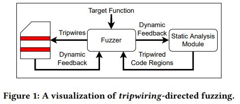
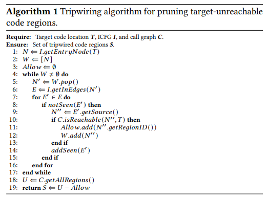

[One Fuzz Doesn’t Fit All: Optimizing Directed Fuzzing via Target-tailored Program State](https://dl.acm.org/doi/pdf/10.1145/3564625.3564643)

[source code](https://github.com/HexHive/SieveFuzz)

# 0. Abstract
- GF는 가까운 test case를 분리하고 이를 확률적으로 번형하는 distance minimization 전략을 사용함
- target에 도달하는지 여부와 관계없이 모든 test case에 대해서 적용됨 > target에 도달할 수 없는 path 에서 정체, disjoint target에 비효율적
- target에 도달 가능한 path를 우선시해야함
- 비효율적인 탐색 병목 현상을 극복하기 위하여 tripwiring 도입 > target site에 도달하지 않을 path를 사전에 차단하고 종료
- target site에 도달하지 않을 fuzzing을 사전에 종료
- search를 target rechable path set으로 제한하여 search noise를 줄임
# 1. Introduction
- DGF에서 모든 testcase 에 대한 distance 측정으로 인하여 높은 instrumentation overhead
- tripwiring : distance minimization을 벗어나고 target unrechable path를 filtering
- disjoint target에 대하여 효율적임
> contribution
- tripwiring : target site에 reach하는데 필수적인 program search space만 제한하는 target-tailored DF를 위한 ligthweight technique
- tripwiring이 distance minimization보다 최적화된 방법론임을 보여줌
- SieveFuzz 설계
# 2. Background
## 2.1. Guided Fuzzing
- guided fuzzing은 serach를 제어하는 feedback loop를 사용
- CGF, resource consumption, memory allocations, program state등 policy를 사용
## 2.2. Directed Fuzzing
- patch testing과 같은 search target을 위하여 DF 개념을 도입
- Fuzzing을 특정 target site로 "direction"
- 대부분 최신 DF는  distance minimazation을 선택함 
# 3. Pitfalls of Distance Minimization
- distance manimization을 기반으로한 DF는 execution path가 target에 가까운 testcase에 초점을 맞춤 > 두가지 overhead
1. 모든 test case에 대해서 path distance 계산
2. 작은 set을 찾기 위하여 greedy serach
- distance minimiazation의 cost를 quantify 하기 위하여 실험 진행
## 3.1. Experiment Setup

- DAPRA cyber grand challenge benchmark `KPRCA-00038` 
- `cgc_program_parse` : NULL pointer referencing 이 포함된 interpreter
1. empty statement > language semantics 만족
2. reference를 trigger하는 non empty statement 삽입
- `crc_parse_statements`는 disjoint target
- *AFL* vs *AFLGo*
## 3.2. Consequence 1: Poor Performance
- *AFL* 2/10 > *AFLGo* 1/10 , 시간도 92% 빠름
- disjoint target에 대해서는 distance minimization이 non-DF보다 더 안좋음
## 3.2. Consequence 2: Unconstrained Exploration
- distance minimization DF와 non-DF 의 격차
- 두 fuzzing campain을 profiling > target site에 도달하는데 관련없는 코드에 대한 shfur cmrwjd
- *AFLGo*는 exploitation, exploration 두 단계가 있기에 explotitation mode에 대해서만 측정
- 두 Fuzzer 모두 Poc대비 29% 이상의 함수를 실행함
- distance minimazation은 program state에 대한 greedy search로 인한 대가를 지불 > non-DF이 더 우수할때가 있음
# 4. Overcoming the bottlenecks of directedness

-  tripwiring : fuzzer의 program state space의 search가 확률 적이며 control flow에 크게 영향을 받는점을 이용 > rechable path의 subset을 serach space에 제한 > subset은 target site에 도달하는데 반드시 필요한 path로 보장됨
- control flow, path detection으로 target 으로의 path set을 식별
- coverage guided fuzzing workflow를 수정하여 이러한 set만 탐색하도럭함
- 이 region의 boundary를 "trip"할때 사전에 차단하고 종료
# 5. Preemptive Termination
- 기존 DF는 distance minimazation을 모든 testcase에 대해서 적용 > serach noise에 민감함
- target site를 선행하지 않는것으로 입증되는 region의 탐색을 선제적으로 종료 > 장점
1. 90% 이상의 runtime에서 실행되는 target inrerelevant path의 code coverage, target distance를 측정하는 낭비 없앰
2. path를 explore 하기 전에 filtering > resource를 낭비하지 않음
## 5.1. Tripwiring
- target site에 선행되지 않는것으로 보장되는 region을 식별하는 방법론 제시
### 5.1.1. Methodology
- SieveFuzz는 code space가 target rechable path에 있는지 판별해야함
- SA로 iCFG, CG를 이용하여 target site 로의 path에 있는 모든 space를 표시

- iCFG는 context insensetive 하기 때문에 target-relevant code region은 over-approximate 
- CG에서 수행되는 function rechability analysis를 함께 사용함

### 5.1.2. Indirect Transfers
- point-to, value-set analysis를 사용하여 inderect transfer에 대한 문제를 해결함 > over approximate에 대한 문제 존제
- 이러한 오차는 under tripwiring (탐색해야 하는 code를 과다 추정)
- indirect branch가 발견될때마다 CG를 동적으로 update함 > tripwiring을 조정
- re-analysis 과정은 overhead를 더하지만 새로운 coverage는 지수적으로 감속하기 때문에 괜찮음
- indirect call을 dynamic하게 해결하기 때문에 target site가 초기 rechability analysis에서 빠질 수 있음 > 실험적으로 괜찮음 (추가되기 때문)
# 6. Implementation : SIEVEFUZZ
## 6.1.  Architectural Overview
- AFL++위에 구현
- on-demand rechability analysis를 수행하기 위하여 fuzzer, analyzer 간의 client-server 구축
- indirect edge를 static analyzer로 전달하여 dynamic CFG를 update한 후 rechability, tripwiring analysis를 update
- LLVM 기반 SVF framwork 사용
- LLVM pass를 사용하여 function level 조기 종료를 위한 intrumentation을 도입
## 6.2. High-level Fuzzing Workflow

### 6.2.1. Initial Analysis (INIT)
- initial iCFG, CG analysis에서 도달 여부를 질의함, unreachable : indirect call edge가 누락된것으로 판단 > EXP 를 실행
### 6.2.2. Exploration (EXP)
- target에 unreachable한 경우 non-directed, non-tripwiring fuzzing으로 seed를 다양화함
- indirect edge를 모니터링하여 rechability analysis를 수행하고 이에 따라 update

### 6.2.3. Tripwired Fuzzing (FUZZ)
- target이 rechable한 순간부터 tripwiring DF가 시작
- 이때도 새로운 indirect edge를 analysis 수행
- tripwiring intrumentation (조기 종료와 관련된 명령어 추가, 삭제)를 수행
## 6.3. Maintaining Fast On-demand Analysis
- fuzzing을 종료하고 다시 재게함에 있어서 overhead가 크기 때문에 client-server 방식을 채택
- new indirect edge에 대한 analysis가 완료되면 fuzzing을 정지 상태에서 재개함
- coverage가 증가하는  testcase는 1/10000정도 이기 때문에 괜찮음
## 6.4. Maintaining Fast SUT Execution
### 6.4.1. Preemptive Termination
- fuzzing을 위해 instrumentation 되는 동안 PUT의 code region(function)에 ID 할당
- region의 시작점에 해당 ID로 runtime library 호출, library를 PUT에 연결하고 tripwiring preemptive termination 수행
- 구현 : activation birmap 사용 > bit 설정 : 실행 허용 > bitmap을 SA module에서 동적으로 유지
### 6.4.2. Indirect Call Tracking
- 모든 indirect call site에 intrumentation을 적용하여 edge의 destination을 식별
- indirect(caller, callee) pair 추적
- 각 함수에 32bit ID 할당 > indirect call edge : caller,callee " 64bit edge ID 계산
- 시간 복잡도가 낮기에 overhead 무시할만함
## 6.5. Maintaining Exploration Diversity
- tripwiring은 CGF를 특정 target site로 유도하여 direction을 달성함
- 새로운 coverage가 발견되지 않은 경우 seed를 random mutation > target을 자체를 실행해야 하기에 올바르지 않음
- execution diversity heuristic을 개발 > code coverage가 더 큰 test case의 mutation을 우선시함
- fuzzing 대상에 instrumentation을 통하여 trace length(testcase에 의해 실행된 function의 수) 측정
# 7. EVALUATION
## 7.0.1. Benchmarks
## 7.0.2. Experiment Procedure and Infrastructure
## 7.1. RQ1: Tripwiring’s Search Space Restriction
### 7.1.1. Results: Magnitude of Space Restriction
### 7.1.2. Results: Initialization Cost
### 7.1.3. Results: On-demand Analysis Cost
## 7.2. RQ2: Targeted Defect Discovery
### 7.2.1. Results: Tripwiring vs. Minimization-directed Fuzzing
### 7.2.2. Results: Tripwiring vs. Precondition-directed Fuzzing
### 7.2.3. Results: Tripwiring vs. Undirected Fuzzing
## 7.3. RQ3: Target Location Feasibility for Tripwiring
# 8. Discussion and Future Work
## 8.1. Refinements in Path Analysis
## 8.2. Path Prioritization
# 9. Related Work
## 9.1. Directed Fuzzing
## 9.2. Improving Fuzzing Performanc
# 10. Conclusion
