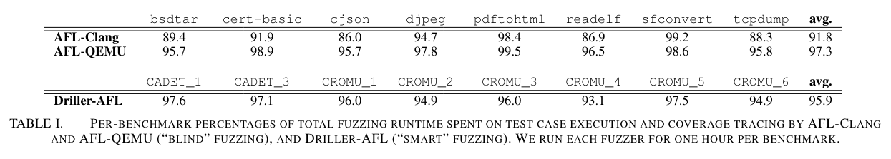

[Full-speed Fuzzing: Reducing Fuzzing Overhead through Coverage-guided Tracing](https://users.cs.utah.edu/~snagy/papers/19SP.pdf)

# 0. Abstract
- CGF의 3가지 구성 요소
1. test case generation
2. code coverage tracing
3. crash triage
- code coverage tracing이 가장 큰 overhead > static or dynamic binary intrumentation을 통한 모든 test case의 code coverage 추적 > 대다수의 coverage 정보가 code coverage를 증가시키지 않아 버려짐
- 이를 해결하기 위하여 coverage guided tracing 도입
1. 생성된 test case중 소수만이 coverage를 증가시킴
2. coverage를 증가하는 test case는 시간이 지남에 따라 드물게 발생
- target bianry file에 현재 frontier of coverage를 incoding하여 testcase가 새로운 coverage를 생성할때 tracing 없이 self-report > filtering
- coverage를 증가시키지 않는 testcase를 처리하는 시간을 줄임
- UnTracer : Static binary intrumentation tool *Dyninst*를 기반으로 구현
- testcase를 더 많이 실행할 수 있음
# 1. Introduction
- code coverage는 3가지 형태 > BB, BB edge, BB path
- White box : compile time에 intrumentation을 통한 coverage 측정
- Black box : 동적으로 삽입된 intrumentation or binary rewriting, or hardware support
- code coverage를 증가 시키는 것은 1/10000 이기에 모든 test case의 coverage를 추적하는것은 낭비
- UnTracer : CGF에서 overhead를 줄이는 것이 목표
- coverage guided tracing은 code coverage 를 증가시키는 test case에 대해서만 보고하도록 함 > 이러한 수정된 binary 를 *Interst Oracle* > native speed로 실행 가능
- Black Box binary intrumentation tool *Dyninst*를 이용하여 Interst Oracle, tracing infra 구축

> Contribution
- Covergea guided Tracing 도입
- Coverage 증가 testcase의 발생 빈도를 정량화함
- UnTracer 구현, 평가
- QSYM-UnTracer
# 2. Background
## 2.1. An Overview of Fuzzing

- fuzzer는 많은 양의 testcase를 생성하고 binary file의 execution을 monitoring, bug, crash를 일으키는 test case를 식별
> test case를 생성하는 2가지 방법 
1. Grammar-based > 사전에 정의된 input grammer에 제약을 받는 test case를 생성
2. Mutational > 다른 test case를 muation하여 test case 생성
- CGF는 binary file code 전체를 탐색하려고 하므로 새로운 code region에 도달하는 test case mutation 선호
## 2.2. Coverage-Guided Fuzzing

- CGF는 binary intrumentation, system emulation, hardware-assisted mechanism을 통하여 code coverage 추적
- CGF는 BB, BBE, BBP중 하나를 code coverage 측정 기준에 기반함
- BBE 는 BB의 tuple로 사용
- BBP를 사용하는 fuzzer는 없음 > intel processor tracing을 사용한 가능성 있음
## 2.3. Coverage Tracing Performance
- White box : compile/assemble time에 instrumentation 주입
- Black box : binaly control flow에 비용이 많이 듬, QEMU, Dyninst
## 2.4. Focus of this Paper
- coverage가 증가하는 test case에 대해서만 coverage 계산
# 3. Impact of Discarded Test Cases
- CGF (*AFL, libFuzzer, honggfuzz*) 는 "blind" test case generation에 의존함
- coverage가 증가하지 않는 test case의 비율을 줄이기 위하여 "smart" test case 생성을 사용 > symbolic ececution, program state, taint tracking 등을 통하여 coverage increasing testcase의 비율을 높임 > 효과가 불분명함
- AFL, Driller에서 coverge가 증가하지않는 testcase에서의 성능을 조사함
> AFL : random mutation에 의존하여 coverage increasing testcase를 생성하는 "blind" fuzzer
>
> Driller : conconlic execution으로 mutation을 보강하느 "smart" test case generation 
## 3.1. Experimental Setup
- [6절](#6-tracing-only-evaluation)에서 사용한 8개의 benchmark 사용
- Driller는 DARPA CGC에서의 benchmark만 지원하므로 사전에 compile된 CGC binary file 8개로 평가
- fuzzer의 execution/tracing time을 측정하기 위하여 AFL의 testcase execution function `run_target()`에 timing code 삽입
## 3.2. Results

- 대부분의 시간을 coverage가 증가하지 않는 testcase의 execution/tracing에 사용함
# 4. Coverage-guided Tracing
- blind, smart 모두 대부분의 시간을 coverage가 증가하지 않는 testcase를 execution/tracing에 사용함
- coverage guided tracing : coverage increasing test case에 대해서만 tracing 
## 4.1. Overview

- coverage guided tarcing은 test case generation과 code coverage tracing 사이에 도잉ㅂ
- Interst Oracle : target binary file의 수정된 버전으로 cover되지 않은 BB 시작 부분에 INT를 삽입
- Oracle에서 INT가 발생한 test case는 coverage increasing이 표시되고 이때만 추적함
- BB가 cover됨에 따라 Oracle binary에서 INT는 제거됨

1. Determine Interesting : Interst Oracle에서 test case를 실행하여 INT를 발생하면 coverage increasing을 표시
2. Full Tracing : Coverage Increasing test case에 대해 전체 code coverage 추적
3. Unmodify Oracle : Oracle에서 새로 방문한 모든 BB에 대해 INT 제거
## 4.2. The Interst Oracle
- Interst Oracle : non-coverage-increasing test case를 filtering
- 모든 BB의 address를 사전에 식별해야 함 > *angr, Dyninst*와 같은 SA tool 사용
- 2가지 주의사항
1. INT를 사용하지만 fuzzing과 관련된 중요 신호 (bug or crash)와의 충돌은 없어야함
2. INT instruction의 크기는 cadidate BB size보다 작아야함
## 4.3. Tracing
- coverage guided tracing은 별도의 추적 전용 version을 총해 전체 coverage를 측정함 
- Interst Oracle 이 BB level 이기 떄문에 이 또한 BB level에서 수행되어야함 > 기존 방법과 호환 하근ㅇ
## 4.4. Unmodifying
- Oracle에서 INT를 제거해야함 > 각 BB의 INT를 원래 Binary file 의 instruction으로 overwrite
## 4.5. Theoretical Performance Impact

- 시간이 지남에 따라 coverage increasing test case 수가 증가하면 oracle의 BB가 점점 수정됨
- Interst Oracle이 PUT와 유사해짐에 따라 coverage guide tracing은 0% overhead에 접근함
# 5. Implementation : UnTracer
## 5.1. UnTracer Overview
- *AFL 2.52b* 기반
- UnTracer는 target binary를 2가지 버전으로 instrumentation
- Coverage increasing을 식별하는 Interest Oracle, 새로운 coverage를 식별하는 tracer
- AFL의 forkserver을 사용하여 UnTracer의 Oracle과 Tracer binary를 이로 사용함

## 5.2. Forkwerver Instrumentation
- Tracer, Oracle binary의 실행 속도를 최적화 해야함
- 두 binary 모두 forkserver execution model을 도입 > fork()가 execve()보다 빠름
- Oracle의 경우 Dyninst를 통해 instrumentation 하는 것은 한계가 있었음
- Black box binary overwriter를 모방하는 AFL assembly time intrumentation을 활용하여 forkserver 삽입
## 5.3. Interst Oracle Binary
- Dyninst의 Static control flow analysis를 통하여 BB list를 찾고 binary file IO를 통하여 INT 삽입
- fork server 초기화 전 INT가 발생하는것을 막기위해 _start, _libc_start_main, _init, frame_dummy는 고려하지 않음
- INT = SIGTRAP > 0xCC 1byte 이고 gdb, kernnel proving에 사용되어왔기에 선택
## 5.4. Tracer binary
- Tracer의 binary를 static instrumentation 하여 각 BB에 coverage callback을 삽입
- 반복적으로 실행되는 BB가 coverge tracing의 2가지 overhead를 추가함
1. 개별 BB를 여러번 기록
2. tracing reading의 불이익
- 이를 해결하기 위하여 유일하게 cover된 BB만 기록함 > overhead 줄임
## 5.5. Unmodifying th Oracle

# 6. Tracing-only Evaluation

## 6.1. Evaluation Overview

## 6.2. Experiment Infrastructure

## 6.3. Benchmarks

## 6.4. Timeouts

## 6.5. Untracer vs Coverage-agnostic Tracing

## 6.6. Dissecting UnTracer's Overhead

### 6.6.1. Tracing

### 6.6.2. Forkserver restarting

## 6.7. Overhead vs Rate of Coverage-increasing test cases

# 7. Hybrid Fuzzing Evaluation

### 7.0.1. Trimming and calibration

### 7.0.2. Saving timouts

## 7.1. Evaluation Overview

## 7.2. Performance of UnTracer-based Hybrid Fuzzing

# 8. Discussion

## 8.1. UnTracer and Intel Processor Trace

## 8.2. Incorporating Edge Coverage Tracking

## 8.3. Comprehensive Black-Box Binary Support

# 9. Related Work

## 9.1. Improving Test Case Generation

## 9.2. System Scalability

# 10. Conclusion
