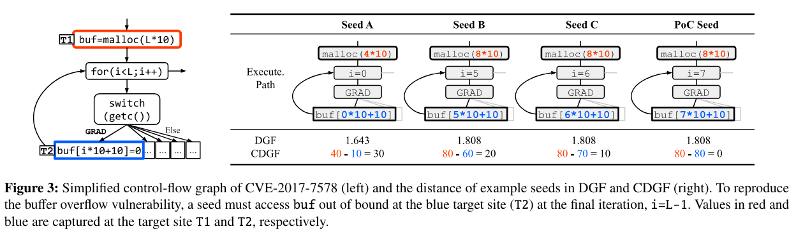

[Constraint-guided Directed Greybox Fuzzing](https://www.usenix.org/system/files/sec21fall-lee-gwangmu.pdf)

# 0. Abstract
- DGF는 orderd target site, data condition을 고려하지 않음
- target site에 도달하는 것이 아닌 constraint를 만족하는 것을 목표로 하는 constraint-guided DGF를 제시
- target site와 dat condition의 조합으로 constraint를 정의하고 해당 constraint를 만족하도록 seed를 유도함
- 7가지 crash dump와 4가지 patch changelog로 constraint 생성
- constraint가 명확해질수록 PoC generation 측면에서 우수한 성능을 보여줌
# 1. Introduction
- 현재 DGF의 문제
1. DGF는 target site 들이 서로 독립적이라고 가정, target site의 order dependency를 고려하지 않음
2. target crash에 필요한 data condition을 고려하지 않음
- 이러한 문제를 해결하는 CDGF 제안
- target site에 도달하는것이 목표가 아닌 constraint를 만족시키는것을 목표로함
- 순서에 따라 그 constraint를 더 잘 만족시키는 seed를 우선
- constraint는 하나 이상일 수 있으며 이때 지정된 순서대로 constraint를 만족해야함
> contribution
- ordered target site, data conditon을 통합한 CDGF 제안
- 주어진 information source (crash dump, patch changelog)를 통하여 자동으로 constraint 생성
- CAFL을 구현하고 AFLGo에 비해 crash triger 측면에서 우수성을 입증
# 2. Background and Motivation
## 2.1. Directed Greybox Fuzzing

- [a,b,e,f] -> 0.785
- [a,b,c,d,a,b,e,f] -> 0.85
- [a,b,c,a,d,e,f] -> 0.971
- target에 모두 도달해도 거리가 더 클 수 있음

## 2.2. Usage Example
- DGF는 target site를 정확하게 정의할수 있는 곳에서 사용할 수 있음
### 2.2.1. Static Analyzer Verification
- compile time의 source code의 잠재적 버그를 발견하기 위한 SA를 사용함
- SA는 crash location, crash에 가정된 data condition을 포함함
- SA의 낮은 정확도로 인해 크게 신뢰하지 않음 > DGF를 이용한다면 target site로 설정하여 testing 가능
### 2.2.2. Crash Reproduction
- crash report : 어떤 유형의 crash가 어떤 위치에서 발생한지 나와있음
- 하나의 PoC만으로 crash를 수정할때 PoC가 부족하여어려울 수 있음 > DGF 사용 가능
### 2.2.3. PoC Generation
- 공격자의 입장에서 patch changelog를 분석하여 patch된 위치에 target을 설정하여 DGF를 이용한 PoC 생성 가능
## 2.3. Limitation
### 2.3.1. Independent Target Sites

- DGF는 모든 target site를 독립적이라고 간주하여 crash site 이전에 precondition site에 도달하는 개면이 없음
- UAF에서 T1 : TYPE_INT, T2 : ident > 우선 순위가 seed C > B > A 가 바람직함
- DGF는 T1, T2를 독립적으로 간주하기 때문에 target site 의 average distance를 기준으로 seed distance 계산

### 2.3.2. No Data Condition

- DGF는 seed를 원하는 data condition으로 유도할 mechanism이 없음 
- T1에서 buf를 할당 > t2에서 bound를 넘어서 buf에 접근하는 GRAD를 가져야함 > 우선 순위가 seed C > B > A 가 바람직함
- DGF는 data condition을 인식하지 못하므로 distance를 기준으로 잘못된 우선순위 부여
## 2.4. Requirements
1. Ordered Target Sites : crash의 precondition을 나타내는 program location을 가지고 있어야 하므로 DGF는 이 지점으로 먼저 유도되어야함
2. Data Conditions : 대부분의 vulnerability는 data condition을 동반하므로 DGF는 seed를 data condition으로 유도할 수 있어야함

# 3. Constraint-guided DGF
## 3.1. Overview
- CDGF : independent target site set에 도달하는 것이 아닌 sequence of constraints 를 만족하는 것을 목표로함
- 따라서 더 많은 constraint를 만족하거나 다른 seed보다 첫번째로 만족되지 않는 constraint를 만족하기 쉬운 경우에 짧은 distance 부여 
- constraint distance = target site distance + data condition

## 3.2. Example
### 3.2.1. Ordered Target Sites

- figure 2의 `yasm 1.3.0`의 UAF에 대한 constraint
- T1 > T2  순서로 도달해야함

- CDGF의 seed distance
1. seed A : T1과 가까운 b에 접근 > free의 constraint = 2, %use : T1에 도달하지 못하였기에 T2에 도달하더라도 max > 2 + max
2. seed B : 1 + max
3. seed C : 0 + 1
4. seed D : 0 + 0
- UAF를 재현하는 단계를 더 잘 따르는 seed에 대해서 더 짧은 seed distance 부여

### 3.2.2. Data Conditions

- figure 3의 `CVE-2017-7578` 의 constraint
- T1 에서 buffer allocation
- T2 : buffer 크기와 offset 사이의 크기를 줄이도록 하여 boundary로 유도 (cond)
- figure 3의 모든 seed는 target에 도달함
- %access의 data condition distance를 통하여 seed distance를 계산함
- T1의 buf 크기 - T2 의 offset 
# 4. Constraints
- CDGF를 사용하기 위해선 constraint, constraint의 distance metric을 정의해아함
## 4.1. Definition
- constraint = target site + target site's data condition
- constraint는 다음의 경우 satisfied 된것으로 간주
1. target site에 도달
2. target site에서 모든 data condition을 만족 한 경우 (있다면) 
### 4.1.1. Variable capturing
- target site에서 사용된 변수를 캡쳐 > target site가 의 유형에 따라 다름
- figure 5 의 예시
- T2:buf[] : deereference > (&buf[i*10+10]) : dereferenced address
- T1:malloc() : allocation > L*10 : size, 할당된 주소 : ret
### 4.1.2. Data condition
- data condition : target site 에서 만족해야하는 캡쳐된 변수간의 boolean expression (including comparison operation)
- precondition 이나 constraint에 의해 캡쳐된 모든 변수를 사용할 수 있음
### 4.1.3. Orderedness
- constraint는 여러개가 존재할 수 있음 > 그러한 경우 지정된 순서되로 만족되어야함
## 4.2. Distance of Constraints

### 4.2.1. Target Site Distance

### 4.2.2. Data Condition Distance

### 4.2.3. Constraint Distance

### 4.2.4. Total Distance

# 5. Constraint Generation

## 5.1. Crash Dump

### 5.1.1. Multiple Target Sites (nT)

### 5.1.2. Two Target Sites with Data Conditions (2T+D)

### 5.1.3. One Target Site with Data Conditions (1T+D)

## 5.2. Patch Changelog

# 6. Implementation

## 6.1. System Overview

## 6.2. CAFL Compiler

## 6.3. CAFL Runtime

## 6.4. CAFL Fuzzer

# 7. Evaluation

## 7.1. Microbenchmark: LAVA-1

## 7.2. Crash Reproduction

## 7.3. PoC Generation

# 8. Discussion

## 8.1. Use-cases with manually written constraints

## 8.2. Bugs that require three or more constraints

## 8.3. Ineffective scenarios

## 8.4. Bugs that require further research

## 8.5. Issue on distance of pointer conditions

# 9. Related Work

## 9.1. Directed greybox fuzzing

## 9.2. Static analysis-assisted directed fuzzing

## 9.3. Targeted analysis with symbolic execution

## 9.4. ML-based directed fuzzing

## 9.5. Alternative distance metrics

## 9.6. Domain-specific fuzzing

## 9.7. PoC generation

# 10. Conclusion
