[Sound Input Filter Generation for Integer Overflow Errors](https://www.cs.toronto.edu/~fanl/papers/sift-popl14.pdf)

# 0. Abstract
- SIFT : memory allocation, block copy에서 INT OF를 막는 input filter를 생성
- 이전 기술과 다르게 sound함 (62895중 false postive 발생 X)

# 1. Introduction
## 1.1. Pervious Filter Generation Systems
### FSE
- 기존 방법은 error를 발생하는 input에서 시작하여 execution path를 찾음
- 이 path를 기반으로 FSE를 통해 vulnerability signature를 도출
- vulnerability signature : error와 동일한 path를 지나는 input의 조건식 (boolean condition)
- 이는 sound 하지 않음 > error로 가는 다른 path가 존재할 수 있기 때문
### weakest precondition analysis
- [기존방법](https://ieeexplore.ieee.org/document/4271657)의 두가지 문제점 (unsound)
1. loop unroling을 사용함 > 가능한 execution path의 subset만 분석
2. aliased value를 고려하지 않음
- 이렇게 생성된 조건은 execution path constraint와 통합되기 때문에 프로그램이 거를 수 있는 input을 filtering 하지 않음 > 많은 연산을 수행함
## 1.2. SIFT
- critical expression : malloc, block copy의 size
- SIFT는 critical expression에서 시작하여 constrol flow에 따라 backward propagate
- interprocedural, demand-driven, weakest precondition SA 사용
- demand-driven : 특정 부분에 대한 정보가 필요할때 (demand가 있을때) analysis를 수행
- 이 결과는 critical expresion의 value를 갖기 위해 평가할 수 있는 모든 expression의 symbolic condition
- 즉 input field 에서 수행할 수 있는 모든 연산을 포착
- input이 주어지면 input filter는 해당 input field에 대해 조건을 평가하여 OF를 유발하는 input 폐기
- 모든 path를 고려하기 때문에 sound
## 1.3. No Execution Path Constraints
- 기존과 다르게 condition을 확인하는 부분을 포함하지 않고 ciritical expression의 value를 변경하는 arithmetic expression만 사용
- 이러한 선택의 특징
1. Sound and Efficient Analysis
- execution path constraint를 무시함으로써 더 효율적이다.
- target site로 가는 다양한 execution path에서 나타나는 constrasint를 추적할 필요가 없기 때문
- 이러한 path의 수가 매우 많기 때문에 execution path constraint를 완벽하게 도출하는것은 불가능함 > 기존 방법이 unsound한 이유
2. Efficient Filters
- coditional statement를 무시하기 때문에 input filter의 overhead가 낮음
3. Accurate Filters
- 하지만 무시하는 conditional statement가 safety check를 수행할 수 있음, 이를 무시하면 안전한 input 또한 폐기될 수 있음
- 하지만 실험 결과 이를 무시한는 것이 큰 정확도 손실을 초례하지 않음
## 1.4. Input Fields With Multiple Instantiations
- input file은 동일한 input field의 여러 instantiation를 포함함
- SIFT는 propagated symbolic expression의 free variable이 참조하는 input field의 모든 instantiation를 추상화함
- 즉 variable과 동일한 input field와 다른 instantiation간 대응을 시키지 않음
- 동일한 input field를 참조하는 모든 변수는 서로 교환 할 수 있음 > 정확한 대응 관계를 결정할 수 없는 프로그램 또한 분석 가능
- 교환 가능성은 loop에서 variable을 renumbering 하여 loop invarient expression을 얻는 알고리즘을 가능하게함 [3.2](#32-intraprocedural-analysis)
## 1.5. Pointer Analysis and Precondition Generation
- SIFT는 potential aliasing relationship을 분석하여 pointer를 equivalence set으로 gouping
- pointer을 통해 값을 load할때 이를 분석하기 위해 load 값을 나타내는 새 변수를 생성함
- 각 변수가 참조하는 정확한 값을 정적으로 결정할 수 없는 프로그램을 분석할 수 있음
- 이 논문은 arbitary off-the-shelf alias or pointer analysis와 precondition generation algorithm을 통합하는 첫 논문
## 1.6. SIFT Usage Model
1. Module Identification : input을 처리하는 module을 식별, SIFT는 이러한 module을 분석하여 해당 module이 처리하는 input에 대한 input filter 생성
2. Input Statement Annotation : 각 input statement가 읽는 input field를 식별하기 위해 주석을 추가 
3. Critical Site Identification : module을 scan하여 ciritical site를 식별, ciritical expression의 INT OF를 유발하는 input을 filtering
4. Static Analysis : ciritical exprssion에 대해 demand-driven backward SA를 통해 symbolic condition 도출, input field의 함수로 critical expression의 값이 어떻게 계산되는지 지정
5. Input Parser Acquisition : input format에 대한 parser를 획득, input bitstream을 group화 하여 API를 통해 field를 사용할 수 있음
6. Filter Generation : filter는 input field를 읽고 symbolic condition을 사용하여 input filter 생성

## 1.7. Experimental Results
- SIFT를 통해 5개의 real-world application에 적용,56/58개의 filter 생성
- filter 생성 시간 : 1초 미만
- 62895 개의 input 중 false postive 발생 X
- filter의 overhead 최대 16ms
## 1.8. Contributions
### 1.8.1. SIFT
- SIFT는 Module을 스캔하여 memory allocation, block copy site를 찾음
- symbolic condition을 도출하여 이에 따라 INT OF를 유발하는 input을 거르는 input filter를 자동으로 생성
- 기존과 다르게 모든 execution path를 고려하기 때문에 sound함
- execution path constraint를 무시하기 때문에 효율적임 (기존 수만번 -> SIFT 수십번)
### 1.8.2. Sound and Efficient Static Analysis
- input field의 함수로 critical expression의 값을 다양한 실행 경로에 따라 계산하는 방법을 자동으로 도출
- conditional expression을 포함하지 않고 값에 직접 기여하는 arithmetic operation만 사용
### 1.8.3. Input Fields With Multiple Instantiations
- 여러 instance가 있는 input field에 대한 새로운 abstraction 제시
- 동일한 input field의 다른 instance와 변수간 정확한 대응을 하지 않음
- 같은 input field를 참조하는 모든 변수를 교환 가능하게 만듬 > loop invariant를 자동으로 도출하는 새로운 정규화 기범 제시
### 1.8.4. Pointer Analysis and Precondition Generation
- pointer를 통해 값에 접근하는 새로운 abstraction 제시 > pointer가 참조하는 값을 정적으로 결정할 수 없는 프로그램에 대한 분석 가능
- arbitrary off-the-shelf alias 와 pointer analysis 를 통합한 a precondition generation algorithm 를 최초로 제시
# 2. Example
- `Swfdec 0.5.5` 의 예시
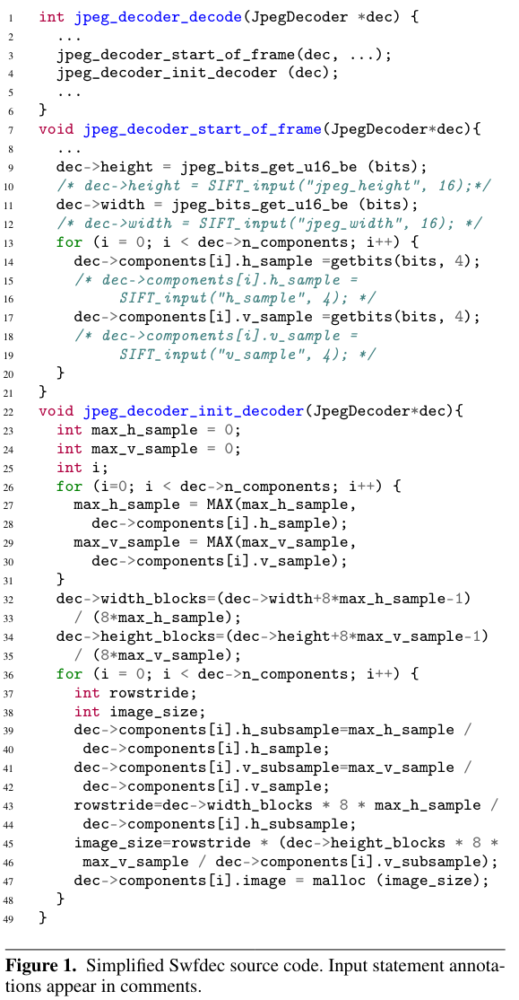
- jpeg_decoder_decode : JPEG 디코딩
- jpeg_decoder_start_frame : image metadata를 읽음
- jpeg_decoder_init_decoder : JPEG에 대한 메모리 buffer 할당
- line 43~47에서 Swftdec에서 INT OF 취약점 존재

## 2.1. Analysis Challenges
- 버퍼의 크기를 계산하는 식은 `h_sample, v_sample`의 최대 값인 `max_h_sample, max_v_smaple`을 사용
- 이 변수가 어떤 instance를 나타내는지 정적으로 결정하는것은 불가능함 > 해당 input field의 모든 instance를 나타내는 추상화 수행
- 포인터로 input field의 값에 접근하는 load/store 명령이 많음, 이를 처리하기 위해 alias analysis와 통합 할 수 있는 추상화 수행
- input field를 읽는 함수와 할당하는 함수가 다름 > interprocedual analysis
- fixed poinst analysis, 새로운 expression normalization technique을 사용하여 loop invariants를 얻음

## 2.2. Source Code Annotations
- SIFT는 어떤 명령이 어떤 input field를 읽는지 지정할 수 있는 인터페이스 제공

## 2.3. Compute Symbolic Condition
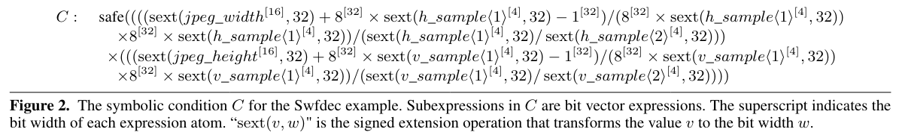

- demand-driven interprocedual backward SA를 통해 figure2의 symbolic condition C를 계산함
- safe(e) : e를 계산하는 과정에 OF 발생하지 않아야함
- sext(v, w) : v를 w로 확장
- 실제로는 부호도 추적하지만 figure 2에는 이를 생략

## 2.4. Generate Input Filter
- C를 위반하는 input을 버리는 input filter 생성
- safe(e)을 계산하는 과정에서 OF가 발생하는 경우 이를 거부함
- h_s_1,2 v_s_1,2의 모든 가능한 조합을 반복함
# 3. Static Analysis
- LLVM Compiler Infrastrucutre를 사용
## 3.1. Core Language and Notation
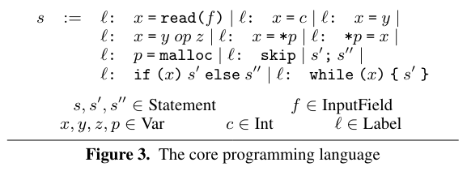

> Labels and Pointer Analysis

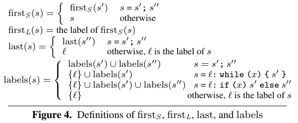
- firstS(s) : s의 첫번째 statement, firstL(s) : s의 첫번째 label 
- last(s) : s의 마지막 label
- labels(s) : s의 label의 집합, load sotre는 LoadLabel, StoreLabel 을 사용하여 표현
- SA는 load, store 에서 alias를 구분하기 위하여 LLVM pointer analysis pass, DSA pointer pas 사용
- 이 두 방법은 다음 두 함수를 제공
1. no_alias : (StoreLabel X Load Label) -> Bool
- load 명령이 store에서 저장한 값을 절대 retrieve 하지 않음
2. must_alias : (StoreLabel X Load Label) -> Bool
- load 명령이 store에서 마지막으로 저장한 값을 항상 retrieve

## 3.2. Intraprocedural Analysis
- critical site 에서 변수 v로 시작하여 backward propagation
- input field value -> v의 값을 계산 하는 방식중 symbolic condition을 계산 > 이 과정에 INT OF 발생 확인

### 3.2.1. Condition Syntax
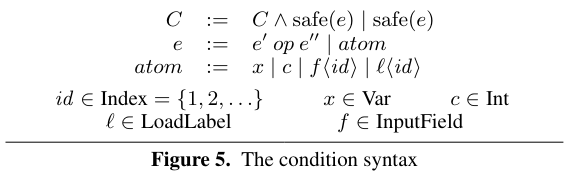
- symbolic condition의 정의
- f\<id> : input field의 값, l\<id> : load statement의 return value
### 3.2.2. Abstraction for Input Field Instantiations
- symbolic condition C에서 f\<id>는 input field의 임의의 instantiation를 나타냄, id를 통해 구분 가능
### 3.2.3. Abstraction for Values Accessed via Pointers
- l\<id>는 load 명령이 반환한 값 > id를 통해 구별
- abstraction을 통해 시작 위치에서 propagation 된 지점까지의 label l에서 역참조된 포인터의 모든 alias를 저장
### 3.2.4. Analysis Framework
- s : statement sequence
- l : s 내부의 label
- C : l 직후의 symbolic condition
- F(s,l,C)를 계산함 > s statement 이후 C가 성립을 보장 > hoare logic과 유사
- 따라서 우리는 f(s0, l, safe(v))를 만족하는지 확인하는 input filter (s0는 주어진 프로그램, l : critical site)
### 3.2.5. Analysis of Assignment, Conditional, and Sequence Statements
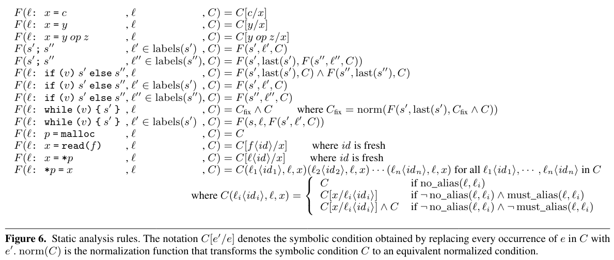

- 기본 program statement analysis rule
- C[e'/e] : C에서 e를 e'으로 대체함
- if 문에서 true, false를 식별하지 못한다면 true, false branch를 합침
### 3.2.6. Analysis of Load and Store Statements
- `x=*p` : x를 l\<id>로 abstract
- `*p=x` : aliase analysis를 사용하여 x를 반환 할 수 있는 모든 load와 매칭, 특정 가능하다면 그 값으로 변경
- DSA algorithm 기반
### 3.2.7. Analysis of Loop Statements
- fixed-point algorithm을 사용
- $C_0 = \emptyset, C_i = norm(F(s',last(c'), C \cap C_{i-1}))$
- norm(C) : 각  condition을 normalization and remove duplicate
- $C_n = C_{n-1}$ 이 되는 순간 (fixed point가 되는 순간) 중지 : 고정된 반복 loop에서는 가능
- 반복횟수가 변화는 loop 에서는 fixed-point에 도달할 수 없음, 이때는 10번의 반복 후 분석을 종료함
- 실제로 변화되는 경우가 많지만 demand-driven이기 때문에 괜찮음, 또한 실험적으로 효과적

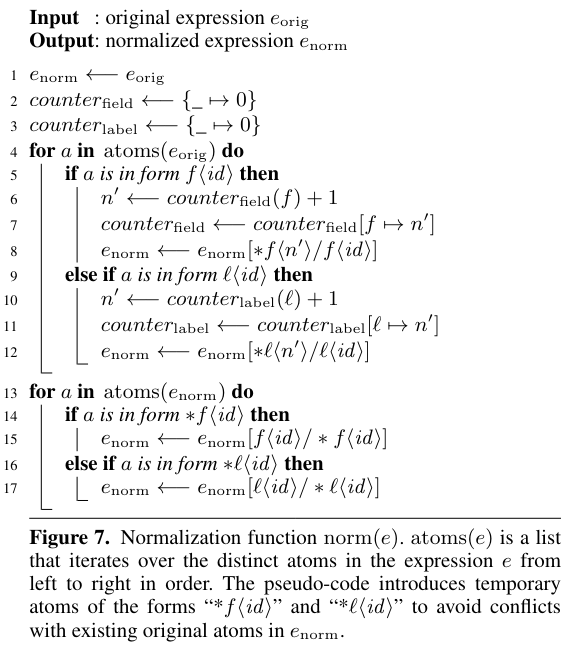
- normalization algorithm : sound함 이유
1. f\<id_k> : interchangable
2. 정규하는 사실 id_k의 renumbering만 하기 때문

## 3.3. Interprocedural Analysis
### 3.3.1. Analyzing Procedure Calls

1. C에서 v(반환값)가 있는 경우 symbolic expresion으로 대체
2. function에서 store가 있는 경우 C를 변경
- 즉 C에서 다음과 같은 l\<id>를 찾음
1. function이 p에 저장 할 수 있는 값
2. function call 이후 load 명령으로 p에 접근하는 l을 찾음
- 이와 같은 l\<id>을 symbolic expression으로 대체함

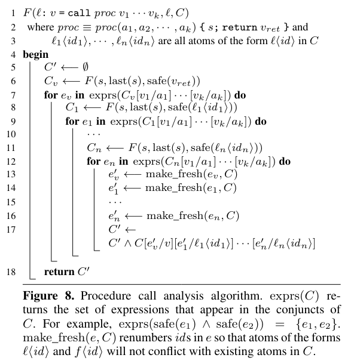
- caching을 사용하여 procedual에 대한 중복 분석 하지 않음
- return value에 대한 symbolic expression (line 6) or l\<id>(line 8, 11) 을 얻음
- 이 분석으로 인한 symbolic expression 에는 argument (a_i)가 포함될 수 있음, 이때 caller의 이름으로 변경해줌 (line 7,9,12)
- line 13-16 : id renumbering > 기존 c와 중복 X
### 3.3.2. Propagation to Program Entry
- CG를 이용해서 현재 procedural을 호출 할 수 있는 모든 call site를 찾음 > 현재 C를 caller에게 전파
- argument를 caller의 naming context로 변환
- critical site에서 프로그램의 시작점까지 이를 계속함, 최종 조건 C는 모든 path로 도출한 조건의 합집합
- /// indirect call은 어떻게 해결 ? + callee를 기준으로 caller을 찾는게 쉬울까?
## 3.4. Extension to C Programs
### 3.4.1. Identify Critical Sites
- LLVM IR을 scan > 개발자가 지정한 module 내의 alloc, block copy site (크기 포함) 식별 이를 통해 정적분석 수행
- alloc, calloc, realloc, memcpy, dMalloc을 인식함
### 3.4.2. Bit Width and Signedness
- 각 atom들의 bit크기를 식별, 산술 연산 부호 추적, bitvector의 크기를 변경하는 작업을 처리
### 3.4.3. Function Pointers and Library Calls
- pointer analysis(context-sensetive point-to analysis)를 사용하여 function pointer 구분
- SA의 경우 source code가 없는 libarary call을 처리할 수 없음 > memset, strlen과 같은 일부 함수에 대해 사전 정의된 주석을 사용
- library call에 잠재적으로 저장된 값을 symbolic expression 으로 표현 불가능함 
- 반환 값이나 매개변수를 통해 접근할 수 있는 값이 symbolic condition에 영향을 미친다면 filter 생성 X
- 아니라면 생성함 > demand-deriven이기 때문에 영향이 없는한 가능 /// 잘 이해 되지 않음
### 3.4.4. Command Line Arguments
- benchmark 56개중 4개가 command line argument의 길이에 의존함
- SIFT는 input filter를 생성할때 최종 symbolic condition에 이러한 길이를 나타내느 변수를 포함시킴
- 큰 특정 상수와 비교하거나 동적으로 추출하여 필터에 제공할 수 있음
### 3.4.5. Annotations for Input Read Statements
- 어떤 input statement가 어떤 input field를 읽는지 주석을 달아줌
- SIFT annotation generator는 comment를 스캔하여 input을 찾은 다음 지정된 정보를 LLVM IR에 삽입함
- `v = SIFT_INPUT("field_name", w)`
- v = field_name을 저장하는 프로그램 변수, w는 field의 너비
## 3.5. Input Filter Generation
- filter generator는 최종 symbolic condition C에서 l\<id>를 포함하는 모든 조건을 제거, v = 0 으로 변경
// 4장 읽고 다시

SIFT 필터 생성기는 최종 기호 조건 C에서 추상 구체화된 값 l\<id>의 잔여 발생을 포함하는 모든 결합 조건을 제거합니다. 또한 프로그램 변수v의 잔여 발생을 모두 0으로 대체합니다. 이러한 잔여 발생은 추상 의미론의 프로그램 상태 σ와 h 의 초기 값에 해당합니다(섹션 4.3 조). 가지치기 후 최종 조건 C_Inp​ 에는 f\<id> 형식의 입력 필드 변수와 상수 원자만 포함됩니다.
실질적으로, 가지치기 알고리즘은 초기화되지 않은 데이터와 관련된 모든 검사를 필터에서 제거합니다. SIFT 필터는 프로그램이 초기화되지 않은 데이터에 접근할 때 발생할 수 있는 오버플로 오류를 무효화하도록 설계되지 않았습니다(C에서는 초기화되지 않은 데이터가 임의의 값을 포함할 수 있음). SIFT의 완전성 정리(Theorem 4)는 이 제한을 반영합니다. Java와 같이 데이터를 특정 값으로 초기화하는 언어의 경우, SIFT 필터 생성기는 초기화되지 않은 데이터에 대한 참조를 포함하는 결합 조건을 가지치기하지 않습니다. 대신, 초기화되지 않은 데이터와 관련된 오버플로를 방지하기 위해 추상 구체화된 값과 프로그램 변수의 잔여 발생을 해당 초기 값으로 대체합니다.

생성된 필터는 다음과 같이 작동합니다. 먼저 입력 형식에 대한 기존 파서를 사용하여 입력을 파싱하고, 입력 조건 C_Inp​ 에서 사용되는 입력 필드를 추출합니다. 오픈 소스 파서는 다양한 입력 파일 형식에 대해 사용할 수 있으며, 우리의 실험 평가에 사용된 모든 형식을 포함합니다. 이러한 파서는 클라이언트가 파싱된 입력 필드에 접근할 수 있도록 표준 API를 제공합니다.

생성된 필터는 표현식의 각 기호 입력 변수를 파싱된 입력의 해당 구체 값으로 대체하여 C_Inp 의 각 결합 표현식을 평가합니다. 
C_Inp 의 어떤 표현식 평가에서 정수 오버플로가 발생할 수 있으면, 필터는 입력을 폐기하고 선택적으로 경고를 발생시킵니다. Swfdec 예제에서 h_sample 및 v_sample​ 과 같은 입력 필드 배열의 경우(섹션 2 참조), 입력 필터는 모든 가능한 구체 값 조합을 나열합니다(조건 평가의 형식 정의는 그림 11 참조). 어떤 조합이라도 정수 오버플로 오류를 유발할 수 있으면 필터는 입력을 폐기합니다.

여러 중요한 프로그램 지점에서 생성된 여러 기호 조건이 주어지면, SIFT는 입력을 먼저 파싱한 다음, 파싱된 입력을 모든 최종 기호 조건에 대해 순차적으로 검사하는 단일 효율적 필터를 생성할 수 있습니다. 이 접근 방식은 입력을 읽는 데 소요되는 오버헤드를 모든 최종 기호 조건 검사에 걸쳐 분산시킵니다(실제로, 입력을 읽는 데 필터 실행 시간의 거의 모든 시간을 소비함을 그림 14에서 볼 수 있습니다).
# 4. Soundness of the Static Analysis
- intra procedual analysis에 중점, inter는 생략
## 4.1. Dynamic Semantics of the Core Language
### 4.1.1. Program State
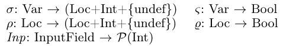

- σ : variable
- ρ : memory location
- ς, ϱ : boolean overflow flag
- undef : 초기화 되지 않은 값
- Inp : 실행중 변경되지 않는 input file
- Inp(f) : input field f를 f의 모든 nstantitaion value에 mapping
- 초기 상태에서 σ, ρ는 모든 변수와 위치를 undef로 mapping, ς, ϱ = false
### 4.1.2. Small Step Rule
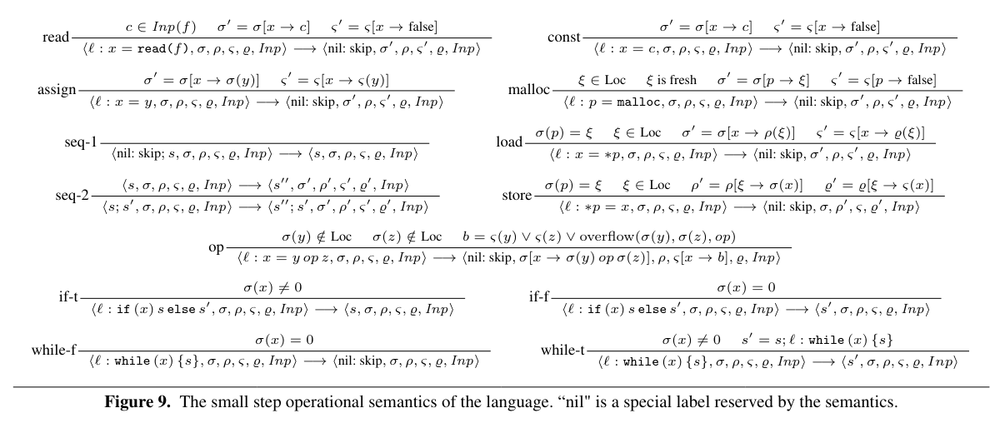

- overflow(a, b, op) : a op b가 overflow를 일으킬때 true
- read 에서 Inp(f)에서 임의워 요소 c를 선택하여 x를 update
## 4.2. Soundness of the Pointer Analysis
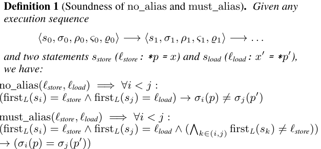
- no_alias : s의 load, store에서 variable의 mapping이 모두 다를때
- must_alias : load 할때 store가 마지막으로 저장한 값을 읽을떄
```c
    *p = 10;  // store
    x = *p;   // load
```
## 4.3. Abstract Semantics
- soundness를 증명하기 위한 정의
- 기존 dynamic semantics와 차이점
1. if, while에 대해 condition을 무시하고 두 control flow중 하나를 nondeterministic하게 실행
2. load, store 값을 uderlying pointer or alias analysis로 얻는 정보로 equivalence class로 group화 함 > 보수적 모델링
### 4.3.1. Abstract Program State
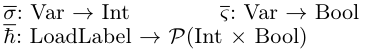
- h : load label을 memory 에서 얻을 수 있는 value의 집합으로 mapping
- 초기 상태 : σ = 0 ς = false, h = empty set
### 4.3.2. Small Step Rule
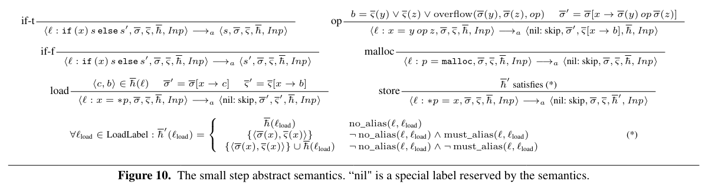
- if, while, malloc, load ,store에 대해 차이가 있음
- if, while의 condition을 무시함
- store는 alias 정보를 기반으로 h를 유지
- load : h에서 (c,b)를 nondeterministic 하게 반환
- store : alias를 기반으로 h를 유지

## 4.4. Relationship of the Original and the Abstract Semantics
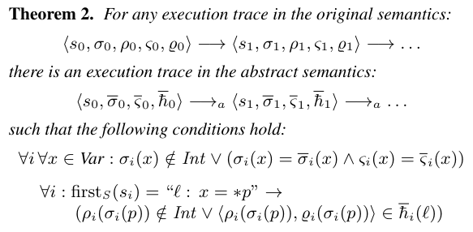
- 
## 4.5. Evaluation of the Symbolic Condition
## 4.6. Soundness of the Analysis
# 5. Experimental Results
## 5.1. Methodology
## 5.2. Analysis and Filter Evaluation-
## 5.3. Filter Confirmation on Vulnerabilities
## 5.4. Discussion
# 6. Related Work

# 7. Conclusion
