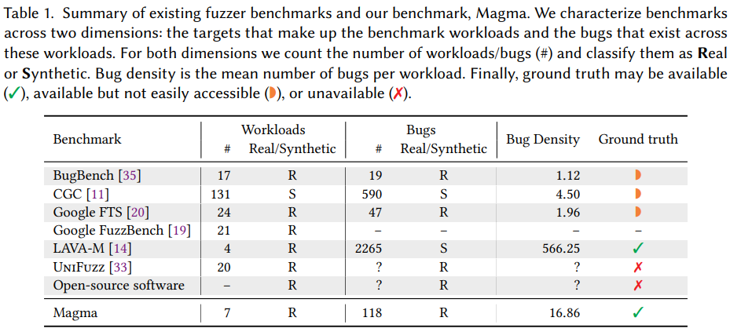
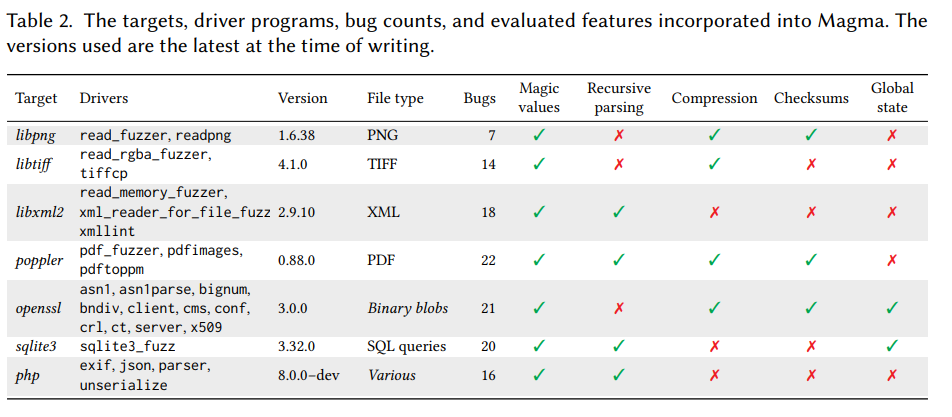
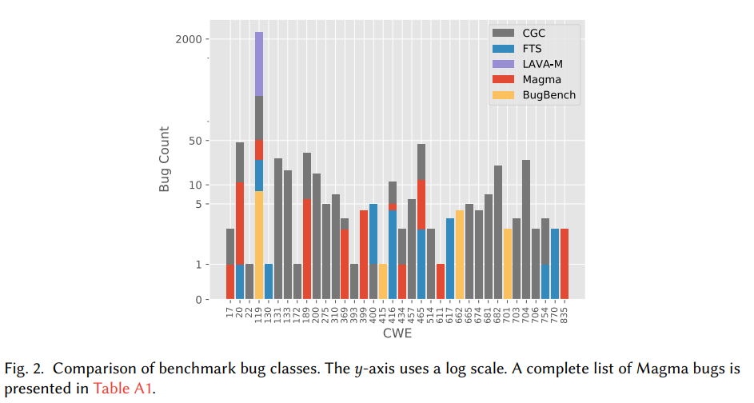
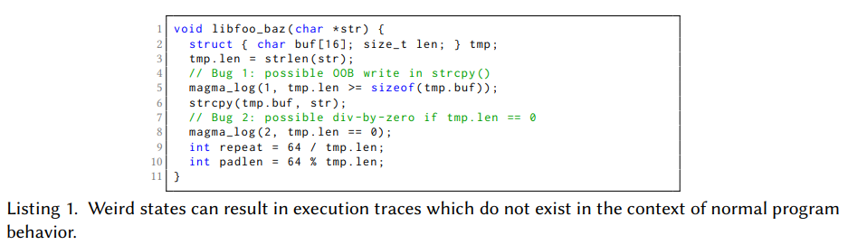
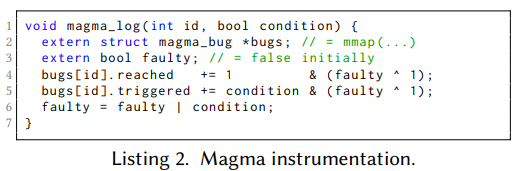
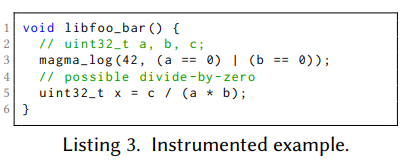

[Magma: A Ground-Truth Fuzzing Benchmark](https://dl.acm.org/doi/pdf/10.1145/3428334)

# 0. Abstract
- fuzzer의 성능을 평가하고 비교하는 것은 metric과 benchmark의 부족으로 인해 어렵다...
- crash count : deduplication technique의 불완전성으로 인해 부정확함
- 특정 target set이 없기에 평가가 일관되지 않음
- Magma : Ground truth fuzzing benchmark
# 1. Introduction
- fuzzing : sound, incomplete
- 일반적으로 crash count, bug count, code coverage profile을 통해 형가됨
- 각 metric의 결함
1. crash count : 실제 bug의 수를 over approximate, deduplication technique의 불완전성
2. bug count : crash의 근본 원인을 식별하는 것이 더 바람직함, 하지만 ground-truth bug count를 얻기 위해선 수작업 분류가 필요하며 도메인 전문 지식과 경험 이 필요
3. code coverage profile : coverage로 제거된 충돌과 ground-truth bug간의 약한 상관관계, 높은 coverage가 반드시 더 좋진 않음
- 실제 프로그램에서 발생한 버그를 기반으로 7개 프로그램에 118개의 버그를 다시 삽입함
- 버그에 도달한것과 트리거 하는것을 구분함
- contributions
1. fuzzer benchmark를 위한 bug-centric performance metric을 제시
2. 기존 fuzzer benchmark의 정량적 비교
3. 실제 프로그램, 버그를 기반으로 한 ground-truth fuzzing benchmark
4. 7개의 fuzzer에 대한 Magama의 평가
# 2. Background and Motivation
## 2.1. Fuzz testing (fuzzing)
- fuzzer는 input format, program strucutre에 따라 input을 생성
- grammer based fuzzer (Superion, Peachfuzz, Quickfuzz) : input format 을 활용한 input 생성
- mutation based fuzzer (AFL, Angora, MemFuzz) : muatation을 통해 input 생성
-  fuzzing은 확률적으로 bug를 찾음, 이러한 특성으로 fuzzer를 평가하고 비교하는 것이 어려움
## 2.2. The Current State of Fuzzer Evalutaion
- 지금 까지 fuzzer를 평가한는 것은 임시적이고 무작위적임
- 다음과 같은 평가되어야 함
1. performance metric : crash count, bug count, coverage profiling
2. target : 다양하고 현실적이어야함
3. seed selection : initial input set이 fuzzer간 일관되어야함
4. Trial duration (timeout) : timeout이 일관되어야함
5. number of trial : fuzzer가 확률적이기에 통계적으로 신뢰 있는 비교를 위해 많은 반복이 필요
### 2.2.1. Existing Fuzzer Benchmarks

- LAVA-M : magic value와 관련된 단순한 버그만 삽입함
- CGC : 작고 단순한 set
- BugBench, Google FTS : target당 1,2개의 bug만 가지고 있음
- Google FuzzerBench : coverage profile만 사용
- UniFuzz : ground-truth 지식 부족, 각 target이 몇개의 bug를 포함한지 불확실함
- OSS : ground truth 지식 부족, 버전 정보에 대한 명시가 부족
### 2.2.2. Crashes as a Performance Metric
- 대부분의 fuzzer은 crash listener을 사용
- crash count를 사용하는 것은 duplication (coverage profile, stack hash)를 사용하더라도 over approximate
- fuzzer가 발견한 bug의 수를 비교하는 것이 더 바람직함
# 3. Desired Benchmark Properties
- fuzzing benchmark를 설계할때 다음과 같은 성질을 고려해야함
1. Diversity : 실제 software test와 유사한 다양한 버그와 프로그램을 포함해야함
2. Verifiability : 성능을 정확하게 설명하는 검증 가능한 metric을 산출해야함
3. Usability : 이용과 채택에 있어서 어렵지 않아야함
## 3.1. Diversity (P1)
- bug의 다양성
1. Class : CWE(Common Weakness Enumeration) bug class에는 memory-based error, type error, concurrency, numeric error등이 있음
2. Distribution : Depth, fan-in(# of bug execution path), spread (bug/total path ratio)
3. Complexity : bug와 관련된 input byte의 수
- target의 다양성
1. Application domain : file, media, network protocol, document parsing, cryptography primitives, data encoding
2. Operations performed : parsing, checksum, indirection, transformation, state management, data validation
3. Input structure : Binary, text, format/grammer, data size
- 결국 이를 만족 하기 위해서는 real program을 사용해야함
## 3.2. Verifiability (P2)
- fuzzing benchmark는 ground truth를 기반으로 fuzzer의 결과를 검증할 수 있는 bug set을 제공해야함
## 3.3. Usability (P3)
- fuzzer은 다양한 형태 (고유 instrumentation, 특정 execution engine)이기 때문에 이에 범용적으로 사용할 수 있어야함
- 쉽게 이용할 수 있고 합리적인 시간 내에 완료되어야 함
# 4. Magma : Approach

- 7개의 real program 에서 118개의 bug를 담고 있음
- fuzzer와 병렬로 실행되어 실시간 통계를 수집하는 runtime monitor 제공
- 도달한 bug, trigger한 bug, 감지된 bug의 수를 기준으로 함
- fatal canaries mode : canary 조건이 충족되면 프로그램 종료 (ideal sanitization)
## 4.1. Target Selection


## 4.2. Bug Selection and Insertion


- 11개의 CWE에서 118개의 bug
- 기존에 비해 다양하고 높은 bug density
- forward porting : 패치된 부분에 버그 조건을 넣어두는것 > 여러 patch로 수정된 bug를 하나의 파일로 볼 수 있음
- bug가 trigger 되었는지 확인하는 ligth-weight oracle (boolean expression)
- 이에 맞게 canary 도입
## 4.3. Performance Metrics
- fuzzer 평가는 bug reach, trigger, detect를 구분해서 평가해야함
1. reach : 해당 bug 위치에 도달
2. trigger : trigger condition을 만족
3. detect : resource exhaustion, timeout과 같은 bug는 trigger되지 않을때도 있음, 이를 구분
- instrumentation은 trigger된 bug에 대한 ground-truth knowledge, runtime feedback을 제공
## 4.4. Runtime Monitoring
- reach, trigger된 bug에 대한 데이터 수집
# 5. Design and Implementation Decisions
## 5.1. Forward-porting
### 5.1.1. Forward-Porting vs. Back-Porting
- forward-porting : 공개된 버그의 수정을 통해 Magma가 발전할 수 있게함
- 물론 새로 도입한 코드가 bug를 재 도입할 가능성이 있음
- 변경된 코드가 forward-porting된 bug의 trigger되지 못하게 만들 수 있음
- fuzzer을 이용하여 PoV를 생성하고 trigger가 가능함을 입증
### 5.1.2. Manual Forward-Porting
- 모든 bug는 다음 과정으로 수동으로 도입함
1. bug report search
2. core codebase에 영향을 미치는 bug 식별
3. bug fix commit 찾기
4. fix commit에서 bug condition 인식
5. path constraint 수집
6. boolean expression (bug canary) 모델링
7. canary 주입
## 5.2. Weired State
- weired state : fuzzer가 탐지되지 않은 bug를 trigger하는 input을 생성하고 이 bug를 넘어 지속되는 경우
- weired state 이후 수집된 정보는 신뢰할 수 없음 > 처음 bug를 trigger할때까지 수집


- bug 1 : out of bound
- bug 2 : divide by zero
- tmp.len =16일때 bug1,2 모두 발생됨, 실제로는 bug2는 발생되지 않아야함 (strcpy로 len field까지 덮어쓰기 때문)
## 5.3. A Static Benchmark
- Magma는 static benchmark
- overfitting의 위험이 있음 (bench mark에 좋은 성능을 내기 위한 fuzzer의 조작)
- 이를 위해 Magma는 forward-porting을 통해 실제 환경에 맞게 변화됨
## 5.4. Leaky Oracles
- benchmarkk에 oracle을 도입하는 것도 overfitting을 발생할 수 있음
- oracle을 if로 구현하면 branch coverage를 최대화 할때 oracle의 branch를 감지하고 해당 input을 생서할 수 있음
- 이를 위해 Magma는 instrumentation이 주입된 binary와 주입되지 않은 binary를 모두 생성함
- instrumentation 되지 않은 binary에서 coverage feedback을 수집함
- instrumentation : canary data를 수집하고 runtime에 보고함
> but 동기화 측면에서 runtime overhead > 이를 해결하기 위하여 always-evaluate memory write
- instrumentation된 bug oracle은 bug trigger 조건을 나타내는 boolean expression을 평가, runtime monitor와 공유


- Magma의 canary 구현


- canary가 삽입된 program
- trigger condition은 compile시 implicit branch를 생성할 수 있음
- coverage 정보를 누출하지 않기 위해 x86-64 assembly block set을 제공함
- taint analysis, data flow analysis에 의해 감지될 수 있는 memory 접근 패턴을 도입할 수 있지만 fuzzer가 이런 접근 패턴에 overfitting 한지 확인할 수 있음 > instrumentation 되지 않은 binary로 fuzzing campain을 반복

## 5.5. Proofs of Vulnerability
- PoV를 제시해야 신뢰성이 높음
- bug report에서 추출하고 없는 경우 fuzzing을 통해 찾음
## 5.6. Unknown Bugs
- oracle이 감지 하지 못하는 (새로운) bug가 존재할 수 있음
- deduplication technique의 불완전성으로 인해 magma의 metric에 포함되지 않을 수 있음
- 추후 연구를 통해 benchmark에 추가 가능성
## 5.7. Fuzzer Compatibility
- whitebox fuzzer 또한 지원함
# 6. Evalutaion
- skip
# 7. Conclusions
- forward-porting을 통하여 7개의 프로그램에 118개 bug 생성
- 7개의 mutation base fuzzer를 비교 함으로 fuzzer 성능의 체계적인 평가 가능

# 8. dfuzz-experiment
- libpng-read-fuzzer : AAH001,3,7(PNG001,3,6)

- git clone시 private repo가 안됨 (infosec-sogang/magma)
- /magma/magma/apply_patches.sh 파일이 존재하지 않음
- docker line 54 : docker-setup/benchmark-project/libpng/build.sh
``` bash
# Build libpng_read_fuzzer.
$CC $CFLAGS -I. \
     ../libpng_read_fuzzer.c \
     -o $OUT/libpng_read_fuzzer \
     $LDFLAGS .libs/libpng16.a $LIBS -lz -lm || exit 1

12.17 clang: error: no such file or directory: '../libpng_read_fuzzer.c'
```
