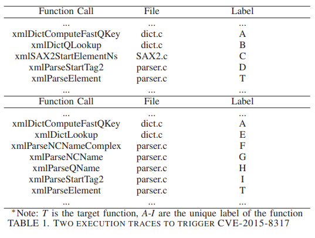
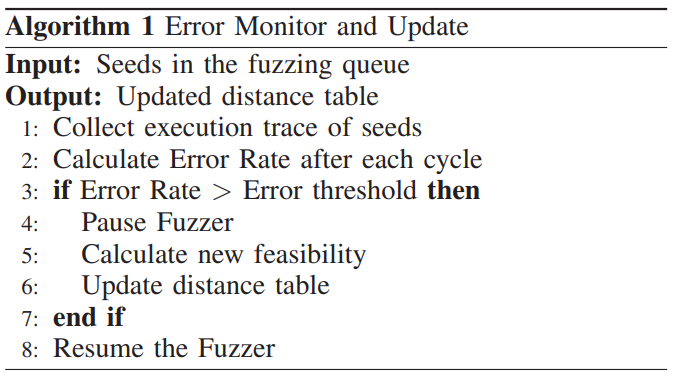

# 1. SELECTFUZZ

- fuzzer가 흥미로운 input을 식별하는 방법을 개선함
- relevant code 개념을 도입
## 1.1. Relevant code

- DGF는 target과 관련 있는지 여부와 관계없이 새로운 코드를 발견하는 input을 선호함
- target과 관련된 path를 선택적을 탐색 (relevant code)
- relevant code : path divergent code , data dependent code
> path divergent code : reachable path와 urrechable path의 교차 지점 (e, f)
- input이 target을 향하는지 구별할 수 있는 중요한 feedback 제공 > 이에대한 정보를 이용하여 direction
> data dependent code : target에서 사용되는 중요 변수에 영향을 미치는 code (b, g)
- target에 도달하는데 도움이 되지 않지만 exploitation 단계에서 도움이 됨

> challenge
1. relevant code를 식별하는 방법
2. irrelevant code를 exploring 하지 않는 전략

## 1.2. Block Distance
- BB에서 target까지 reaching "probability"를 계산

### 1.2.1. Block distance

- BB에 3가지 labeling ( 0 : initial, 1 : distance 계산중, @: distance 계산 완료)
> cal_prob
1. target이라면 1
2. target이 아니라면 avg of cal_prob(succ)

> cal_dist : cal_prob(b) 의 역수

- target이 여러개라면 어떤 target에든 도달할 확률로 계산
- loop, recursion의 경우 unroll 처리하여 한번만 계산
- cross function block distance를 위하여 callsite에 calle function을 successor로 추가
- indirect call의 경우 target function을 추론하여 모든 callee를 추가 > false postive 가능성 > 하지만 이때 distance가 커지게 되어 선호되지 않을 것, >> 의문 : indirect call을 통하여 발견되는 bug는 잘 찾지 못할까? 
### 1.2.2. Input distance
- cover된 모든 block의 distance중 가장 작은것을 사용함

### 1.2.3. Example

- S1: a->f, S2: g->j
- AFLGo : S1 = 3/1 = 3, S2 = 2/1 = 2 > S2 선호
- SELECTFUZZ : S1 = 2, S2 = 4 > S1 선호

## 1.3. Input Prioritization
- relevent BB간의 새로운 edge를 발견하거나 기존 edge를 new scale로 증가시키는 input을 선택
- SELECTFUZZ가 항상 relevant input을 만드는 것은 아님 > 가장 작은 input distance를 갖는 irrelevant input을 선택하여 mutation
## 1.4. Power Scheduling
- AFLGo의 annealing-based power scheduling 사용
## 1.5. Implementation
### 1.5.1. Call Graph
- CG : cross function distance 계산할때 사용
- indirect call에서 target function을 추론할때 pointer analysis 사용
### 1.5.2. Inter-procedural Data-flow Analysis
- target에서 시작하여 역방향으로 inter-procdeural data flow analysis 사용 > data dependent code 식별
### 1.5.3. Alias Analysis
- pointer aliasing을 point-to analysis 사용 > false postive 가능

## 1.6. Evaluation
- RQ1 : SELECTFUZZ는 알려진 vulnerability를 trigger 할 수 있나?
- RQ2 : 각 구성 요소가 성능에 어떤 기여를 하는가
- RQ3 : 어떤 요소가 효과에 어떤 영향을 미치는가
- RQ4 : 표준 bnechmark에서 어떤 결과를 갖는가
- RQ5 : 실제 프로그램에서 새로운 bculnerability를 발견할 수 있는가
### 1.6.1. Triggering Known Vulnerabilities (RQ1)

### 1.6.2. Ablation Study (RQ2)

- distance matric, selective path exploration으로 DGF르 개선하므로 이 효과를 평가하기 위하여 AFLGo의 방식을 적용하여 개선을 비교
### 1.6.3.  Understanding Performance Boost (RQ3)
#### 1.6.3.1. Instrumentation overhead
- 다른 DGF에 비하여 더 적은 BB를 instrumentation함
#### 1.6.3.2. Exploring Relevant code 
- trigger와 관련 없는 코드의 비율에 크게 영향을 받음 다른 DGF는 전체/도달 : 1.96/12.33
### 1.6.4. Benchmarking (RQ4)

- 복잡한 branch constraint를 충족시키는 input을 생성하지 못함
### 1.6.5. Detecting New Vulnerabilities (RQ5)

## 1.7. Discussion
### 1.7.1. False Positive
1. indirect call에서 call relation을 과대추정, data flow analysis에서 보수적으로 alias analysis 
2. data dependent code를 식별할때 target에 사용되는 모든 변수를 추적 > index overflow에서 array, index가 아닌 값까지 추적
### 1.7.2. Complex Path Constraint
- SE, TA, structure-aware mutation이 사용되어야함
### 1.7.3 Improving Directed Fuzzing Efficiency
- 우리의 방법중 relevant code만 intrumentation하여 selective path exploration 은 다른 기존 기술과 통합할 수 있다고 생각한다

# 2. AFLGopher

- 기존 distance matric은 feasibility-unware
- if문에서 두 branch가 같은 feasibility를 갖는다고 가정함 > DGF의 편향

- AFLGo 에서 T1 = 1.6 < T2 = 2.43
- AFLGo에서 p1, p2 거리를 동일하게 계산함 > 실제 실행해서는 2번째 trace가 target에 도달할 확률이 더 높음 > 거리에 가중치를 주어야함

## 2.1. Approach

1. LLVM IR, MLTA를 기반으로 indirect-call을 포함한 CFG 구성
- CFG와 CG의 call site를 수집하여 inter-procedural flow graph 생성
- classification을 수행
2. tracer
- fuzzer와 trace를 함께 실행
3. feasibility prediction
- LSTM (long short time memory : 딥러닝 기법)에 trace를 입력하여 잠재적 branch statement에 대한 feasibility를 예측함
- LSTM에 넣을 data가 부족하기 때문에 graph이론에서 pre-dominating node method를 사용
4. update mechanism
- 새로운 trace를 모니터링 하며 feasibility prediction이 충분하지 않을때 update함

## 2.2. Branch Statement Analysis
- multiple outgoing branch에 대해서 feasibility를 예측해야함
- (1) multi outgoing branch 식별 (2) feasibility analysis 수행
### 2.2.1. Branch Statement Extraction
- outgoing edge가 여러개인 statement를 식별 > LLVM IR 기반
- while, for는 IR에서 if문으로 변함 > indirect call, if, switch에 대해서만 예측
- `prt=malloc(n*sizeof) if (ptr==NULL){...}` 에서 ptr이 아니라 malloc 부분이 중요함
- 즉 branch statement 내부요소(ptr)의 source가 outgoing edge의 feasibility에 영향을 줌 > SBA(Source Backward Analysis) 수행
- 우리는 SBA에서 source를 3가지로 나눔 (global, function reutrn, function argument)
- LLVM IR에서 static SBA를 수행하여 3가지중 하나에 해당하는 source를 찾을때까지 추적함
- 이에 맞는 중요 정보 (global : type, value), (func ret : ret type, func, parameter) (func argu : type, arugument name) 저장
### 2.2.2. Branch Statement Grouping
- 각 category에서 classification을 수행해야함 > NLP 기술들을 이용하여 수행함 (word2vec, DBSCAN clustering)
- `if(ptr==NULL)` 을 <IF ,FR#, G#> 으로 변환 FR : function return, G : global, # : cluster

## 2.3 Tracer
- tracer를 이용하여 branch statement로 도달한 횟수와 각 outgoing branch가 어디로 이동했는지 계산함
- indirect-call에 대한 예측을 수행하기 위하여 LSTM에 trace를 입력

## 2.4. Feasibility Prediction
### 2.4.1. Branch Statement Feasibility Prediction
- trace를 기반으로 각 cluster의 확률을 계산 가능
### 2.4.2. Indirect-call Target Feasibility Prediction
- trace를 기반으로 function call chain 얻을 수 있음 > 이를 기반으로 callee를 예측하기 위하여 LSTM을 사용
- function call chain을 문장으로, function call을 단어로 취급함
### 2.4.3. Distance Calculation
- AFLGo와 Hawkeye에서 CG, CFG에 대해서 동일한 가중치를 주었지만 우리는 달라야 한다고 생각
#### BB level - CFG

#### Function level - CG

## 2.5. Fuzzer Updating
- fuzzer는 edge에 대한 weight를 동적으로 관리

#### Weights on CFG

- fuzzing중 trace를 분석하여 feasability를 업데이트하여 적용함
#### Weights on CG
- indirect call feasability (LSTM)
- 언제 update를 할지 정해야함
### 2.5.1. Error Monitor
- feasability가 충분하지 않을때 update > feasabjility가 정확한지 판단하는 error monitor 도입

