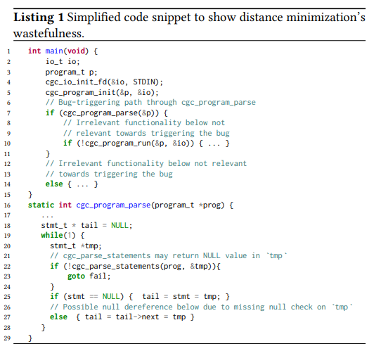
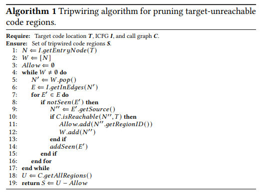
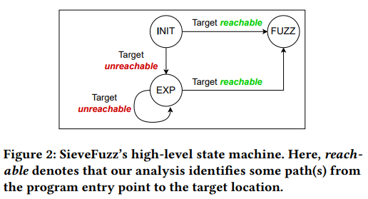
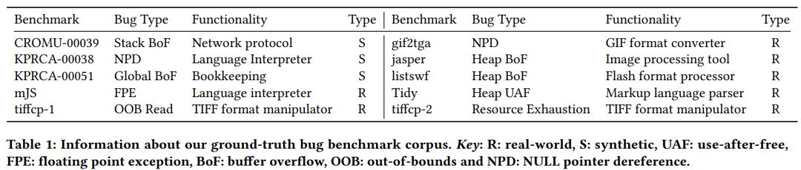
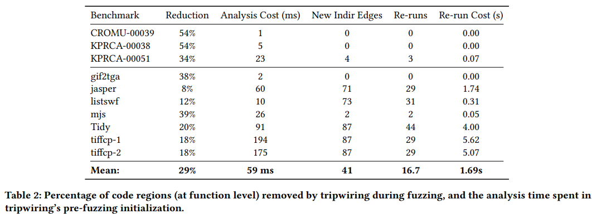
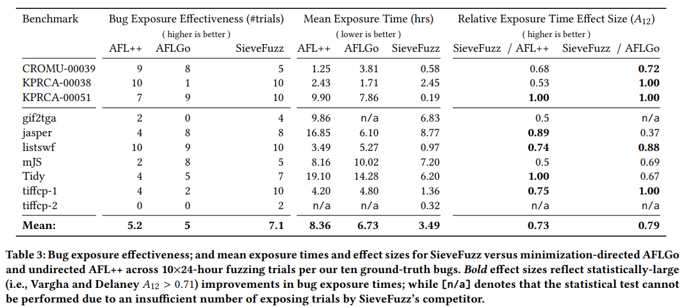
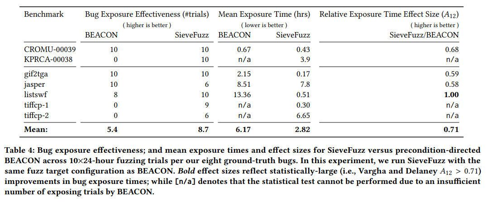
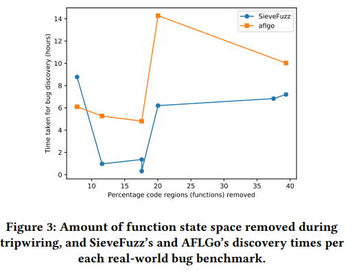

[One Fuzz Doesn’t Fit All: Optimizing Directed Fuzzing via Target-tailored Program State](https://dl.acm.org/doi/pdf/10.1145/3564625.3564643)

[source code](https://github.com/HexHive/SieveFuzz)

# Motivate Example
- distance minimazation > 모든 testcase에 대한 distance calculation : 높은 overhead, dijoint target의 경우 non-DGF보다 비효율적 

- DAPRA cyber grand challenge benchmark `KPRCA-00038` 
- `cgc_program_parse` : NULL pointer referencing 이 포함된 interpreter
- bug trigger 조건 
1. empty statement > language semantics 만족
2. reference를 trigger하는 non empty statement 삽입

- `crc_parse_statements`는 disjoint target
- *AFL* 2/10 > *AFLGo* 1/10 , 시간도 92% 빠름
- distance minimazation은 program state에 대한 greedy search로 인한 대가를 지불함 따라서 non-DF이 더 우수할때가 있음, dijoint target에 대한 성능 문제

# Tripwiring
- tripwiring : fuzzer의 program state space의 search가 확률적이며 control flow에 크게 영향을 받는점을 이용 > rechable path의 subset을 serach space에 제한 > subset은 target site에 도달하는데 반드시 필요한 path로 보장됨

- target site를 선행하지 않는것으로 입증되는 region의 탐색을 선제적으로 종료 > 장점
1. 90% 이상의 runtime에서 실행되는 target inrerelevant path의 code coverage, target distance를 측정하는 낭비 없앰
2. path를 explore 하기 전에 filtering > resource를 낭비하지 않음

- target site에 선행되지 않는것으로 보장되는 region을 식별하는 방법론 

- iCFG는 context insensetive 하기 때문에 target-relevant code region은 over-approximate 
- CG에서 수행되는 function rechability analysis를 함께 사용함

# Indirect Transfers
- point-to, value-set analysis를 사용하여 inderect transfer에 대한 문제를 해결함 > over approximate에 대한 문제 존재
- 이러한 오차는 under tripwiring (탐색해야 하는 code를 과다 추정)
- indirect branch가 발견될때마다 CG를 동적으로 update함 > tripwiring을 조정
- re-analysis 과정은 overhead를 더하지만 새로운 coverage는 지수적으로 감속하기 때문에 괜찮음
- indirect call을 dynamic하게 해결하기 때문에 target site가 초기 rechability analysis에서 빠질 수 있음 > 실험적으로 괜찮음 (추가되기 때문)

# SiveFuzz
> 구체적인 사항이 기술되어있지 않음

- AFL++위에 구현
- on-demand rechability analysis를 수행하기 위하여 fuzzer, analyzer 간의 client-server 구축
- indirect edge를 static analyzer로 전달하여 dynamic CFG를 update한 후 rechability, tripwiring analysis를 update
- LLVM 기반 SVF framwork 사용
- LLVM pass를 사용하여 function level 조기 종료를 위한 intrumentation을 도입

1. Initial Analysis (INIT)
- initial iCFG, CG analysis에서 도달 여부를 질의함, unreachable : indirect call edge가 누락된것으로 판단 > EXP 를 실행
2. Exploration (EXP)
- target에 unreachable한 경우 non-directed, non-tripwiring fuzzing으로 seed를 다양화함
- indirect edge를 모니터링하여 rechability analysis를 수행하고 이에 따라 update
3. Tripwired Fuzzing (FUZZ)
- target이 rechable한 순간부터 tripwiring DF가 시작
- 이때도 새로운 indirect edge 발견한 경우 re-analysis 수행
- tripwiring intrumentation (조기 종료와 관련된 명령어 추가, 삭제)를 수행

## Preemptive Termination
- fuzzing을 위해 instrumentation 되는 동안 PUT의 code region(function)에 ID 할당
- region의 시작점에 해당 ID로 runtime library 호출, library를 PUT에 연결하고 tripwiring preemptive termination 수행
- 구현 : activation birmap 사용 > bit 설정 : 실행 허용 > bitmap을 SA module에서 동적으로 유지
## Indirect Call Tracking
- 모든 indirect call site에 intrumentation을 적용하여 edge의 destination을 식별
- indirect(caller, callee) pair 추적
- 각 함수에 32bit ID 할당 > indirect call edge : caller,callee : 64bit edge ID 계산
- 시간 복잡도가 낮기에 overhead 무시할만함
## Maintaining Exploration Diversity
- tripwiring은 CGF를 특정 target site로 유도하여 direction을 달성함
- 기존 fuzzer는 새로운 coverage가 발견되지 않은 경우 seed를 random mutation > target site를 self call (stack overflow)하는 triggering에 알맞지 않음
- execution diversity heuristic을 개발 > target relevant code region 에서의 coverage가 더 큰 test case의 mutation을 우선시함
- fuzzing 대상에 instrumentation을 통하여 trace length(testcase에 의해 실행된 function의 수) 측정
- trace length를 그대로 사용하는것은 비효율적임 > 평균 trace length를 사용 /// 무슨소린지 모르겠음 (normalization하여 사용 한다는 의미인가?)

# Evaluation
1. RQ1. tripwiring은 rechable search space를 제한하는데 효과적인가 > Tripwiring 된 code region의 비율
2. RQ2. tripwiring은 DF를 효과성과 속도를 향상시키는가 > TTE
3. RQ3. tripwiring에 잘 적용되는 target location의 특성 > dijoint target과 SieveFuz, AFLGo의 성능의 상관관계
## Benchmarks

- DARPA CGC corpus의 3개의 ground truth memory bug set
- real world bug 5개
- Magma의 2개
- 특이한점 : Debian 사용

## RQ1: Tripwiring’s Search Space Restriction

1. tripwiring된 code region의 비율
2. tripwire initialization, on-demand analysis의 cost를 계산
- 24시간 fuzzing중 overhead는 낮은편임
## RQ2: Targeted Defect Discovery

1. consistency
2. speed
### Results: Tripwiring vs. Minimization-directed Fuzzing
- AFLGo와 비교
### Results: Tripwiring vs. Precondition-directed Fuzzing
- BEACON과 비교 

- SieveFuzz 대비 BEACON은 path를 과도하게 줄임
- BEACON은 indirect controlflow를 감지하지 못함 
### Results: Tripwiring vs. Undirected Fuzzing
- AFL++과 비교
## RQ3: Target Location Feasibility for Tripwiring

- disjoint target일때 tripwiring이 distance minimaization 보다 성능이 더 좋아짐 > figure 3의 의미를 잘 모르겠음 (disjointness가 없지않나?)

# Discussion
1. Refinements in Path Analysis
- target site에 도달하는 경로를 찾은 경우 indirect call에 의해 발생되는 경로를 못찾을 수 있음
- 찾지 못한 indirect call로 trigger되는 bug를 놓칠 가능성 존재
- exploration과 tripwiring을 번갈아 수행하여 이를 해결할 수 있을것으로 기대

2. Path Prioritization
- target에 도달한 path set search를 유도 > path중 우선순위를 정하지 못함 > 이를 개선해야함
