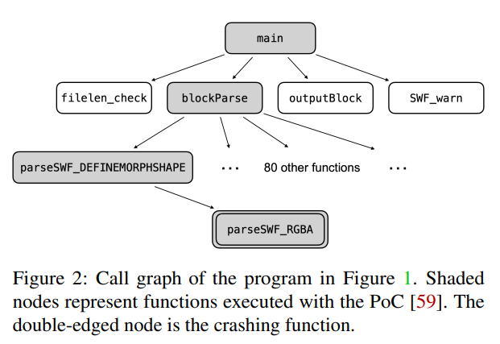
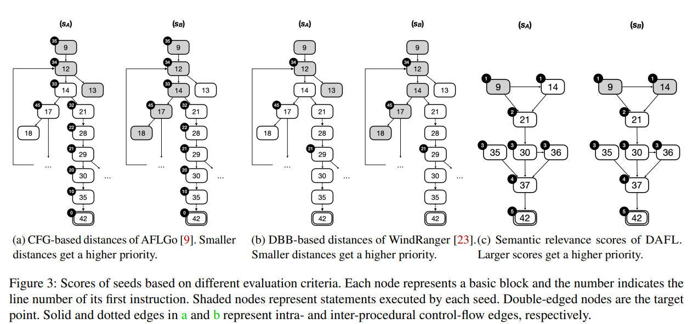
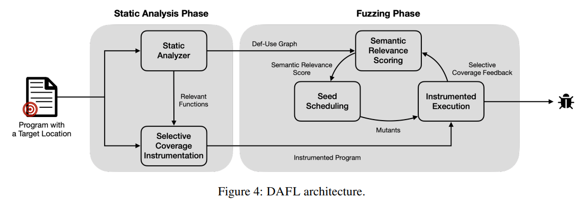
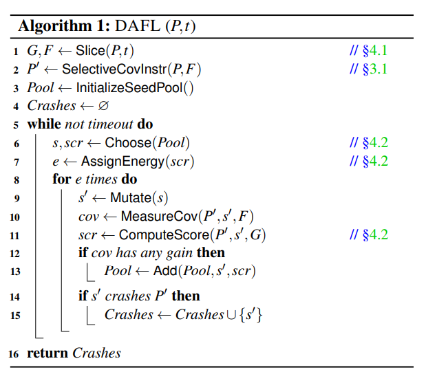
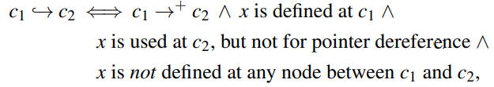
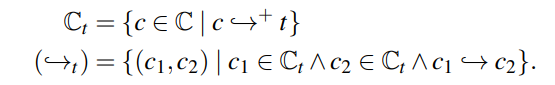
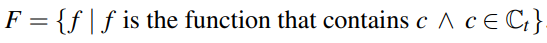

[DAFL: Directed Grey-box Fuzzing Guided by Data Dependency](https://kihongheo.kaist.ac.kr/publications/sec23.pdf)

# 0. Abstract
- DGF이 복잡한 프로그램에 있어서 2가지 확장성 문제
1. coverage feedback이 target에 도달하는데 유의미한 정보를 제공하지 못함
2. seed distance는 복잡한 control flow를 갖는 프로그램에서 잘 작동하지 않음
- DAFL은 target site와 관련된 코드를 식별하고 해당 부분으로 부터만 coverage feedback을 받
- data flow semantics를 고려하여 정밀한 seed distance 계산
# 1. Introduction
- 현재 DGF는 다음 두가지 핵심 매커니즘에 기반
1. 새로운 execution path를 cover하는 testcase를 선호
2. CFG내의 실행된 노드와 target 노드 사이의 거리에 따라 각 테스트 케이스의 우선순위를 지정함
> 복잡한 control flow를 갖는 프로그램에서 좋지 않음 
## 1.1. Challenge 1
- code coverage는 DGF에 부정적인 영향을 줄 수 있음
- 더 많은 coverage를 달성 할 수 있다면 target과 관련 없는 path로 유도할 수 있기 때문
- target program이 클 경우 이는 더 심화됨
- Beacon은 target에 도달하기 위한 weakest precondition을 계산하고 이를 이용해 실행을 조기에 중단시킴
- 실제 프로그램에서 정확한 weakest precondition을 계산하는것이 불가능 > [복잡한 loop는 이를 무력화시킴](#21-challenge-1-negative-feedback)

## 1.2. Challenge 2
- 현재의 distance mechanism은 복잡한 control flow를 갖는 프로그램에서 작 작동하지 않음
- CFG에서 실행된 모든 node를 고려하여 seed distance(priority score)를 계산함
- 프로그램이 큼 > path가 길어짐 > 무관한 node를 많이 포함할 가능성이 있음
- WindRanger는 DBB개념을 도입하여 이러한 문제를 처음으로 다룸 > [loop 내부에서는 DBB가 좋지 않음](#22-challenge-2-misleading-distance-metrics)
## 1.3. Our Solution
- *selective coverage instrumentation* : target과 관련된 부분의 code coverage를 수집하여 부정적인 feedback 줄임
- *semantic relevance scoring* : seed distance를 더 직관적으로 계산 > Def-Use-Graph (DUG)를 사용하여 loop 제거

## 1.4. Contribution
- selective coverage instrumetation
- semantic relevance scoreing
- DAFL 설계 및 공개
# 2. Motivation
`CVE-2017-7578`


- `type == 42`일 때 버그가 발생
## 2.1. Challenge 1: Negative Feedback

- 위의 예시에서 blockParse는 80개 이상의 함수를 호출할 수 있지만 `parseSWF_DEFINEMORPHSHAPE`만이 crash를 유발
- 기존의 DGF는 새롭지만 무관한 testcase에 많은 에너지를 할당함
- Beacon은 target에 도달할 수 없는 경롤르 제거하지만 복잡한 프로그램을 처리할 수 없음
## 2.2. Challenge 2: Misleading Distance Metrics
- 현대 DGF는 CGF의 syntatic distance에 기반 > syntatic distance는 semantic적인 측면을 반영 불가



> sa : 잘못된 format으로 즉시 종료, sb : 형식이 올바르고 target버그와 더 관련이 깊음

- 3a : AFLGo : sa = 34.3 < sb = 36.75
- 3b : WindRanger : sa = 34 < sb = 45

- 따라서 loop와 같은 복잡한 control flow가 있는 경우 WindRanger의 DBB도 잘못 될 수 있음 > 우리는 semantic relevance scoring을 이용하여 distance feedback mechanism을 도입
# 3. Overview


- DAFL은 static analysis, fuzzing 두 단계로 구성됨
- SA에서 target site를 가진 프로그램을 입력으로 받아 data-dependent가 있는 모든 문장을 식별하기 위하여 inter-procedural static analysis를 수행하여 Def-Use Graph와 target point와 관련된 function set을 반환함
- [selective coverage instrumentation](#31-selective-coverage-instrumentation)을 통하여 관련된 함수를 instrument
- 이를 이용하여 fuzzing중 선택적인 coverage feedback을 받을 수 있음
- fuzzing 단계에서 [Semantic Relevance Scoring](#32-semantic-relevance-scoring)이라는 새로운 scheduling algorithm을 사용하여 DUG에서 파생된 relevance score에 따라 seed의 우선순위를 지정


## 3.1. Selective Coverage Instrumentation

- DAFL은 target site와 관련된 일부분으로부터 coverage feedback을 받음
- DUG상의 target 위치에서 시작하여 프로그램을 역방향으로 탐색하여 모든 dependent statement를 수집
- 이러한 node set은 target site와 semantic하게 관련된 부분을 포함 하지만 data dependency는 control dependency를 놓칠 수 있음 > 예를들어 line 29는 target point에 도달하는데 중요한 정보이지만 data dependency의 일부가 아니다.
- 만약 모든 data, control dependency를 수집한다면 정밀도 손실이 발생할 수 있다.
- slice된 DUG의 모든 함수를 수집하고 모든 node에 대해서 coverage feedback을 받음

## 3.2. Semantic Relevance Scoring
- seed input을 syntactic distance가 아닌 semantic distance로 평가함
- seed input score을 DUG에서 실행된 node의 semantic relevance score의 합으로 정의함
- 사장 먼 node에 1을 할당 하고 target으로 부터 가까운 node에 최대 점수를 부여함

# 4. Design

- DAFL은 P(program), t(target program point)를 입력으로 받아 crash test case set을 반환
1. Static analysis phase
- P의 data dependency를 분석하여 t에대한 P를 slicing함 (line 1)
- slice함수는 tuple(G,F) 반환 > G : t에 대한 DUG, F : G에 의해 cover된 함수의 집합
- slice된 함수 집합 (F)는 selective coverage instrumentation을 수행하여 intrument됨 프로그램 P'을 제공
2. Fuzzing phase
- seed pool, test case set 초기화
- seed pool에서 seed를 선택하고 semantic relevance score에 기반하여 에너지 할당 (몇번 mutation을 수행할지 지정)
- mutated test case에 대하여 selective coverage를 측정

# 4.1. Program Slicing
- 전통적인 program slicing은 주어진 point에 영향을 줄 수 있는 모든 source line으 집합을 계산 > 하지만 이는 불필요하게 큰 slice를 생성 > 예제
``` C
x = f();
y = g();
p = &y;
z = x + *p;
```

- z에 대해 static program slice를 계산 > 단순한 slicing algorithm은 line 1~3 반환 > 실제로는 line 3는 관련 없음
- thin slicing은 pointer dereference를 무시하여 이를 해결함 > [3.1절](#31-selective-coverage-instrumentation)에서 논의한것 처럼 모든 data, control dependency를 수집하는것은 실용적이지 않음
- control dependency가 thin slice node 근처에서 나타나는 것을 관찰함 > sliced node를 포함하는 함수에 instrument
- sliced node를 이용하여 Relevance score 계산
- 우리의 slicing module은 P, t가 주어지면 target point와 관련된 data flow를 포함하는 DUG를 계산
- CFG (C, →) : C = program point set , → = control flow edge set
- DUG (C, ↪) : C = program point set , ↪ = data dependency edge set

다음과 같이 thin slicing strategy를 정의



- thin slicing 후에도 pointer가 가리키는 변수를 알고 있어야함 > data depedency를 도출하기 위해 flow-insensitive, context-insensitive pointer analysis가 필요함
- DUG를 형성 한 이후 t와 관련된 node를 가진 G를 얻기 위하여 pruning 수행 > target node에서 싲가하여 역방향으로 순회하여 sliced graph G = $(C_t, ↪_t )$ 만듬 



- sliced graph에서 관련된 모든 ㅎ마수를 수집하여 relevant function을 계산




## 4.2. Seed Scheduling
- semantic relevance score라고 불리는 새로운 feedback mechanism을 도임
- sliced DUG 내에서 실행된 node와 target node 사이의 proximity 측정
- CFG 대신 DUG 사용한 이유
1. sliced DUG는 불필요한 node를 포함하지 않음
2. CFG에서 loop가 있더라도 DUG는 loop를 가지지 않을 수 있음


### 4.2.1. Semantic Relevance Score
- SA에서 얻은 sliced DUG G로 정의된 input에 대하여 semantic relevance socre를 계산함
- G에서 더 많은 node를 실행하거나 target에 더 가까운 node를 실행하는 경우 더 높은 점수를 줌
- node c의 semantic relevance score = $Score_{G,t}(c)=L-(|c-t|)+1$
- |c-t| = DUG에서 c, t 간 최단거리, L : DUG G에서 t와 가장 먼 노드 사이의 거리 > 가장먼 노드 = 1, 가장 까까운 노드 = L
- seed s의 semantic relevance score = $Score_{G,t}(s)=\sum{Score_{G,t}(c)}, c\in C_x$
- 모든 실행된 node의 relevance socre의 합으로 정의됨

### 4.2.2. Seed Pool Management
- seed prioritization에 relevance score를 사용

### 4.2.3. Energy Assignment
- seed energy assignment에도 relevance 사용

$E_{DAFL}(s) =$ ${scr_s} \over {scr_{avg}}$ $ * E_{AFL}(s)$

$scr_s$ : semantic relevance socre of s, $scr_{avg}$ : seed pool의 모든 seed의 평균
## 4.3. Implementation
- AFL v2.57b 기반
- slicing 단계에서 AFL LLVM pass에 추가
- slicing module을 구현하기 위하여 SPARROW 기반으로 구현됨
# 5. Evaluation
- RQ1 : bug reproducing term
- RQ2 : slicing 전략의 효율성
- RQ3 : selective coverage instrumentation과 semantic relevance scoring이 fuzzing의 성능에 미치는 영향
## 5.1. Evaluation Setup
- AFL, AFLGo, Beacon, WindRanger와 비교
- Benchmark : Beacon의 취약점, ASAN으로 target 식별 (Beacon은 아님)
- 평가 기준 : target bug의 input을 찾았는 지 평가 : TTE사용
## 5.2. Time-to-Exposure
- 대체로 성능이 좋음
- 성능이 안좋은 경우 : slicing이 inetr-procedural control dependency를 정확히 계산하지 못함 > slicing을 계선할 여지가 있음
## 5.3. Impact of Thin Slicing
- thin slicing vs normal slicing > thin이 2.01배 향상시킴
## 5.4. Impact of Selective Coverage Instrumentation & Semantic Relevance Scoring
- selective coverage instrumentation : 1.73
- semantic relevance scoring : 1.39
- 둘다 적용 : 1.93
# 6. Discussion
## 6.1. Supporting Multiple Targets
- 이 논문에선 단일 target에 대해서만 적용
- slicing을 각 target에 대해서 별도로 수행, slice들의 합집합에 있는 함수를 계측하여 단일 binary program 생성 가능
## 6.2. Supporting Other Languages
- DAFL은 C에서만 적용되지만 OOP에서 thin slicing의 효과가 입증되어 있음 > OOP로 확장가능
- C++의 동적 특성은 pointer analysis를 어렵게 만들기에 어려움
# 7. Threats to Validity
- bug triage logic의 부정확성
- fuzzer의 성능은 basline, compiler tool chain의 버전등에 의해 달라질 수 있음
- Beacon과 다른 버전의 AFL, LLVM을 사용함

# 8. 추가 공부
[def-use](https://greg4cr.github.io/courses/spring20dit635/Lectures/Spring20-Lecture9-DataFlow.pdf)