[Constraint-guided Directed Greybox Fuzzing](https://www.usenix.org/system/files/sec21fall-lee-gwangmu.pdf)

# 0. Abstract
- DGF는 orderd target site, data condition을 고려하지 않음
- target site에 도달하는 것이 아닌 constraint를 만족하는 것을 목표로 하는 constraint-guided DGF를 제시
- target site와 dat condition의 조합으로 constraint를 정의하고 해당 constraint를 만족하도록 seed를 유도함
- 7가지 crash dump와 4가지 patch changelog로 constraint 생성
- constraint가 명확해질수록 PoC generation 측면에서 우수한 성능을 보여줌
# 1. Introduction
- 현재 DGF의 문제
1. DGF는 target site 들이 서로 독립적이라고 가정, target site의 order dependency를 고려하지 않음
2. target crash에 필요한 data condition을 고려하지 않음
- 이러한 문제를 해결하는 CDGF 제안
- target site에 도달하는것이 목표가 아닌 constraint를 만족시키는것을 목표로함
- 순서에 따라 그 constraint를 더 잘 만족시키는 seed를 우선
- constraint는 하나 이상일 수 있으며 이때 지정된 순서대로 constraint를 만족해야함
> contribution
- ordered target site, data conditon을 통합한 CDGF 제안
- 주어진 information source (crash dump, patch changelog)를 통하여 자동으로 constraint 생성
- CAFL을 구현하고 AFLGo에 비해 crash triger 측면에서 우수성을 입증
# 2. Background and Motivation
## 2.1. Directed Greybox Fuzzing

- [a,b,e,f] -> 0.785
- [a,b,c,d,a,b,e,f] -> 0.85
- [a,b,c,a,d,e,f] -> 0.971
- target에 모두 도달해도 거리가 더 클 수 있음

## 2.2. Usage Example
- DGF는 target site를 정확하게 정의할수 있는 곳에서 사용할 수 있음
### 2.2.1. Static Analyzer Verification
- compile time의 source code의 잠재적 버그를 발견하기 위한 SA를 사용함
- SA는 crash location, crash에 가정된 data condition을 포함함
- SA의 낮은 정확도로 인해 크게 신뢰하지 않음 > DGF를 이용한다면 target site로 설정하여 testing 가능
### 2.2.2. Crash Reproduction
- crash report : 어떤 유형의 crash가 어떤 위치에서 발생한지 나와있음
- 하나의 PoC만으로 crash를 수정할때 PoC가 부족하여어려울 수 있음 > DGF 사용 가능
### 2.2.3. PoC Generation
- 공격자의 입장에서 patch changelog를 분석하여 patch된 위치에 target을 설정하여 DGF를 이용한 PoC 생성 가능
## 2.3. Limitation
### 2.3.1. Independent Target Sites

- DGF는 모든 target site를 독립적이라고 간주하여 crash site 이전에 precondition site에 도달하는 개면이 없음
- UAF에서 T1 : TYPE_INT, T2 : ident > 우선 순위가 seed C > B > A 가 바람직함
- DGF는 T1, T2를 독립적으로 간주하기 때문에 target site 의 average distance를 기준으로 seed distance 계산

### 2.3.2. No Data Condition

- DGF는 seed를 원하는 data condition으로 유도할 mechanism이 없음 
- T1에서 buf를 할당 > t2에서 bound를 넘어서 buf에 접근하는 GRAD를 가져야함 > 우선 순위가 seed C > B > A 가 바람직함
- DGF는 data condition을 인식하지 못하므로 distance를 기준으로 잘못된 우선순위 부여
## 2.4. Requirements
1. Ordered Target Sites : crash의 precondition을 나타내는 program location을 가지고 있어야 하므로 DGF는 이 지점으로 먼저 유도되어야함
2. Data Conditions : 대부분의 vulnerability는 data condition을 동반하므로 DGF는 seed를 data condition으로 유도할 수 있어야함

# 3. Constraint-guided DGF
## 3.1. Overview
- CDGF : independent target site set에 도달하는 것이 아닌 sequence of constraints 를 만족하는 것을 목표로함
- 따라서 더 많은 constraint를 만족하거나 다른 seed보다 첫번째로 만족되지 않는 constraint를 만족하기 쉬운 경우에 짧은 distance 부여 
- constraint distance = target site distance + data condition

## 3.2. Example
### 3.2.1. Ordered Target Sites
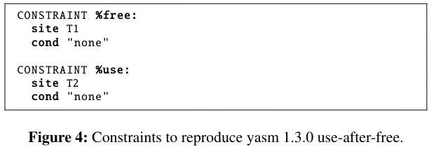
- figure 2의 `yasm 1.3.0`의 UAF에 대한 constraint
- T1 > T2  순서로 도달해야함

- CDGF의 seed distance
1. seed A : T1과 가까운 b에 접근 > free의 constraint = 2, %use : T1에 도달하지 못하였기에 T2에 도달하더라도 max > 2 + max
2. seed B : 1 + max
3. seed C : 0 + 1
4. seed D : 0 + 0
- UAF를 재현하는 단계를 더 잘 따르는 seed에 대해서 더 짧은 seed distance 부여

### 3.2.2. Data Conditions

- figure 3의 `CVE-2017-7578` 의 constraint
- T1 에서 buffer allocation
- T2 : buffer 크기와 offset 사이의 크기를 줄이도록 하여 boundary로 유도 (cond)
- figure 3의 모든 seed는 target에 도달함
- %access의 data condition distance를 통하여 seed distance를 계산함
- T1의 buf 크기 - T2 의 offset 
# 4. Constraints
- CDGF를 사용하기 위해선 constraint, constraint의 distance metric을 정의해아함
## 4.1. Definition
- constraint = target site + target site's data condition
- constraint는 다음의 경우 satisfied 된것으로 간주
1. target site에 도달
2. target site에서 모든 data condition을 만족 한 경우 (있다면) 
### 4.1.1. Variable capturing
- target site에서 사용된 변수를 캡쳐 > target site가 의 유형에 따라 다름
- figure 5 의 예시
- T2:buf[] : deereference > (&buf[i*10+10]) : dereferenced address
- T1:malloc() : allocation > L*10 : size, 할당된 주소 : ret
### 4.1.2. Data condition
- data condition : target site 에서 만족해야하는 캡쳐된 변수간의 boolean expression (including comparison operation)
- precondition 이나 constraint에 의해 캡쳐된 모든 변수를 사용할 수 있음
### 4.1.3. Orderedness
- constraint는 여러개가 존재할 수 있음 > 그러한 경우 지정된 순서되로 만족되어야함
## 4.2. Distance of Constraints
### 4.2.1. Target Site Distance
#### Basic block distance
- 두 BB가의 거리는 다음과 같이 정의

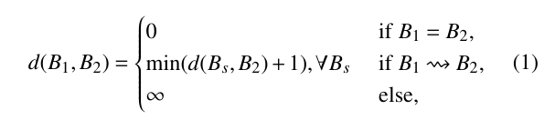
- $B_s$ : $B_1$의 모든 successor

#### Target site distance
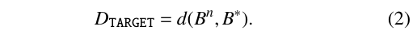
- target site와 현재 BB간의 BB distance로 정의
- $B*$ : target site
- $\overrightarrow{B} = [B_1,B_2,...]$ : 실행된 BB sequence

- 앞으로 임의의 변수 #에 대해서 #^n : B^n을 실행하는 순간의 변수의 값
### 4.2.2. Data Condition Distance
#### Distance of an individual data condition

- Angora와 유사
- 개별 data condition은 $\hat{d}_x(\overrightarrow{n})$를 기반
- $\hat{d}(\overrightarrow{n})$을 다음과 같이 정의함

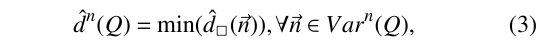

- $Var^n(Q)$ : $B^n$이 실행될때까지 포착된 변수의 vector set

#### Distance of multiple data conditions
- seed가 모든 data condition을 만족하는데까지의 거리를 의미
- 더 많은 data condition이 만족될때 더 짧아지도록 정의
- 만약 같은 수의 data condition이 만족 > 첫번째로 만족하지 못하는 data condition의 가능성이 더 가까운 것으로함

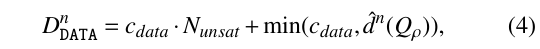
-  $c_{data} = 2^{32}$  
### 4.2.3. Constraint Distance
- constraint distance = target site distance + data condition distance

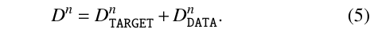
- 다음과 같이 계산됨
1. Target site 이전 : $D^n = d(B^n,B^*)+c_{data}*N(\overrightarrow{Q})$
2. Target site 에서 : $D^n= 0 + D^n_{DATA}$
3. constraint 만족 : $D^n = 0$

### 4.2.4. Total Distance
- total distance = distance of a constraint sequence
- $\overrightarrow{B}^* = [B^*_1, ..., B^*_M]$ : constraint에 포함되는 target site의 sequence
- $\tau_n$ : 천번째로 만족되지 않은 constraint의 index

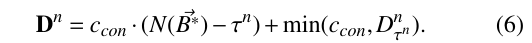

- $c_{con} = 2^{35}$ = 8개의 data condition 수용 가능 
- 다음과 같이 계산됨
1. 모든 constraint를 만족하지 못하였을때 : $D^n=c_{con}(N(\overrightarrow{B}^*)-1+min(c_{con}, D^n_1)$
2. 하나의 constraint가 남았을때 : $D^n = min (c_{con},D^n_M)$
3. 모든 constraint를 만족하였을떄 : $D^n=0$
- seed : execution 동안의 minimum total distance로 정의

# 5. Constraint Generation
- 추가 정보를 이용하여 constraint를 생성함 > 사전에 정의된 constraint templete을 이용
- memory error detector의 crash dump, patch changelog를 이용하여 생성함
## 5.1. Crash Dump
- 7개의 bug type을 지원하는 3가지 template을 제공
- nT : UAF, double-free, use-of-uninitilized-value
- 2T + D : stack-BOF, heap-BOF
- 1T + D : assertion-failure, divide-by-zero

### 5.1.1. Multiple Target Sites (nT)

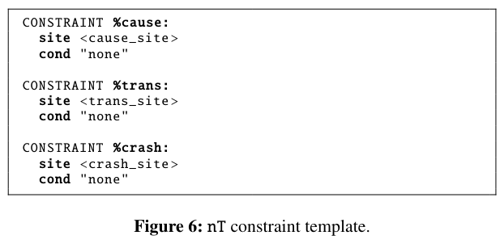
- nT  : crash dump가 순서대로 도달해야하는 target site를 알려줌
#### Avoiding wrapper functions
- alloc, ree, mem과 같은 keyword가 stack fram caller에 있는지 확인하여 memory wrapper 내부의 target이 아닌 하위 stack frame의 location을 선택
#### Constraint description
- crash reproduction을 위해 순서대로 도달해야하는 multiple target site를 지정함
- %cause(cause 생성) -> %trans(cause 전달) -> %crash (crash 발생)
### 5.1.2. Two Target Sites with Data Conditions (2T+D)

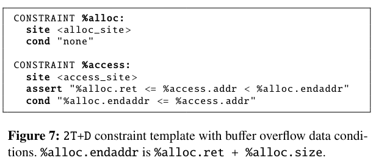

- BOF를 위한것
- endaddr는 할당된 memory의 끝 (ret+size)
#### Constraint description
- %alloc은 buf를 할당하는 위치
- <alloc_site>에 도달하면 ret, endaddr 을 캡쳐
- %access : <access_site>에서 cond 조건을 통하여 endaddr로 경계까지 driven
#### Corresponding bug types
- global-buffer-overflow, buffer underflow를 지원하진 못함
### 5.1.3. One Target Site with Data Conditions (1T+D)

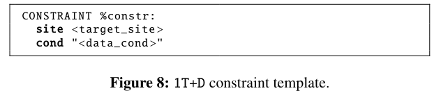
#### Constraint description
- target site와 data condition을 지정
#### Corresponding bug types
- Divide-by-zero : <data_cond>에서 constr.rhs == 0
- Assertion-failure : target_site : 실패한 assertion, datacond = assertion 조건의 부정
## 5.2. Patch Changelog

- patch change log에 대한 constraint는 1T+D를 사용
#### Constraint description
- target_site, data_cond 설정
#### Determining constraint
- 적절한 constraint를 찾기 위하여 patch changelog는 사전에 정의된 case와 matching
- [부록 3](#113-constraint-generation-algorithm-for-changelogs)
1. 새로운 예외검사 도입 : target_site : 해당 source, data_cond : 도입된 예외 검사 조건
2. branch condition 변경 : target_site : 변경된 조건, data_cond : C_pre XOR C_post
3. 변수 교체 : target_site : 교체된 변수, data_cond : patch 전과 후의 변수의 값이 다른지 확인
4. 위의 경우가 아닌 경우 > data condition이 없음
#### Multiple target sites
- 모든 변경된 위치에 sentinal function으로 연결하고 이를 target_site로 설정
- 각 변경 위치에서 sentinal function call을 삽입
# 6. Implementation

- *AFL 2.52b* 기반으로 CAFL 제작

## 6.1. System Overview

## 6.2. CAFL Compiler
### 6.2.1. Coverage instrumentation
- LLVM IR을 통한 byte code 생성
- target site들이 최적화 되지 않도록 주석을 담
- AFL instrumentation compiler를 사용하여 edge coverage를 instrumentation
### 6.2.2. Call graph construction
- target site distance calculation을 위하여 program 전체의 CG 구축
- function pointer와 관련하여 같은 형식의 모든 함수를 잠재적인 callee로 가정 > 그런 함수가 없다면 부분적으로 일치하는 함수들을 callee로 가정
### 6.2.3. Target site distance instrumentation
- target site에서 시작하여 BB의 target site distance를 계산하고 CFG, CG를 기반으로 checkpoint call을 삽입
- target site에서 캡처된 변수를 check point call을 통하여 CAFL에 runtime으로 전달함
## 6.3. CAFL Runtime
### 6.3.1. Seed distance tracking
- checkpoint를 통한 target site distance feedback을 사용하여 seed distance을 tracking
- intrumentation된 binary는 $[\tau,d(B_n,B^*_\tau)]$ tuple을 전달
- $\tau : constraint index, d(B_n,B^*_\tau) : \tau번째 constarint의 target site distance$
- CAFL runtime은 첫번째로 만족되지 않는 constraint의 target site distance를 선택적으로 받아들여 seed distance를 update
- target site에서 checkpoint call을 통하여 캡쳐된 변수를 받고 data condition distance를 계산
- 할당 해제된 변수에를 처리하기 위하여 memory pointer varibale, free/realloc에 의해 해제된 heap objext, stack unwinding object를 폐기
- 현재 constraint의 distance가 0이 된다면 다음 constraint로 이동함
### 6.3.2. Seed distance reporting
- CAFL은 shared memory interface를 통하여 fuzzer에게 seed distance를 보고함
- 추가적인 runtime 정보 (어떤 constraint에 멈추어 있는지)도 보고함
## 6.4. CAFL Fuzzer
### 6.4.1. Seed scoring
- CAFL은 distance에 반비례하여 scoring
- 일부 seed는 더 줄일 수 없는 local minimum 일 수 있음 > 이를 해결하기위해 stuck depth(fuzzing된 횟수)를 통하여 지수적으로 낮춤

### 6.4.2. Seed creation
- 현재 최대 점수보다 높은 점수의 seed를 관찰할때마다 새로운 seed 생성
- seed가 새로운 control flow edge를 cover할때도 일반적인 방법으로 seed를 생성하여 dtat context를 다양화함
### 6.4.3. Seed prioritization
- AFL의 seed prioritization을 수정하여 seed의 선택 확률을 score에 기반하여 조절함
- seed의 점수의 증가순으로 순위를 매기고 지수적으로 높게 부여함
- 점수가 아니라 순위를 통한 확률 부여 > distance가 두가지 척도의 조합이고 스 척도가 호환되지 않기 때문
- P(s)=1/exp(R(s))
# 7. Evaluation
- AFLGo와 CAFL을 비교
- 모든 constraint는 자동으로 생성
## 7.1. Microbenchmark: LAVA-1
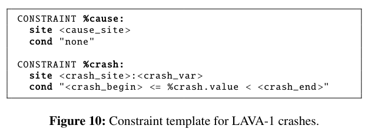

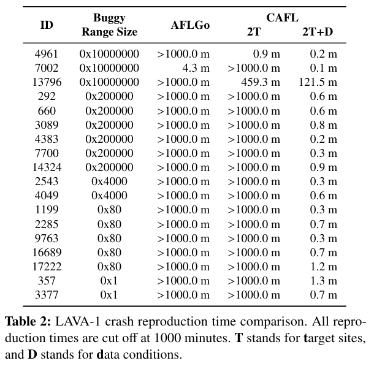

## 7.2. Crash Reproduction
- 47개의 real world crash에 대한 crash reproduction time
- AddressSanitizer, MemorySanitizer의 crash dump를 이용한 자동 constraint 생성

## 7.3. PoC Generation
- 12개의 crash에 대한 PoC 생성 시간
- git, Mercurial의 patch changelog를 사용한 자동 생성

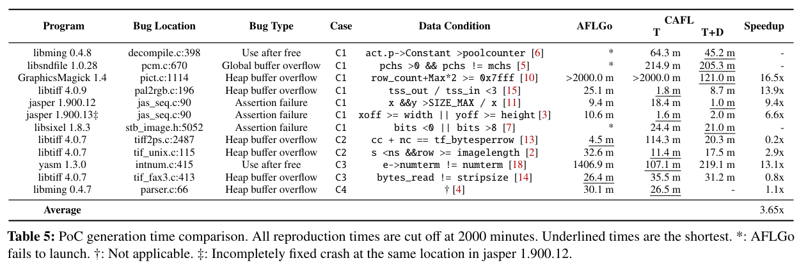

# 8. Discussion
## 8.1. Use-cases with manually written constraints
- 이 논문의 evaluation에서는 자동으로 생성된 constraint를 사용하지만 개발자가 수동으로 설정할 경우에도 효과가 있을것으로 기대됨
## 8.2. Bugs that require three or more constraints
- 일부의 경우 3개 이상의 constraint가 필요한 경우가 존재함
- stack call overflow (무한재귀) : 실행 stack을 더 깊게하기 위하여 여러 constraint가 필요 
- CAFL는 이를 지원하지 않음
## 8.3. Ineffective scenarios
- 현재 자동으로 생성된 datcondition은 crash의 원인이 near-crash condition과 관계가 없을 경우 비효율적일 수 있음
- BOF를 일으키는 uninitialized offset > distance와 관련 없음
- seed scheduling을 통하여 완하활 수 있지만 얼마나 많은 비효율을 초래하는지 조사가 필요
## 8.4. Bugs that require further research
- global buffer-overflow, buffer-underflow의 경우 단순한 data condition으로 유도되기 힘듬
- global BOF의 경우 접근 offset과 buffer boundray 산술적 관계가 없음
- buffer underflow의 경우 buffer의 시작 부분을 쉽게 접근하여 data condition이 이를 구별하는데 실패함 (arr[0]을 접근하는 수가 많기에 arr[-1]에 대한 지향성 힘듬?)
## 8.5. Issue on distance of pointer conditions
- 현재 산술적 차이로 data condition을 표현함 > 부적절한 경우가 있음
- 두 포인터가 다른 객체를 가르키는 경우 두 포인터 값의 차이는 의미있는 정보가 아님

- user.addr과 free.arg0 사이의 차이가 UAF를 발생시킬 확률과 관련이 없음
- double-free와 같은 시간적 pointer bug에서 동일하게 발생
- 이를 nT로 지정하였고 crash input을 찾기 위한 fuzzy한 특성에 의존함
# 9. Related Work
## 9.1. Directed greybox fuzzing
- AFLGo, SemFuzz : DGF
- Hawkeye는 AFLGo를 기반으로 DGF를 개선함 > call trace를 반영한 distance metric
- 전통적인 DGF는 순서가 있는 target site, data condition 개념이 없기 때문에 긴 fuzzing time
- ParemeSan은 dynamic CFG를 통한 distance 개선
- CDGF의 distacne metric은 CFG의 유형에 따라 달라지지 않기에 dynamic CFG를 통한 이점을 얻을 수 있음
## 9.2. Static analysis-assisted directed fuzzing
- 일부 DGF는 SA가 제시한 crash execution path 이용 > crash location에서 crash reproduction을 용이하게 하는 mechanism이 없거나 부정하게 분석된 path로 fuzzing을 과도하게 제한함
## 9.3. Targeted analysis with symbolic execution
- SE는 여러 어려운 branch condition을 해결하는 장점이 있음
- hybrid fuzzing은 branch condition을 해결하는 target SE를 사용함
- DGF에도 이를 결합할 수 있음
## 9.4. ML-based directed fuzzing
- NEUZZ : seed의 branch coverage를 예측하는 model을 사용
- FuzzGuard  seed distance를 단축하지 못할것으로 예측되는 input을 필터링
## 9.5. Alternative distance metrics
- Angora : branch condition solving을 위해 integer distance를 도입
- UAFuzz : seed call stack과 UAF PoC간의 유사성을 활요하는 distance metric > UAF에 한정적임
## 9.6. Domain-specific fuzzing
- FuzzFactory : domain에 특화된 seed generation 규칙 > 이에 맞는 seed generation : 자동화 되지 못함
## 9.7. PoC generation
- 다른 tool과 다르게 CAFL은 SE가 필요없음
# 10. Conclusion
- target site, data condition을 통합하여 constraint를 정의함
- 지정된 순서대로 constraint를 만족시키는 CDGF 제시
- constraint sequence에 대한 distance metric을 정의 > constraint를 잘 만족하는 seed를 우선시
- 7가지 유형의 crash dump, 4가지 유형의 patch changelog를 이용한 constraint 자동 생성

# 11. Appendix
## 11.C. Constraint Generation Algorithm for Changelogs

- 주어진 patch changelog와 함꼐 적절한 constraint를 찾음
- 변경된 location set을 통하여 사전에 정의된 사례로 분류 > target site, data condition 생성

## 11.D. Analysis on Minimum Distance Change

- fuzzing중 minimum seed distance의 변화